*Preliminary Report - Final Project (CM3070)*

# SixLove - Can novice linear progression be applied to tennis?

*Taking on the task of creating a tennis app that provides users with the tools to go from novices to confident, well-rounded amateur players.*

<!-- @import "[TOC]" {cmd="toc" depthFrom=1 depthTo=6 orderedList=false} -->

<!-- code_chunk_output -->

- [SixLove - Can novice linear progression be applied to tennis?](#sixlove---can-novice-linear-progression-be-applied-to-tennis)
- [1 Aims, objectives, and background](#1-aims-objectives-and-background)
  - [1.1 Introduction and background](#11-introduction-and-background)
  - [1.2 Concept and motivations](#12-concept-and-motivations)
  - [1.3 Proposed approach](#13-proposed-approach)
    - [1.3.1 Aims](#131-aims)
    - [1.3.2 Objectives](#132-objectives)
- [2 Literature](#2-literature)
  - [2.1 Existing solutions](#21-existing-solutions)
    - [2.1.1 TennisPAL](#211-tennispal)
    - [2.1.2 MyFitnessPal](#212-myfitnesspal)
    - [2.1.3 TopCourt](#213-topcourt)
    - [2.1.4 Nike Training Club](#214-nike-training-club)
  - [2.2 Techniques and methods](#22-techniques-and-methods)
    - [2.2.1 The theory](#221-the-theory)
      - [2.2.1.1 Fundamental tennis strokes](#2211-fundamental-tennis-strokes)
      - [2.2.1.2 Linear progression in skill development](#2212-linear-progression-in-skill-development)
      - [2.2.1.3 Structured training sessions](#2213-structured-training-sessions)
      - [2.2.1.4 Cardiovascular endurance and agility](#2214-cardiovascular-endurance-and-agility)
      - [2.2.1.5 Progress tracking](#2215-progress-tracking)
    - [2.2.2 Software Libraries](#222-software-libraries)
  - [2.3 External research studies](#23-external-research-studies)
    - [2.3.1 The laws of muscle memory](#231-the-laws-of-muscle-memory)
- [3 Project Design](#3-project-design)
  - [3.1 Project structure](#31-project-structure)
    - [3.1.1 Wireframing](#311-wireframing)
    - [3.1.2 Entity-Relationship Diagram](#312-entity-relationship-diagram)
    - [3.1.3 Database Tables](#313-database-tables)
  - [3.2 Work plan](#32-work-plan)
  - [3.3 Evaluation strategy](#33-evaluation-strategy)
- [4 The Implementation](#4-the-implementation)
  - [4.1 The `registration` app](#41-the-registration-app)
  - [4.2 The `tennis` app](#42-the-tennis-app)
  - [4.3 The `planner` app](#43-the-planner-app)
- [5 Evaluation](#5-evaluation)
  - [5.1 Unit testing](#51-unit-testing)
  - [5.2 Overall project evaluation](#52-overall-project-evaluation)
- [6 Conclusion](#6-conclusion)
- [7 References](#7-references)

<!-- /code_chunk_output -->

# 1 Aims, objectives, and background

## 1.1 Introduction and background

*Taking you back to the beginning.*

Health is wealth- a sentiment echoed by millions across the globe. However, according to *ScienceDaily* over "*95% of the world's population [have] health problems*" [1]. Though we cannot single-handedly gift health to 95% of the world, as fellow humans we have a duty to help facilitate the process of getting healthy. Now where does tennis fit into all this? Tennis is a great sport for those wanting to improve their health. It does not bear the initial intimidation of going to the gym for the first time, but also allows for social interaction. Most important to note is that tennis allows those playing it to improve their cardiovascular endurance, agility, and coordination- it provides a full body workout. *Mayo Clinic Proceedings* published a study (The Copenhagen City Heart Study) in which it was found that tennis players added 9.7 years to their lives in comparison to sedentary individuals [2]. An article published in the *British Journal of Sports Medicine* found that playing tennis for 3 hours a week reduced your risk of heart disease by 56%[3]. Tennis was also found to be linked to "*improved aerobic fitness, a lower body fat percentage, a more favourable lipid profile, reduced risk for developing cardiovascular disease, and improved bone health*" [4].

## 1.2 Concept and motivations

*Formally specifying the how.*

The template chosen for this project is the 'CM3055 Interaction Design: Introducing novices to strength' template. I will be creating an app entitled 'SixLove'. This project is centred around novice linear progression. Novice linear progression (Novice LP) is defined as a program where "*weight on the bar increases, linearly, every workout for each lift*" [5]. What makes Novice LP so potent is that it provides a simple and structured approach for novices, allowing them to build strength efficiently and safely. What does this mean in practice? Novice LP can be be summarised into five key features / principles:

1. Basic movements
2. Linear progression
3. Three workouts per week
4. Simple structure
5. Goal-orientated

Basic movements refers to this idea of the fundamentals. This feature allows novices to learn the elemental barbell exercises, thus building the foundation required for strength. Linear progression represents the linear nature of the program (as defined earlier). This linearity helps to stimulate muscle growth and strength gains. The program is implemented three days a week "*on non-consecutive days, i.e. Mon/Wed/Fri, Tues/Thurs/Sat or similar*" [7]- allowing for sufficient recovery. Novice LP is simple in its nature with an emphasis on using a small number of exercises and sets, making it accessible for novices. Goal-orientated points to novices being encouraged to set specific and measurable strength goals- helping them stay motivated and track their progress.

The real challenge of this project, is taking the fundamental principles of this technique and applying it to tennis. (In [Section 2.2.1](#221-the-theory), an exploration will be undertaken to elaborate on how these principles will be tailored and applied to tennis). In greater detail, the idea is to create an application that helps take users from novices to confident, well-rounded amateur tennis players. Well, what is a novice tennis player? Or rather, what is an amateur tennis player? How is that any good? In the world of tennis, a novice tennis player refers to a beginner. Whereas an amateur tennis player refers to anything upwards of and including intermediate, so long as they are not professional- though these definitions can change based on the source. For the purpose of this project, a novice tennis player is an individual completely new to tennis, and an amateur tennis player is an individual who has learnt the basics but may still need to "*develop their shots and learn more about tactics*" [6]. 

It is now relatively simple to infer the users that this project was conceptualised for- they include but are not limited to:

- Novice tennis players
- Tennis enthusiasts
- Fitness enthusiasts
- Aspiring amateur tennis competitors

With the mention of the users comes the project domain. Though alluded to and specified earlier, the domain can broadly be described as '*novice tennis training*'. Expanding upon that, this project will result in the creation of a web based application that is centred around guiding individuals with little or no tennis experience through a structured tennis training program.

## 1.3 Proposed approach

*Breaking down how I will go about this project.*

### 1.3.1 Aims

*Goals for the development of SixLove and for its evaluation.*

1. **Comprehensive training program**
   - SixLove should provide a structured and comprehensive training program.
   - SixLove should facilitate novice players with the gaining of the fundamental tennis strokes and skills.
   - SixLove users should have access to resources to support learning and improving technique.
2. **User engagement and community building**
   - SixLove should create a sense of community with the use of social features.
   - SixLove users should be able to connect, share achievements, and engage in joint training sessions.
3. **Customisation and personalisation**
   - SixLove users should be able to track their progress.
   - SixLove users should be able to add tennis sessions and create their own schedule.
4. **User-friendly interface and accessibility**
   - SixLove's design should be intuitive and visually appealing.
   - SixLove's design should ensure accessibility for a wide range of users.

### 1.3.2 Objectives

*The core objectives of SixLove.*

1. **Skill development**
   - Provide a structured training program covering fundamental tennis strokes.
2. **User engagement and social interaction**
   - Implement user authentication and profiles, displaying achievements and progress.
   - Enable users to connect with each other.
   - Facilitate tennis session management, allowing joint tennis sessions.
3. **Customisation and personalisation**
   - Allow users to track progress.
   - Allow users to add their own tennis sessions.
4. **User interface (UI/UX)**
   - Design an intuitive and visually appealing interface.
   - Ensure a dynamic and responsive UI for an enhanced user experience.
5. **Community engagement**
   - Create an activity stream showcasing friends' achievements and posts.

# 2 Literature

*What has been done and what is to come.*

## 2.1 Existing solutions

*Scoping out the current market.*

### 2.1.1 TennisPAL

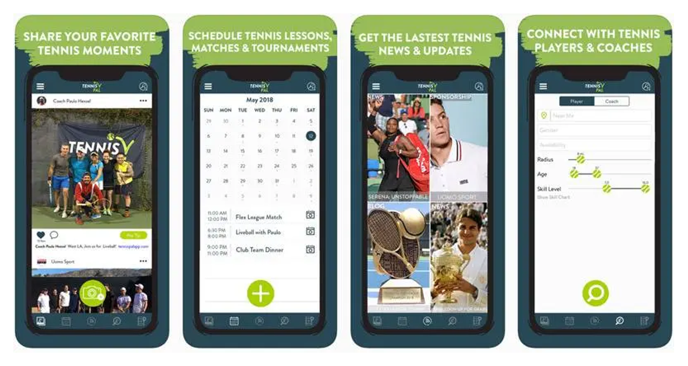

**Figure 1** TennisPAL's User Interface<br><br>

TennisPAL is an app designed specifically for tennis players. It includes features for finding tennis partners and tracking match scores. It also allows users to improve their game through training exercises. **Figure 1** displays TennisPAL's user interface.

#### Some of the pros of TennisPAL include:

1. Simple, easily digestible user interface.

2. Social features.
   
   - TennisPAL provides a platform for tennis enthusiasts to connect with fellow players, schedule matches, and build a community.

3. Court locator.
   
   - TennisPAL allows users to find nearby tennis courts, while also providing information about their availability.

4. Match tracking.
   
   - TennisPAL allows its users to track match scores and stats.

5. In-app messaging.
   
   - TennisPAL offers offers in-app messaging for easy communication between players, which makes it easier to organise matches.

#### Some of the cons of TennisPAL include:

1. Lack of training resources.
   
   - Since TennisPAL's focus is on connecting players and tracking matches, it lacks training resources for novice players.

2. Limited coaching integration.

3. Absence of fitness tracking.

4. Not tailored to novices.

#### Areas of Improvement:

1. Training resources.
   
   - TennisPAL could offer a comprehensive library of tennis exercises and video tutorials, catering to novice players who want to learn and improve their skills.

2. Structured training programs.

3. Warm up and cool down routines.

4. Performance analytics.
   
   - TennisPAL could implement data tracking and analytics to allow users to monitor their progress which in turn would motivate users.

5. Machine learning recommendations.

### 2.1.2 MyFitnessPal

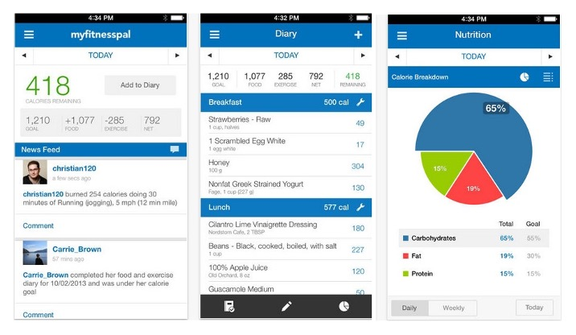

**Figure 2** MyFitnessPal's User Interface<br><br>

MyFitnessPal is not tennis specific. However, it is a popular fitness app that allows users to track workouts, set fitness goals, and log nutrition. Tennis players can use the app to monitor their overall fitness and nutrition. **Figure 2** displays MyFitnessPal's user interface.

#### Some of the pros of MyFitnessPal include:

1. Diverse fitness content.

2. User engagement.
   
   - MyFitnessPal offers interactive features like challenges, social sharing, and a  community forum to keep users engaged and motivated.

3. Comprehensive tracking.

4. Personalisation.
   
   - MyFitnessPal gives users personalised workout recommendations and nutrition plans based on their goals and preferences.

5. Wide user base.

#### Some of the cons of MyFitnessPal include:

1. Lack of sport specific content.
   
   - MyFitnessPal does not offer fitness programs specifically aimed at tennis players.

2. Limited tennis resources.

3. Performance analytics for tennis.

4. Accessibility to novices.

#### Areas of Improvement:

1. Sport specific content.
   
   - MyFitnessPal could provide a dedicated section with tennis-specific content.

2. Tennis performance analytics.

3. User-centric design.
   
   - MyFitnessPal could make their user interface more user-friendly and accessible.

### 2.1.3 TopCourt

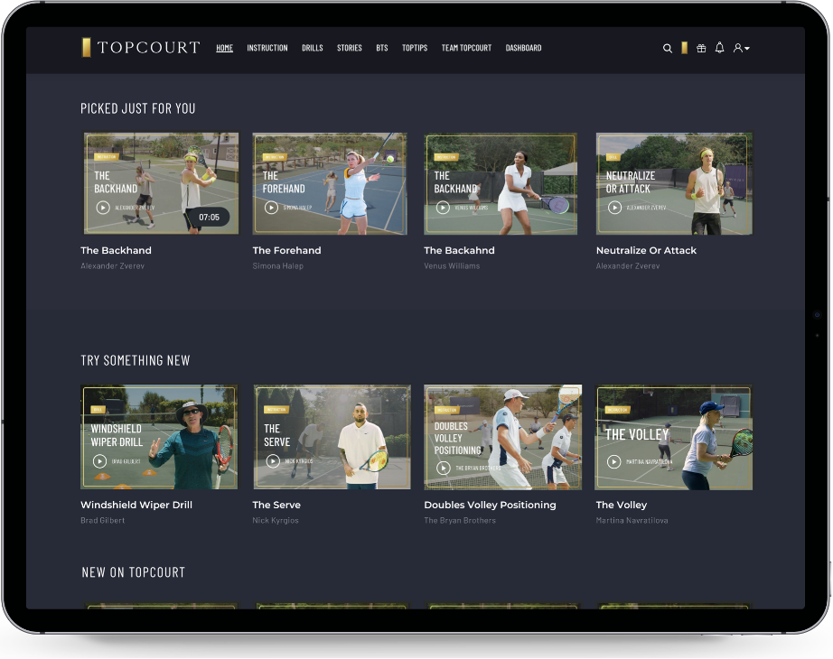

**Figure 3** TopCourt's User Interface<br><br>

TopCourt offers video lessons from professional tennis players. This helps users improve their skill and fitness on the court. It also motivates novice tennis players, since they get the opportunity to learn from the very best. **Figure 3** displays TopCourt's user interface.

#### Some of the pros of TopCourt include:

1. High-quality tennis content.

2. Professional instruction.
   
   - TopCourt allows users to learn from world-class tennis players and coaches.

3. Skill development.

4. Diverse content.
   
   - TopCourt offers content not only pertaining to tennis technique but content centred around fitness, mental preparation, and other important aspects of tennis.

5. User progress tracking.

#### Some of the cons of TopCourt include:

1. Premium-only content.

2. Limited user interaction.

3. Quite expensive, especially for those new to the sport, and aren't sure if it is a sport that they will enjoy.

#### Areas of Improvement:

1. Free and affordable content.
   
   - TopCourt could consider offering a mix of free and premium content to cater to a broader audience, ensuring accessibility for users with varying budgets.

2. Social features and community.

### 2.1.4 Nike Training Club

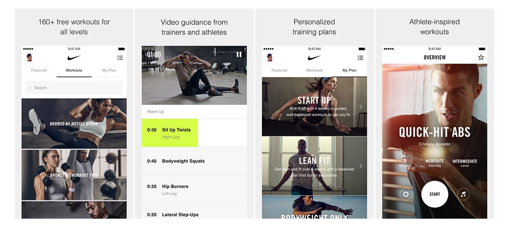

**Figure 4** Nike Training Club's User Interface<br><br>

Nike Training Club is a general fitness app that offers a variety of workout routines, including some designed for specific sports. Tennis players are able to use the app to find workouts that focus on agility, strength, and endurance. **Figure 4** displays Nike Training Club's user interface.

#### Some of the pros of Nike Training Club include:

1. High-quality workouts.

2. Diverse exercises.
   
   - Nike Training Club offers a diverse set of workouts including strength training, cardio, yoga, and the like, catering to a broad fitness audience.

3. User-friendly interfaces.

4. Personalisation.

5. Community and challenges.
   
   - Nike Training Club users can participate in challenges and engage with the Nike Training Club community, promoting motivation and accountability.

### Some of the cons of Nike Training Club include:

1. Non-tennis specific / lack of tennis exercises.

2. Performance tracking.

3. Tailoring to novices.
   
   Nike Training Club offers workouts for all fitness levels, however it does not specifically tailor content to novice tennis players who need foundational instruction.

#### Areas of Improvement

1. Nike Training Club could offer sport-specific tennis content.

2. Nike Training Club could have tennis and novice-friendly content.

## 2.2 Techniques and methods

*Exploring the various software libraries, algorithms, and research methodologies.*

### 2.2.1 The theory

*Exploring tennis novice linear progression.*

[Section 1.1](#11-introduction-and-background) delineated the fundamental features and principles of Novice LP. Now, the focus shifts to customising and applying these concepts to the realm of tennis. This brings us to the definition of tennis novice linear progression (TNLP)- a program that I have created based on Novice LP. TNLP represents a structured and incremental approach to skill development for novice tennis players. It places emphasis on foundational strokes, court awareness, fitness, and overall improvement in tennis proficiency. TNLP is built upon five core principles:

1. Fundamental tennis strokes
2. Linear progression in skill development
3. Structured training sessions
4. Cardiovascular endurance and agility
5. Progress tracking

#### 2.2.1.1 Fundamental tennis strokes

*The 'basic movements' of Novice LP.*

The first core principle of TNLP encompasses the fundamental tennis strokes, namely the groundstrokes—forehand and backhand—and the serve. In order for novices to succeed in tennis, they must fully grasp the foundational shots. A good foundation leads to a more well-rounded tennis player.

#### 2.2.1.2 Linear progression in skill development

*The 'linear progression' of Novice LP.*

While linearity in Novice LP involves an incremental increase in weight per workout, promoting strength development, in TNLP, it denotes continuous skill enhancement through consistent practice. This is achieved through the gradual increase in the complexity of tennis drills and exercises. Thus resulting in systematic progression through skill levels. TNLP encourages regular practice sessions to reinforce fundamental techniques and build muscle memory. TNLP hones in on the notion that "*repetition is the key*" [9]. This notion will be better understood when the laws of muscle memory are explored in [section 2.3.1](#231-the-laws-of-muscle-memory).

#### 2.2.1.3 Structured training sessions

*The 'three workouts per week' of Novice LP.*

Novice LP used three workouts per week to gradually increase the novices strength while allowing for recovery. In terms of TNLP, structured tennis sessions are utilised to build muscle memory, so that (tennis) strokes can become instinctual. This is also linked to the laws of muscle memory.

#### 2.2.1.4 Cardiovascular endurance and agility

*The 'simple structure' of Novice LP.*

The structure of Novice LP is simple in nature, allowing users to "*develop a strong foundation and learn proper lifting techniques*" [16]. This foundation is what enables novices to build strength and muscle mass. In terms of fitness for tennis, cardiovascular endurance and agility are key. Tennis matches do not have a set time and can go on for hours at a time. The tennis court is quite big, and points are typically won by making use of its angles. These features calls for a strong foundation in agility and good stamina. Though it is unlikely for novices to play against others novices who have the skills to make use of the whole tennis court, this a fundamental skill that is needed for their journey as a tennis enthusiast and amateur.

#### 2.2.1.5 Progress tracking

*The 'goal-orientated' of Novice LP.*

Novice LP makes use of progress tracking to linearly increase weight, and monitor a novice's progress. In TNLP, setting goals is imperative. The exercises and practices may seem repetitive, but they are necessary for building muscle memory and improving technique. Being goal-orientated allows users to focus on what is important and remember their reasons for picking up tennis.

### 2.2.2 Software libraries

The libraries and technologies that will be used in this project are as follows:

*Though this is subject to change due to unforeseeable circumstances.*

- **Frontend**
  
  - Figma
    
    - For wireframing, ideation, and creating a design system.
  
  - HTML, CSS / SCSS, Bootstrap, JavaScript
    
    - For styling and user interactivity.
    
    - Though other frameworks such as React may end up being used in conjunction.

- **Backend**
  
  - Django
    
    - To serve static assets and handle API requests from the frontend.
    - Used to connect the database, and for other backend functionality.
    - To enhance the backend capabilities.

- **Database**
  
  - PostgreSQL
    - To store all the data needed for SixLove's functionality.

- **Version Control**
  
  - Git
    - To keep track of changes and monitor SixLove's progress.

## 2.3 External research studies

*Diving into external research to increase the effectiveness of SixLove.*

### 2.3.1 The laws of muscle memory

*From beginners luck to second nature.*

As mentioned in [section 2.2.1](#221-the-theory),TNLP is centred around this idea of muscle memory.  Therefore in order to gain a deeper understanding of the concept it is imperative to consider the laws of muscle memory. The laws of muscle memory as stated in Archie Dan Smith's "*Muscle Memory Application to Tennis*" paper are the following:

1. "*Your tennis strokes are due to muscle memory.*

2. *Muscle memory is the result of permanent changes in the brain, nerves, and muscles.*

3. *Permanent changes occur through repetition in a concentrated period of time.*

4. *Repetition by doing it right in practice is how you hit good strokes during a match.*

5. *Learning different patterns back to back may cause forgetting of the initial one.*

6. *Once your muscle memory is in place it “forgets” slowly, if at all.*

7. *The temporary improvement that occurs during practice or matches should not be considered learning, but rather a transient performance effect*."[11]

The laws of muscle memory will not be addressed in too much detail in this report, since at this stage it isn't necessary to do so. However, these laws illustrate why many of the principles of TNLP are focused around this idea of mastering the fundamentals, repetition and consistency. When creating TNLP I made sure to take into account these laws and Novice LP. TNLP is a concept that requires dedicated use, however if one is free to apply their self, they can improve quickly in tennis as opposed to when taking a more traditional approach (this will be discussed further in the final report). 

# 3 Project Design

## 3.1 Project structure

*Getting into the specifics: tackling the overall structure and important technologies and/or methods.*

### 3.1.1 Wireframing

The wireframing and design in SixLove utilises a mobile first approach. This approach  is used since a vast majority of the SixLove app users will be accessing the app from their phone- due to the nature of the app. People are more likely to tracks things on their mobile devices as opposed to a desktop device.

**Figure 5** displays SixLove's landing page, login page, and sign up page. The designs are quite rudimentary (for now), since the focus was on designing for optimal app functionality. **Figure 5** displays the first iteration for the aforementioned pages. The next iteration for these pages will be making adjustments to the size of input elements and font-size.

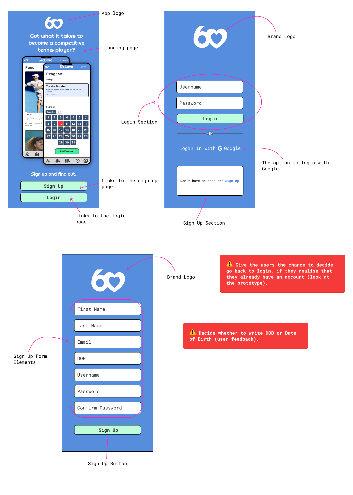

**Figure 5** SixLove's Landing, login, and signup pages.<br><br>

**Figure 6** displays SixLove's profile page and settings page. This too is the 1st iteration. The figures highlights the decisions to be made between the two settings logo based on any user feedback.  The settings icon on the left seems to be a lot more intuitive, however the other icon is fairly prevalent in apps that are commonly used.

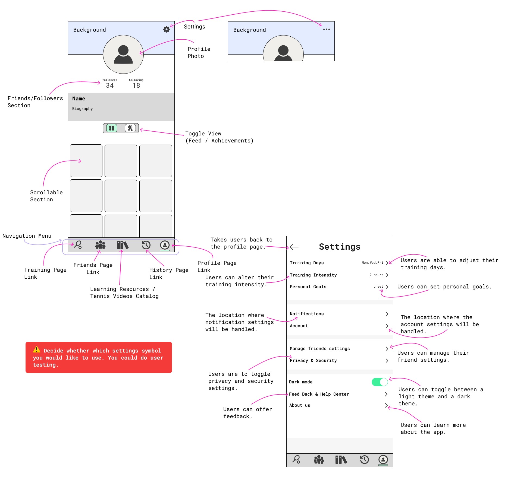

**Figure 6** SixLove's profile and settings pages.<br><br>

**Figures 7 to 9** display SixLove's tennis program page. Each figure represents an iteration. **Figure 7** was the first iteration of the page and **figure 9** the most recent. The annotations on the figures themselves explain why certain changes were made, but in general the goal was to increase the accessibility of the design based on the user feedback. The `+` buttons in the day boxes of the calendar were brought about as a concern. Therefore the following iterations, were primarily focused on the size of input elements and making the app more accessible.

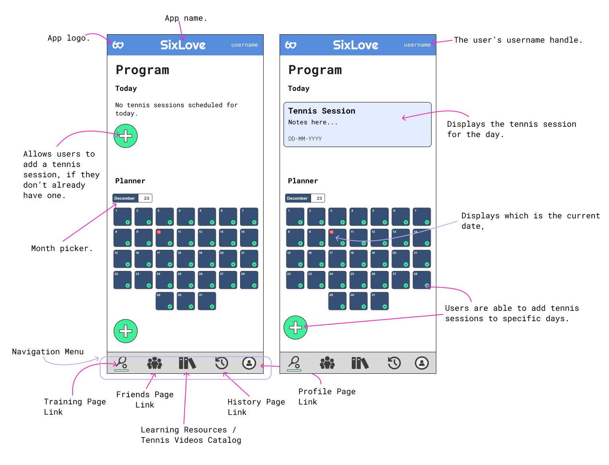

**Figure 7** SixLove's tennis program page (1st iteration).<br><br>

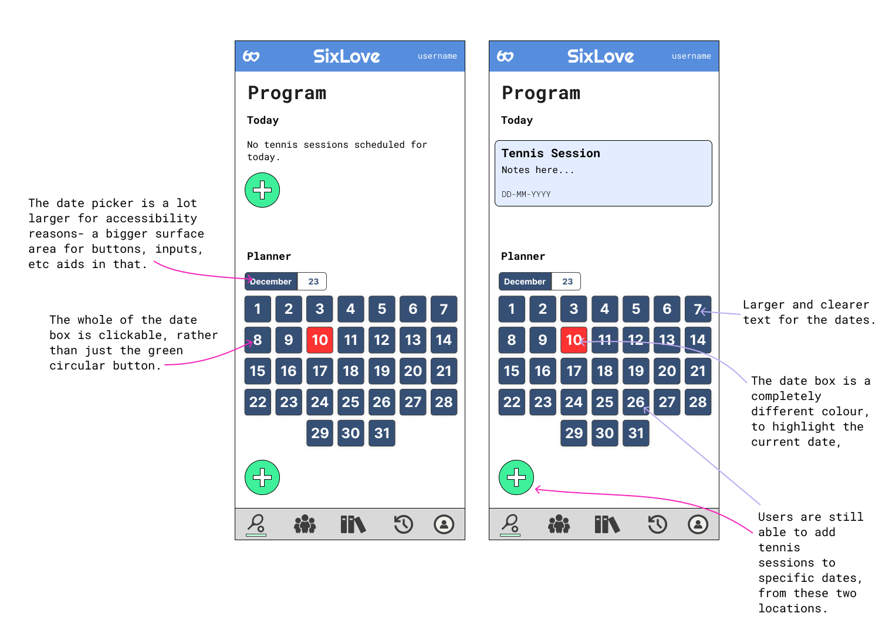

**Figure 8** SixLove's tennis program page (2nd iteration).<br><br>

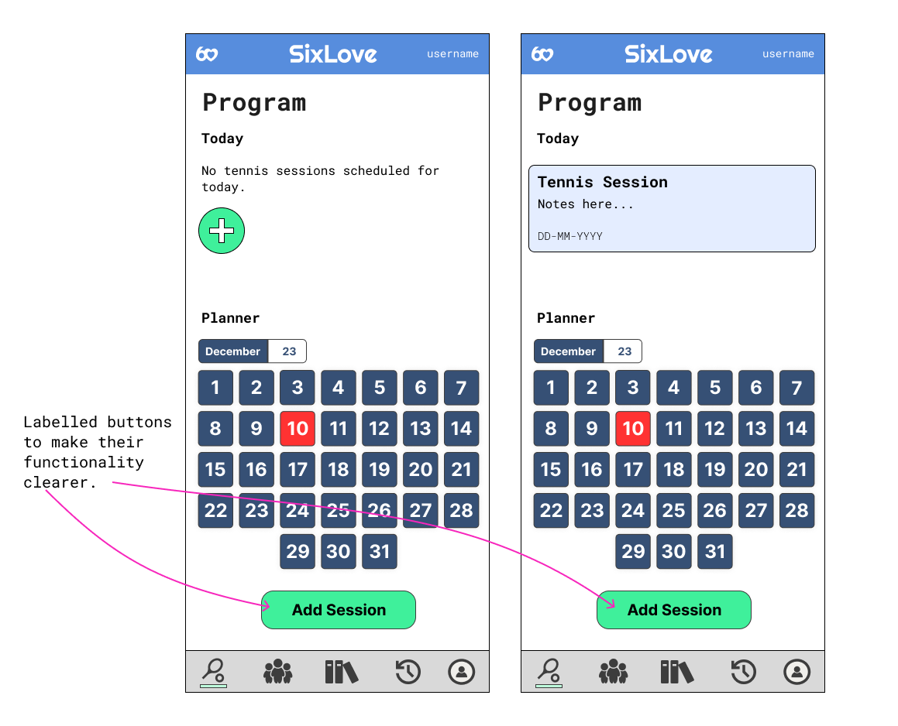

**Figure 9** SixLove's tennis program page (3rd iteration).<br><br>

**Figure 10** displays SixLove's learning resources page, the aim of this page is to be a hub of information for users so that SixLove can be a sort of one stop shop. It was found that many people prefer to have all their functionality is one place, rather than in many places. Providing users with this bundled functionality aids in increasing their user experience.

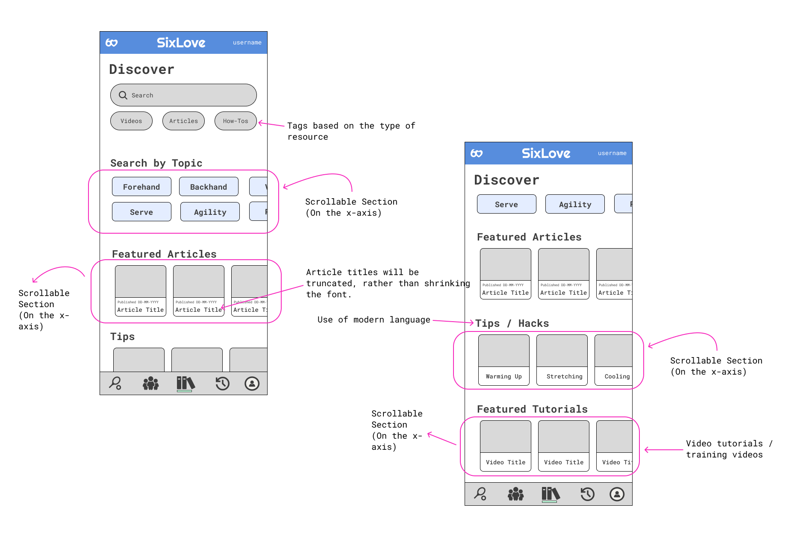

**Figure 10** SixLove's learning resources page.<br><br>

**Figure 11** displays SixLove's history page. The design is quite elementary since it is in its first iteration. The goal of the page is to allow users to look at their past tennis sessions. But rather than just listing them there, a date input is provided so that they can filter for specific days.

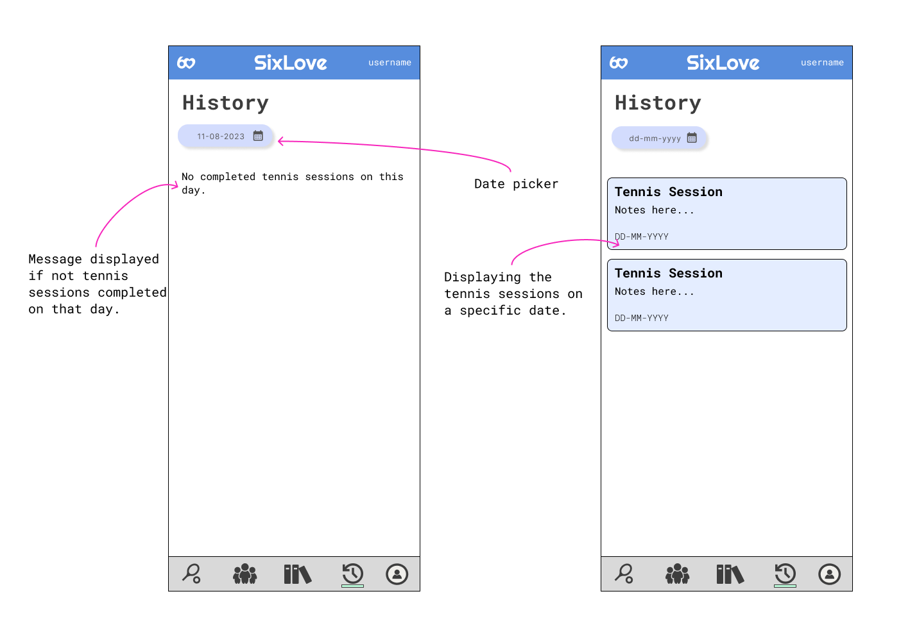

**Figure 11** SixLove's history page.<br><br>

**Figure 12** displays SixLove's feed page. This is an important part of the app. It was essential to hone in on the community aspect of sports and fitness. Community is something that is integral in our lives and impacts us greatly. It was found that people who were "*actively involved in initiatives utilising community engagement approaches experienced positive benefits, in terms of physical and emotional health and well-being, self-confidence, self-esteem, social relationships and individual empowerment*" [17]. Therefore incorporating community in a sports app seemed fitting.

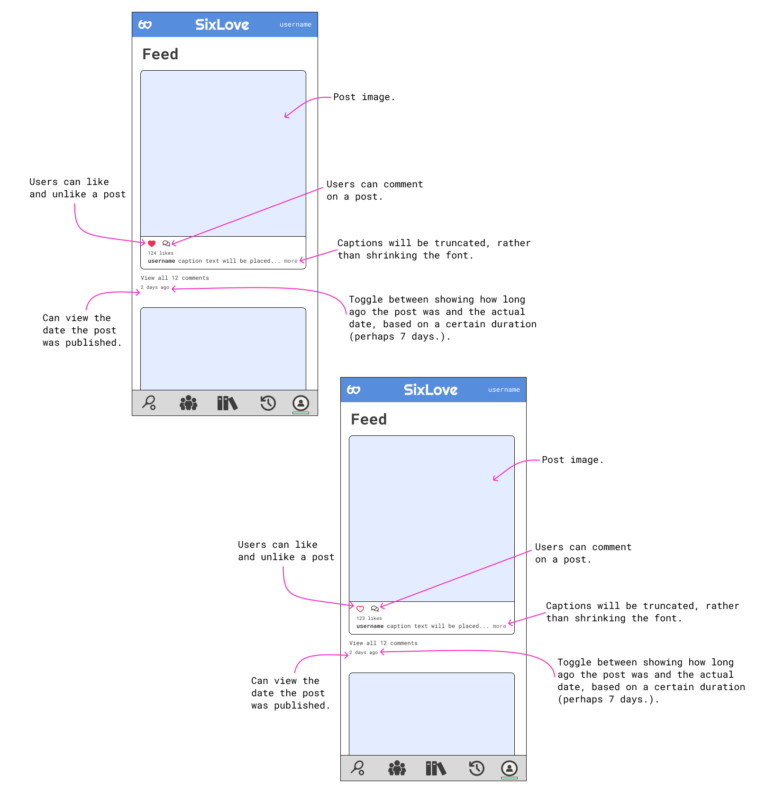

**Figure 12** SixLove's feed page.<br><br>

### 3.1.2 Entity-Relationship Diagram

 **Figure 13** displays the entities and relationships that the SixLove app will potentially / initially have. Here is a brief summary of some of the potential relationships:

- Each user can have multiple posts, followers, tennis sessions, and history entries.

- Each post belongs to a user.

- Each follower relationship connects two users.

- Each tennis session belongs to a user.

- Each history entry records a user's completion of a tennis session.

- Each feed entry connects a user to a post.

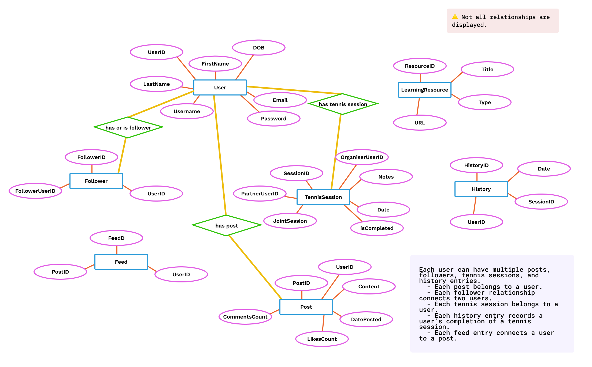

**Figure 13** The project's Entity Relationship Diagram.<br><br>

### 3.1.3 Database Tables

**Figure 14** displays a tabular version of the entity relation diagram, while highlighting the primary keys and foreign keys. It was important to establish a database schema earlier on in the process, since it can be altered further down the line, and the SixLove application relies heavily on data.

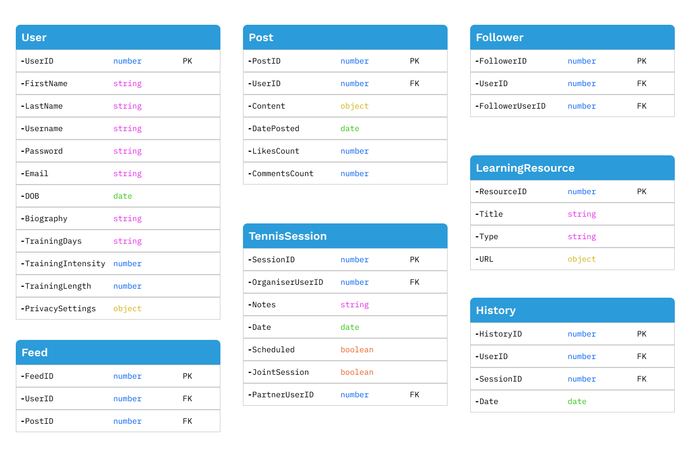

**Figure 14** The project's UML Diagram.<br><br>

### 3.1.4 SixLove Pages

Though the entities, relationships, and design of the project have been showcased, the app's structure in terms of pages has yet to be addressed.

The SixLove app will have the following pages:

- Profile page
  - This displays the users posts, and biography.
  - It also displays the users followers and following.
  - Users are able to toggle between viewing their posts and viewing their achievements / awards.
  - There is also a button that links to the setting page.
- Tennis page
  - Displays the users tennis schedule, and  whether or not they have a tennis session scheduled for today or not.
  - Tennis sessions are displayed as a card, with notes and a date.
  - Displays a calendar that allows users to add tennis sessions to their schedule.
  - Users can click on a day to add a tennis session, and to see what sessions are already there.
- Learning page
  - This pages gives users access to a variety of resources pertaining to tennis.
  - These resources can be in the form of links, blog posts, and links to videos etc.
- History page
  - Displays a date picker (when no date is selected, yesterday's date is selected).
  - Users can use the date picker to select past days, and see what sessions they have completed.
- Feed page
  - Since users can follow / friend other users, the feed page displays the user’s post and the post of those they are following.
  - Users can like, comment, and interact with posts.
- Setting page
  - Users can alter their training days, intensity, plan length.
  - Users can alter their biography, picture, and privacy settings.
  - User can alter their email etc.
- Other pages
  - Login page
  - Sign up page
  - Landing page for when users first reach the site.
- Onboarding
  - When users sign up, they will get asked to pick their training days, intensity, and plan length. 
  - Then tennis sessions will be assigned accordingly. (Tennis sessions can also be joint).
  - Users also have the option to pick pre selected training schedules based on research.

## 3.2 Work plan

*My project roadmap.*

**Figure 15** displays the SixLove's Gantt chart that contains all the major tasks and when they should be completed. Most tasks are given a duration of at least 4 to 7 days. The chart also doesn't allow work to be assigned on the weekends, and weekends are not accounted for when displaying how many days a task has been given.

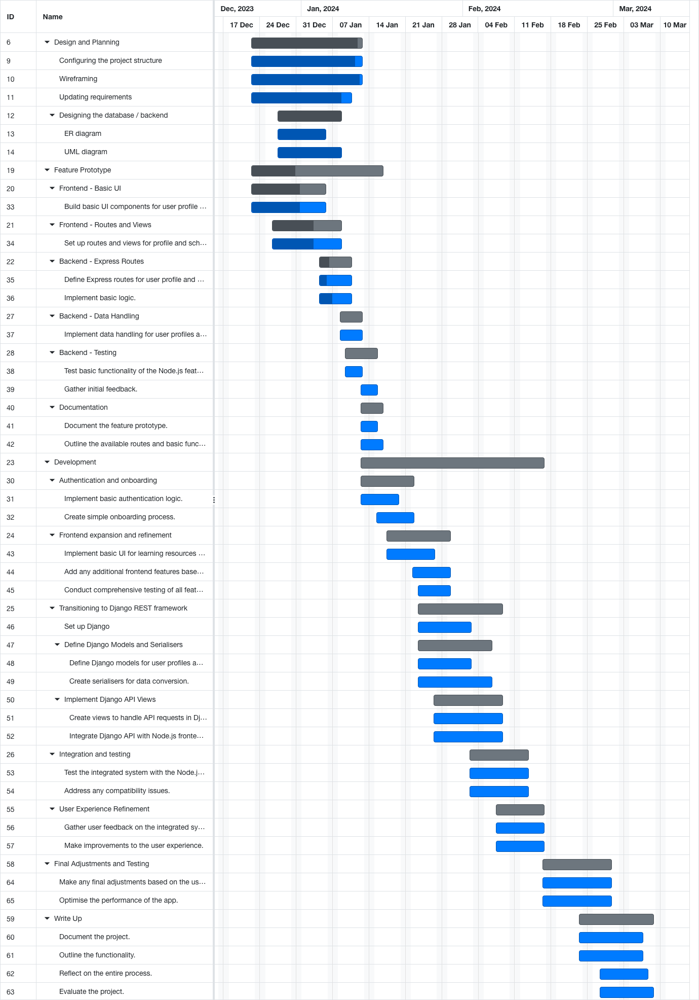

**Figure 15** The project's Gantt Chart.<br><br>

## 3.3 Evaluation strategy

*Now that there is a plan, how will I test and evaluate the project progress?*

SixLove  will be evaluated using four categories which are as follows:

- Functionality
  
  - Functionality refers to functionality testing which is where all features (up to the point at which evaluation is ensued) are evaluated based on whether they work as intended.
  
  - Different scenarios will be tested, including but not limited to, valid and invalid inputs, performing certain tasks, etc.

- Usability
  
  - Usability refers to usability testing, which will be focused on ensuring that the SixLove app is user-friendly, intuitive, and accessible.
  
  - Other forms of user testing can be performed in conjunction, such as:
    
    - User acceptance testing.
    
    - Task evaluation- how well users are able to complete key tasks.

- Performance
  
  - The performance of SixLove will be tested by checking its responsiveness and load times.

- Goals (aims and objectives) accomplished
  
  - The SixLove app will be evaluated against it's initial aims and objectives (and requirements).
  
  - It will be decided whether or not SixLove delivered the planned functionality (or how much of its functionality has been completed).

# 4 The Implementation

*Implementation review.*

The features that the prototype focuses on are user authentication and the ability to add tennis sessions. These two requirements play a crucial role in the functionality of the SixLove app. SixLove's purpose is to allow its users to keep track of their tennis sessions, follow a training schedule, and feel a sense of community. User authentication is needed for this to work. Users can only keep track of their sessions if they are able to log in. In addition, users should only be able to access their tennis sessions and no other users (other than in the case of joint sessions). User authentication is also necessary for the community aspect. Users need to login to connect with their friends and communicate with others. Tennis sessions are the core of the app. Users must be able to add tennis sessions to their planner, and also view what they have scheduled for the day.

The prototype works quite well. Users can log in and add tennis sessions- but there is still a lot of room for improvement. When the user is adding a tennis session, they click a button that displays a modal / popup that allows them to add a title and notes for their tennis session. The user can then finalise their creation by clicking the add session button. When this action is complete a tennis session is added to the page, however the user must click the close button to close the modal, it doesn't close automatically- this makes for bad user experience. There also needs to be a visual way to display to the user that they have successfully added a tennis session, if they add the session on a date other than the current date. With that, the generated calendar, should also make it clear when there are sessions scheduled on particular dates.

In terms of user authentication the prototype is quite good, though the next step would be making the sign up process more robust. Users should also be able to sign up / log in using their Google accounts, and the database must take this into account. It is also important to consider appropriate form validation, though there would need to be a balance between being secure and being a nuisance.

The calendar is currently dynamically rendered. The user can change what month they are viewing by utilising the date picker. Though the functionality for this is not yet complete, the goal is for the calendar to be newly rendered whenever a new date is selected (if it is is a different month). However, due to the nature of the html date input, an `onChange` events refers to any valid date- which may not necessarily be the date the user wanted to select. This  would result in an app that displays the calendar for a date not wanted by the user, therefore this is something that must be kept in mind while working on the planner's functionality.

I decided that I wanted to start building SixLove's functionality in a somewhat chronological order. Chronological order referring to the user's flow, for instance, what route will potential users take when navigating the app? That meant starting with the landing page, then moving on to the sign up and login pages, then to the pages that allow the users to add, edit, and delete tennis sessions. I have previously stated SixLove's aims and objectives, and at their very core user authentication and tennis sessions play a huge role in whether the aims and objectives are met, so using this approach made the most logical sense. I must mention however, at this stage my goal was to program the functionality, therefore I did very minimal styling- currently the user interface is not fully fleshed out (or quite minimal- refer to **figures 16** to **23** to see what I mean), and there will be upcoming changes to the wireframes based on user input and accessibility matters.

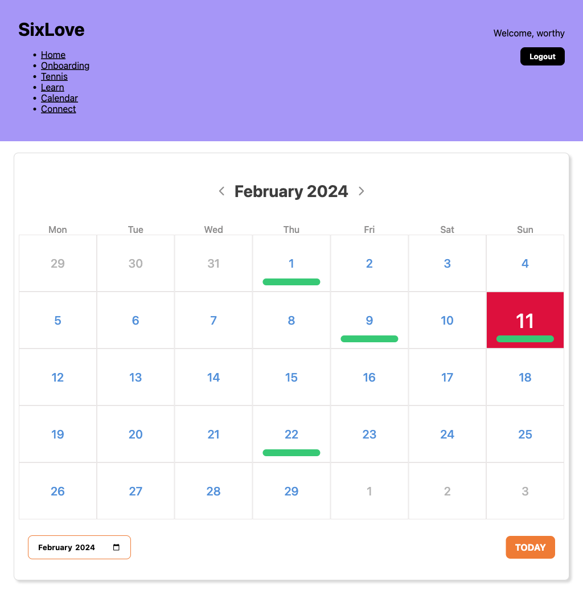

**Figure 16** The project's current calendar page. (Screenshot of the developer tools view to get a view of the whole page- 50% zoom).<br><br>

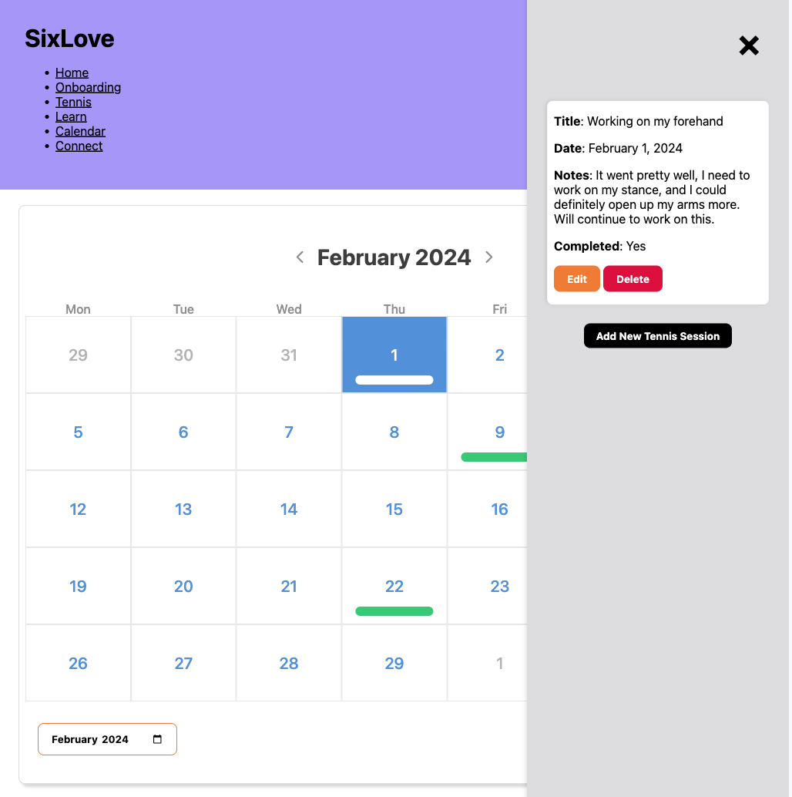

**Figure 17** The project's current side panel for the calendar page. (Screenshot of the developer tools view to get a view of the whole page- 50% zoom).<br><br>

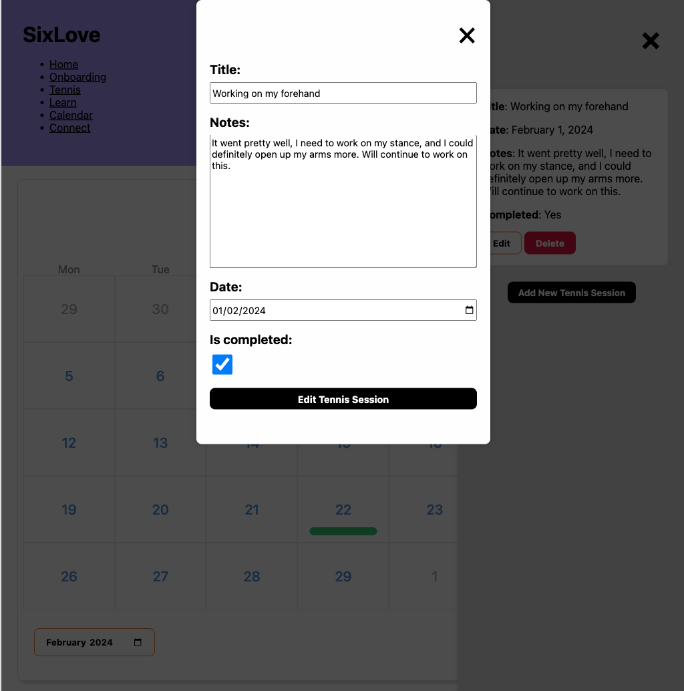

**Figure 18** The project's current edit tennis session popup for the calendar page. (Screenshot of the developer tools view to get a view of the whole page- 50% zoom).<br><br>

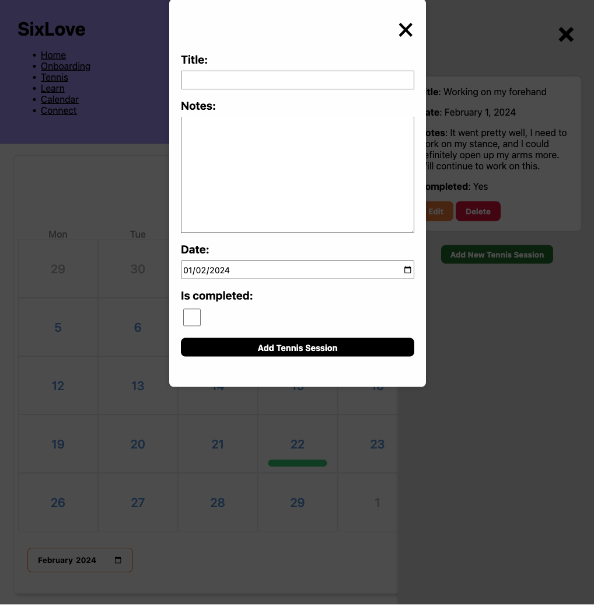

**Figure 19** The project's current add tennis session popup for the calendar page. (Screenshot of the developer tools view to get a view of the whole page- 50% zoom).<br><br>

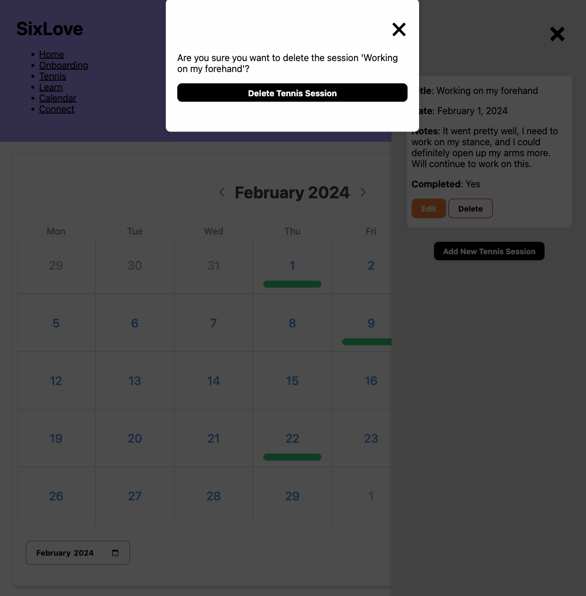

**Figure 20** The project's current delete tennis session popup for the calendar page. (Screenshot of the developer tools view to get a view of the whole page- 50% zoom).<br><br>

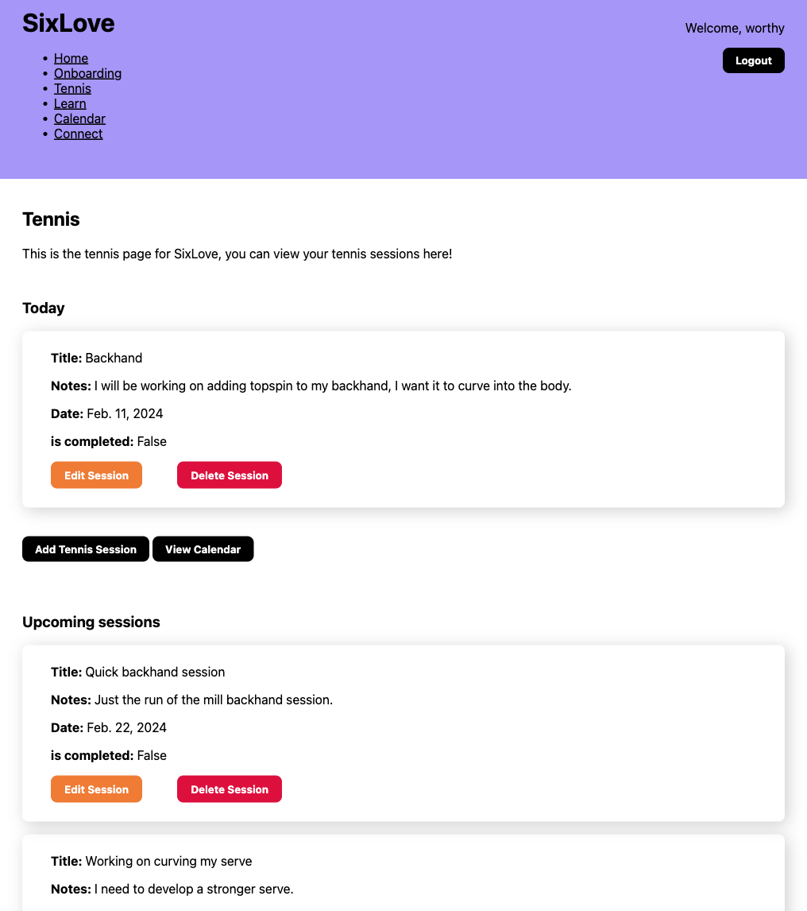

**Figure 21** The project's current tennis page. (Screenshot of the developer tools view to get a view of the whole page- 50% zoom).<br><br>

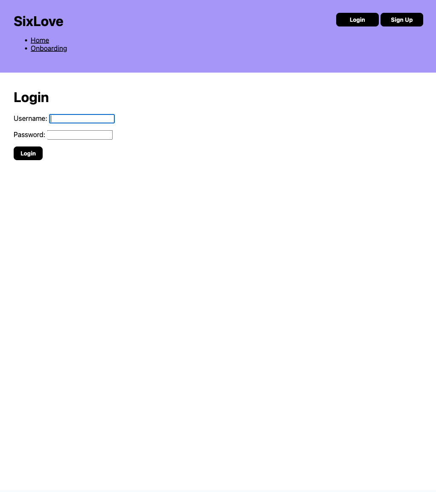

**Figure 22** The project's current login page. (Screenshot of the developer tools view to get a view of the whole page- 50% zoom).<br><br>


**Figure 23** The project's current sign up page. (Screenshot of the developer tools view to get a view of the whole page- 50% zoom).<br><br>

## 4.1 The `registration` app

User authentication is a primary requirement of the app. SixLove's purpose is to allow its users to keep track of their tennis sessions, follow a training schedule, and feel a sense of community. User authentication is needed for this to work. Users can only keep track of their sessions if they are able to log in. In addition, users should only be able to access their tennis sessions and not another user's one (other than in the case of joint sessions). User authentication is housed within the `registration` app. The app has the following pages:

- Home- the page that the user lands on when they navigate to the SixLove web application as a new or logged out user.

- Sign up- the page that allows the user to sign up.

- Onboarding- subject to change, however currently, it is the page that gains information about the user to help create a schedule.

- Login- the page that authenticates the user.

In order to authenticate the users, I needed to first create a table in my database that would store users information. In Django, this is facilitated through the creation of a model. The UML diagram for users can be seen in **figure 14**. Django has its own user model, but for the purpose of this project, I wanted to create my own- or expand upon it rather. It was important that I created the modified user model before making migrations (specifically, before running migrations of the Django `auth` app), since it would result in an `ValueError` . This I learnt the hard way, when I created a mock trial of the app, and was forced to clear all the databases tables and delete the migrations folder. The **code snippet 1** displays the model that I created to store user information. It inherits from the `AbstractUser` class. The official Django site describes the class as a '*model [that] behaves identically to the default user model*' [18]. The documentation advises developers to setup a custom user model beforehand, in case they want to later customise it in the future.

```python
...
class CustomUser(AbstractUser):
    first_name = models.CharField(max_length=50)
    last_name = models.CharField(max_length=50)
    email = models.EmailField(unique=True)
    date_of_birth = models.DateField(null=True, blank=True)
```

**Code Snippet 1** The CustomUser model.<br/><br>

Each attribute displayed in **code snippet 1** corresponds to a field within the database. In addition to the fields displayed, Django will add the other fields that are specified within `AbstractUser`, such as the user's `id` and `password` among some other things. With the database table created, I created a form that uses the `CustomUser` model to create a form with fields that correspond to the models attributes. **Code snippet 2** displays a reduced version of the code for the form.

```python
...
class CustomUserCreationForm(UserCreationForm):
    first_name = forms.CharField(required=True, max_length=50)
    last_name = forms.CharField(max_length=50)
    email = forms.EmailField(required=True)
    date_of_birth = forms.DateField(
        required=False, widget=forms.DateInput(attrs={'type': 'date'}))

    class Meta:
        model = CustomUser
        fields = ('first_name', 'last_name', 'email',
                  'date_of_birth',) + UserCreationForm.Meta.fields
```

**Code Snippet 2** The CustomUserCreationForm form.<br><br>

This form was used to create the forms displayed to the user, for both the login and sign up pages (which can be seen in **figures 22 and 23**). I then created the views corresponding to the pages previously mentioned, **code snippet 3** displays a condensed version of the code for this.

```python
...
def home(request):
    ...
    return render(
        request,
        "./registration/index.html",
        {
            "title": "Home"
        }
    )


def signup(request):
    ...
    if request.method == "POST":
        form = CustomUserCreationForm(request.POST)

        if form.is_valid():
            user = form.save()
            login(request, user)
            return redirect("home")
    else:
        form = CustomUserCreationForm()

    return render(
        request,
        "./registration/signup.html",
        {
            "title": "Sign Up",
            "form": form
        }
    )


def onboarding(request):
    # Similar to the home view.


def user_login(request):
    ...
    if request.method == "POST":
        form = AuthenticationForm(request, request.POST)

        if form.is_valid():
            # The same as the signup view.
    else:
        form = AuthenticationForm()

    return render(
        # Similar to the signup view.
    )
```

**Code Snippet 3** The `registration` app views.<br>

<br>


**Code snippet 3** displays how I use the form create users and authenticate users. I passed the form to a html file (more specifically a Django template file), where it is then rendered (**code snippet 4** shows some of the code for the signup template).

```python
...
<form method="post">
    
    {{ form.as_p }}
    <button type="submit">Sign Up</button>
</form>
...
```

**Code Snippet 4** The `signup` html template.


I created a superuser so that I could create a manual pretest, then I wrote some unit tests to t

## 4.2 The `tennis` app

## 4.3 The `planner` app

Update the above text to highlight the following:

0 Go through all the logs to make sure everything is covered.

0 (The registration app)- User authentication- describe how you achieved this, refer to logs. Explain about other parts of the registration app. Explain why you did what you did.

0 (The tennis app)- The ability to add tennis sessions- describe how you achieved this, refer to logs. Explain about other parts of the tennis app. Explain why you did what you did.

Describe the rest of implementations:

0 The calendar app.

0 The community / connect app- future implementation.

# 5 Evaluation

*Evaluation...*

## 5.1 Unit testing

0 Go into detail about the unit testing that you have conducted, and why you chose particular tests (for instance, `test_calendar_view_loads`). When you were explaining the implementations in the previous section, make sure that you pointed to this section, to go into detail about the tests. (Could be its own section).

## 5.2 Overall project evaluation

Evaluate what stage you are are by evaluating the aims and objectives.

Describe the things that you are currently working on / will start working on (in your case it is the community aspect).

Decide / describe what you will do next.

# 6 Conclusion

*Conclusion...*

Short section: summarise what I have done, or speak about things that hasn’t come up in other sections, or suggest some future work.

# 7 References

*List of all the sources used for this project.*

[1] The Lancet. 8 June 2015. "*Over 95% of the world’s population has health problems, with over a third having more than five ailments*." *ScienceDaily*. [Online]. Available: https://www.sciencedaily.com/releases/2015/06/150608081753.htm [Accessed 29 November 2023]<br>
[2] Peter Schnohr, MD, DMSc, James H. O’Keefe, MD, Andreas Holtermann, PhD, Carl J. Lavie, MD, Peter Lange, MD, DMSc, Gorm Boje Jensen, MD, DMSc, Jacob Louis Marott, MSc. September 04, 2018. "*Various Leisure-Time Physical Activities Associated With Widely Divergent Life Expectancies: The Copenhagen City Heart Study*", *Mayo Clinic Proceedings*, vol. 93, issue 12, pp. 1775-1785. doi: 10.1016/j.mayocp.2018.06.025.<br>
[3] Babette M Pluim, Jack L Groppel, Dave Miley, Miguel Crespo, Michael S Turner.  2018. "*Health benefits of tennis*", *British Journal of Sports Medicine*, vol. 52, issue 3, pp. 201-202. doi: 10.1136/bjsports-2017-098623.<br>
[4] Babette M Pluim, J Bart Staal, Bonita L Marks, Stuart Miller, Dave Miley. November, 2007. "*Health benefits of tennis*", *British Journal of Sports Medicine*, vol. 41, issue 11, pp. 760-768. doi: 10.1136/bjsm.2006.034967.<br>
[5] "*Novice Linear Progression Program Explained*" *Barbell Logic* [Online]. Available: https://barbell-logic.com/novice-linear-progression-explained. [Accessed 29 November 2023]<br>
[6] "*Tennis Beginner vs Intermediate (Main Differences)*" *My Tennis HQ* [Online]. Available: https://mytennishq.com/tennis-beginner-vs-intermediate-main-differences/ [Accessed 29 November 2023]<br>
[7] "*The Starting Strength Program*" *Starting Strength* [Online]. Available: https://startingstrength.com/get-started/programs. [Accessed 30 November 2023]<br>
[8] "*Novice LP: Why We Love It and You Should Too*" *Barbell Logic* [Online]. Available: https://barbell-logic.com/why-novice-linear-progression/. [Accessed 30 November 2023]<br>
[9] Jack Edward. "*How to improve your tennis as an adult - and get the most from coaching*" *Talking Tennis* [Online]. Available: https://talkingtennis.net/blog-posts/how-to-get-improve-your-tennis-as-an-adult-and-get-the-most-from-coaching [Accessed 1 December 2023]<br>
[10] Archie Dan Smith. April, 2018. "*Muscle memory and imagery: Better tennis. An introduction*", *International Tennis Federation: Coaching & Sport Science Review*, issue 74, pp. 22-25. doi: 10.52383/itfcoaching.v26i74.266.<br>
[11] Archie Dan Smith. January, 2018. "*Muscle Memory Application to Tennis*", doi: 10.13140/RG.2.2.12047.69287.<br>
[12] "*TennisPAL*" [Online]. Available: [https://tennispal.com/](https://tennispal.com/) [Accessed 15 November 2023]<br>
[13] "*MyFitnessPal*" [Online]. Available: [https://www.myfitnesspal.com/](https://www.myfitnesspal.com/) [Accessed 15 November 2023]<br>
[14] "*TopCourt*" [Online]. Available: [https://www.topcourt.com/](https://www.topcourt.com/) [Accessed 15 November 2023]<br>
[15] "*Nike Training Club*" [Online]. Available: https://apps.apple.com/gb/app/nike-training-club-fitness/id301521403 [Accessed 15 November 2023]<br>
[16] "*Linear Progression vs. Conjugate Method: Quick Start Guide*" [Online]. Available: [Linear Progression vs. Conjugate Method: Quick Start Guide](https://www.boostcamp.app/blogs/linear-progression-vs-conjugate-method) [Accessed January 2024]
[17] Pamela Attree PhD, Beverley French PhD, Beth Milton PhD, Susan Povall PhD, Margaret Whitehead PhD FFPH, Jennie Popay BA (Hons) MA. 8 December, 2010. "*The experience of community engagement for individuals: a rapid review of evidence*", vol. 19, issue 3, pp. 250-260. doi: 10.1111/j.1365-2524.2010.00976.x.<br>
[18] "*Customizing authentication in Django*" [Online]. Available: [Customizing authentication in Django | Django documentation | Django](https://docs.djangoproject.com/en/5.0/topics/auth/customizing/) [Accessed February 2024]<br>
