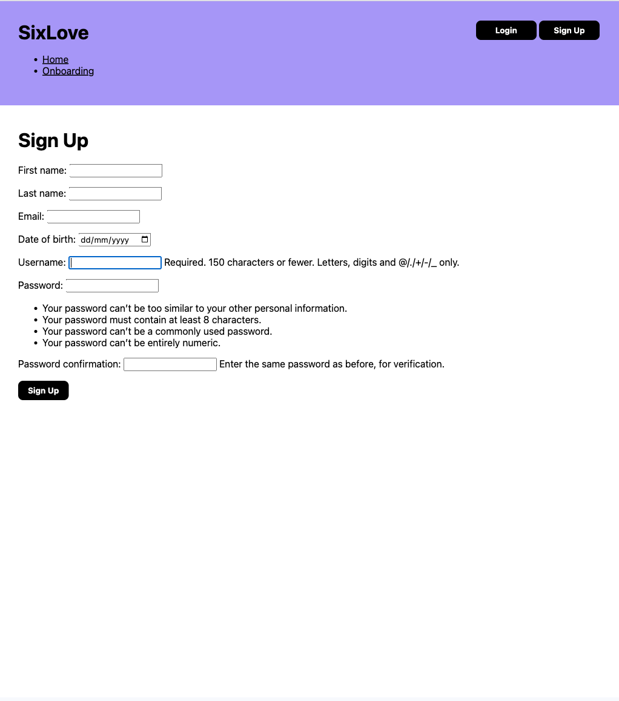

*Draft Report - Final Project (CM3070)*

# SixLove - Can novice linear progression be applied to tennis?

*Taking on the task of creating a tennis app that provides users with the tools to go from novices to confident, well-rounded amateur players.*

<!-- @import "[TOC]" {cmd="toc" depthFrom=1 depthTo=6 orderedList=false} -->

<!-- code_chunk_output -->

- [SixLove - Can novice linear progression be applied to tennis?](#sixlove---can-novice-linear-progression-be-applied-to-tennis)
- [1 Aims, objectives, and background](#1-aims-objectives-and-background)
  - [1.1 Introduction and background](#11-introduction-and-background)
  - [1.2 Concept and motivations](#12-concept-and-motivations)
  - [1.3 Proposed approach](#13-proposed-approach)
    - [1.3.1 Aims](#131-aims)
    - [1.3.2 Objectives](#132-objectives)
- [2 Literature](#2-literature)
  - [2.1 Existing solutions](#21-existing-solutions)
    - [2.1.1 TennisPAL](#211-tennispal)
    - [2.1.2 MyFitnessPal](#212-myfitnesspal)
    - [2.1.3 TopCourt](#213-topcourt)
    - [2.1.4 Nike Training Club](#214-nike-training-club)
  - [2.2 Techniques and methods](#22-techniques-and-methods)
    - [2.2.1 The theory](#221-the-theory)
      - [2.2.1.1 Fundamental tennis strokes](#2211-fundamental-tennis-strokes)
      - [2.2.1.2 Linear progression in skill development](#2212-linear-progression-in-skill-development)
      - [2.2.1.3 Structured training sessions](#2213-structured-training-sessions)
      - [2.2.1.4 Cardiovascular endurance and agility](#2214-cardiovascular-endurance-and-agility)
      - [2.2.1.5 Progress tracking](#2215-progress-tracking)
    - [2.2.2 Software Libraries](#222-software-libraries)
  - [2.3 External research studies](#23-external-research-studies)
    - [2.3.1 The laws of muscle memory](#231-the-laws-of-muscle-memory)
- [3 Project Design](#3-project-design)
  - [3.1 Project structure](#31-project-structure)
    - [3.1.1 Wireframing](#311-wireframing)
    - [3.1.2 Entity-Relationship Diagram](#312-entity-relationship-diagram)
    - [3.1.3 Database Tables](#313-database-tables)
    - [3.1.4 SixLove Pages](#314-sixlove-pages)
    - [3.1.5 Django Structure](#315-django-structure)
  - [3.2 Work plan](#32-work-plan)
  - [3.3 Evaluation strategy](#33-evaluation-strategy)
- [4 The Implementation](#4-the-implementation)
  - [4.1 The `registration` app](#41-the-registration-app)
  - [4.2 The `tennis` app](#42-the-tennis-app)
    - [4.2.1 The MVT Pattern](#421-the-mvt-pattern)
  - [4.3 The `planner` app](#43-the-planner-app)
- [5 Evaluation](#5-evaluation)
  - [5.1 Unit testing](#51-unit-testing)
    - [5.1.1 The `registration` app](#511-the-registration-app)
    - [5.1.2 The `tennis` app](#512-the-tennis-app)
    - [5.1.3 The `planner` app](#513-the-planner-app)
  - [5.2 Overall project evaluation](#52-overall-project-evaluation)
    - [5.2.1 Proposed changes](#521-proposed-changes)
- [6 Conclusion](#6-conclusion)
- [7 References](#7-references)

<!-- /code_chunk_output -->

# 1 Aims, objectives, and background

## 1.1 Introduction and background

*Taking you back to the beginning.*

Health is wealth- a sentiment echoed by millions across the globe. However, according to *ScienceDaily* over "*95% of the world's population [have] health problems*" [1]. Though we cannot single-handedly gift health to 95% of the world, as fellow humans we have a duty to help facilitate the process of getting healthy. Now where does tennis fit into all this? Tennis is a great sport for those wanting to improve their health. It does not bear the initial intimidation of going to the gym for the first time, but also allows for social interaction. Most important to note is that tennis allows those playing it to improve their cardiovascular endurance, agility, and coordination- it provides a full body workout. *Mayo Clinic Proceedings* published a study (The Copenhagen City Heart Study) in which it was found that tennis players added 9.7 years to their lives in comparison to sedentary individuals [2]. An article published in the *British Journal of Sports Medicine* found that playing tennis for 3 hours a week reduced your risk of heart disease by 56%[3]. Tennis was also found to be linked to "*improved aerobic fitness, a lower body fat percentage, a more favourable lipid profile, reduced risk for developing cardiovascular disease, and improved bone health*" [4].

## 1.2 Concept and motivations

*Formally specifying the how.*

The template chosen for this project is the 'CM3055 Interaction Design: Introducing novices to strength' template. I will be creating an app entitled 'SixLove'. This project is centred around novice linear progression. Novice linear progression (Novice LP) is defined as a program where "*weight on the bar increases, linearly, every workout for each lift*" [5]. What makes Novice LP so potent is that it provides a simple and structured approach for novices, allowing them to build strength efficiently and safely. What does this mean in practice? Novice LP can be be summarised into five key features / principles:

1. Basic movements
2. Linear progression
3. Three workouts per week
4. Simple structure
5. Goal-orientated

Basic movements refers to this idea of the fundamentals. This feature allows novices to learn the elemental barbell exercises, thus building the foundation required for strength. Linear progression represents the linear nature of the program (as defined earlier). This linearity helps to stimulate muscle growth and strength gains. The program is implemented three days a week "*on non-consecutive days, i.e. Mon/Wed/Fri, Tues/Thurs/Sat or similar*" [7]- allowing for sufficient recovery. Novice LP is simple in its nature with an emphasis on using a small number of exercises and sets, making it accessible for novices. Goal-orientated points to novices being encouraged to set specific and measurable strength goals- helping them stay motivated and track their progress.

The real challenge of this project, is taking the fundamental principles of this technique and applying it to tennis. (In [Section 2.2.1](#221-the-theory), an exploration will be undertaken to elaborate on how these principles will be tailored and applied to tennis). In greater detail, the idea is to create an application that helps take users from novices to confident, well-rounded amateur tennis players. Well, what is a novice tennis player? Or rather, what is an amateur tennis player? How is that any good? In the world of tennis, a novice tennis player refers to a beginner. Whereas an amateur tennis player refers to anything upwards of and including intermediate, so long as they are not professional- though these definitions can change based on the source. For the purpose of this project, a novice tennis player is an individual completely new to tennis, and an amateur tennis player is an individual who has learnt the basics but may still need to "*develop their shots and learn more about tactics*" [6]. 

It is now relatively simple to infer the users that this project was conceptualised for- they include but are not limited to:

- Novice tennis players
- Tennis enthusiasts
- Fitness enthusiasts
- Aspiring amateur tennis competitors

With the mention of the users comes the project domain. Though alluded to and specified earlier, the domain can broadly be described as '*novice tennis training*'. Expanding upon that, this project will result in the creation of a web based application that is centred around guiding individuals with little or no tennis experience through a structured tennis training program.

## 1.3 Proposed approach

*Breaking down how I will go about this project.*

### 1.3.1 Aims

*Goals for the development of SixLove and for its evaluation.*

1. **Comprehensive training program**
   - SixLove should provide a structured and comprehensive training program.
   - SixLove should facilitate novice players with the gaining of the fundamental tennis strokes and skills.
   - SixLove users should have access to resources to support learning and improving technique.
2. **User engagement and community building**
   - SixLove should create a sense of community with the use of social features.
   - SixLove users should be able to connect, share achievements, and engage in joint training sessions.
3. **Customisation and personalisation**
   - SixLove users should be able to track their progress.
   - SixLove users should be able to add tennis sessions and create their own schedule.
4. **User-friendly interface and accessibility**
   - SixLove's design should be intuitive and visually appealing.
   - SixLove's design should ensure accessibility for a wide range of users.

### 1.3.2 Objectives

*The core objectives of SixLove.*

1. **Skill development**
   - Provide a structured training program covering fundamental tennis strokes.
2. **User engagement and social interaction**
   - Implement user authentication and profiles, displaying achievements and progress.
   - Enable users to connect with each other.
   - Facilitate tennis session management, allowing joint tennis sessions.
3. **Customisation and personalisation**
   - Allow users to track progress.
   - Allow users to add their own tennis sessions.
4. **User interface (UI/UX)**
   - Design an intuitive and visually appealing interface.
   - Ensure a dynamic and responsive UI for an enhanced user experience.
5. **Community engagement**
   - Create an activity stream showcasing friends' achievements and posts.

# 2 Literature

*What has been done and what is to come.*

## 2.1 Existing solutions

*Scoping out the current market.*

### 2.1.1 TennisPAL


**Figure 1** TennisPAL's User Interface<br><br>

TennisPAL is an app designed specifically for tennis players. It includes features for finding tennis partners and tracking match scores. It also allows users to improve their game through training exercises. **Figure 1** displays TennisPAL's user interface.

#### Some of the pros of TennisPAL include:

1. Simple, easily digestible user interface.

2. Social features.
   
   - TennisPAL provides a platform for tennis enthusiasts to connect with fellow players, schedule matches, and build a community.

3. Court locator.
   
   - TennisPAL allows users to find nearby tennis courts, while also providing information about their availability.

4. Match tracking.
   
   - TennisPAL allows its users to track match scores and stats.

5. In-app messaging.
   
   - TennisPAL offers offers in-app messaging for easy communication between players, which makes it easier to organise matches.

#### Some of the cons of TennisPAL include:

1. Lack of training resources.
   
   - Since TennisPAL's focus is on connecting players and tracking matches, it lacks training resources for novice players.

2. Limited coaching integration.

3. Absence of fitness tracking.

4. Not tailored to novices.

#### Areas of Improvement:

1. Training resources.
   
   - TennisPAL could offer a comprehensive library of tennis exercises and video tutorials, catering to novice players who want to learn and improve their skills.

2. Structured training programs.

3. Warm up and cool down routines.

4. Performance analytics.
   
   - TennisPAL could implement data tracking and analytics to allow users to monitor their progress which in turn would motivate users.

5. Machine learning recommendations.

### 2.1.2 MyFitnessPal


**Figure 2** MyFitnessPal's User Interface<br><br>

MyFitnessPal is not tennis specific. However, it is a popular fitness app that allows users to track workouts, set fitness goals, and log nutrition. Tennis players can use the app to monitor their overall fitness and nutrition. **Figure 2** displays MyFitnessPal's user interface.

#### Some of the pros of MyFitnessPal include:

1. Diverse fitness content.

2. User engagement.
   
   - MyFitnessPal offers interactive features like challenges, social sharing, and a  community forum to keep users engaged and motivated.

3. Comprehensive tracking.

4. Personalisation.
   
   - MyFitnessPal gives users personalised workout recommendations and nutrition plans based on their goals and preferences.

5. Wide user base.

#### Some of the cons of MyFitnessPal include:

1. Lack of sport specific content.
   
   - MyFitnessPal does not offer fitness programs specifically aimed at tennis players.

2. Limited tennis resources.

3. Performance analytics for tennis.

4. Accessibility to novices.

#### Areas of Improvement:

1. Sport specific content.
   
   - MyFitnessPal could provide a dedicated section with tennis-specific content.

2. Tennis performance analytics.

3. User-centric design.
   
   - MyFitnessPal could make their user interface more user-friendly and accessible.

### 2.1.3 TopCourt


**Figure 3** TopCourt's User Interface<br><br>

TopCourt offers video lessons from professional tennis players. This helps users improve their skill and fitness on the court. It also motivates novice tennis players, since they get the opportunity to learn from the very best. **Figure 3** displays TopCourt's user interface.

#### Some of the pros of TopCourt include:

1. High-quality tennis content.

2. Professional instruction.
   
   - TopCourt allows users to learn from world-class tennis players and coaches.

3. Skill development.

4. Diverse content.
   
   - TopCourt offers content not only pertaining to tennis technique but content centred around fitness, mental preparation, and other important aspects of tennis.

5. User progress tracking.

#### Some of the cons of TopCourt include:

1. Premium-only content.

2. Limited user interaction.

3. Quite expensive, especially for those new to the sport, and aren't sure if it is a sport that they will enjoy.

#### Areas of Improvement:

1. Free and affordable content.
   
   - TopCourt could consider offering a mix of free and premium content to cater to a broader audience, ensuring accessibility for users with varying budgets.

2. Social features and community.

### 2.1.4 Nike Training Club


**Figure 4** Nike Training Club's User Interface<br><br>

Nike Training Club is a general fitness app that offers a variety of workout routines, including some designed for specific sports. Tennis players are able to use the app to find workouts that focus on agility, strength, and endurance. **Figure 4** displays Nike Training Club's user interface.

#### Some of the pros of Nike Training Club include:

1. High-quality workouts.

2. Diverse exercises.
   
   - Nike Training Club offers a diverse set of workouts including strength training, cardio, yoga, and the like, catering to a broad fitness audience.

3. User-friendly interfaces.

4. Personalisation.

5. Community and challenges.
   
   - Nike Training Club users can participate in challenges and engage with the Nike Training Club community, promoting motivation and accountability.

### Some of the cons of Nike Training Club include:

1. Non-tennis specific / lack of tennis exercises.

2. Performance tracking.

3. Tailoring to novices.
   
   Nike Training Club offers workouts for all fitness levels, however it does not specifically tailor content to novice tennis players who need foundational instruction.

#### Areas of Improvement

1. Nike Training Club could offer sport-specific tennis content.

2. Nike Training Club could have tennis and novice-friendly content.

## 2.2 Techniques and methods

*Exploring the various software libraries, algorithms, and research methodologies.*

### 2.2.1 The theory

*Exploring tennis novice linear progression.*

[Section 1.1](#11-introduction-and-background) delineated the fundamental features and principles of Novice LP. Now, the focus shifts to customising and applying these concepts to the realm of tennis. This brings us to the definition of tennis novice linear progression (TNLP)- a program that I have created based on Novice LP. TNLP represents a structured and incremental approach to skill development for novice tennis players. It places emphasis on foundational strokes, court awareness, fitness, and overall improvement in tennis proficiency. TNLP is built upon five core principles:

1. Fundamental tennis strokes
2. Linear progression in skill development
3. Structured training sessions
4. Cardiovascular endurance and agility
5. Progress tracking

#### 2.2.1.1 Fundamental tennis strokes

*The 'basic movements' of Novice LP.*

The first core principle of TNLP encompasses the fundamental tennis strokes, namely the groundstrokes—forehand and backhand—and the serve. In order for novices to succeed in tennis, they must fully grasp the foundational shots. A good foundation leads to a more well-rounded tennis player.

#### 2.2.1.2 Linear progression in skill development

*The 'linear progression' of Novice LP.*

While linearity in Novice LP involves an incremental increase in weight per workout, promoting strength development, in TNLP, it denotes continuous skill enhancement through consistent practice. This is achieved through the gradual increase in the complexity of tennis drills and exercises. Thus resulting in systematic progression through skill levels. TNLP encourages regular practice sessions to reinforce fundamental techniques and build muscle memory. TNLP hones in on the notion that "*repetition is the key*" [9]. This notion will be better understood when the laws of muscle memory are explored in [section 2.3.1](#231-the-laws-of-muscle-memory).

#### 2.2.1.3 Structured training sessions

*The 'three workouts per week' of Novice LP.*

Novice LP used three workouts per week to gradually increase the novices strength while allowing for recovery. In terms of TNLP, structured tennis sessions are utilised to build muscle memory, so that (tennis) strokes can become instinctual. This is also linked to the laws of muscle memory.

#### 2.2.1.4 Cardiovascular endurance and agility

*The 'simple structure' of Novice LP.*

The structure of Novice LP is simple in nature, allowing users to "*develop a strong foundation and learn proper lifting techniques*" [16]. This foundation is what enables novices to build strength and muscle mass. In terms of fitness for tennis, cardiovascular endurance and agility are key. Tennis matches do not have a set time and can go on for hours at a time. The tennis court is quite big, and points are typically won by making use of its angles. These features calls for a strong foundation in agility and good stamina. Though it is unlikely for novices to play against others novices who have the skills to make use of the whole tennis court, this a fundamental skill that is needed for their journey as a tennis enthusiast and amateur.

#### 2.2.1.5 Progress tracking

*The 'goal-orientated' of Novice LP.*

Novice LP makes use of progress tracking to linearly increase weight, and monitor a novice's progress. In TNLP, setting goals is imperative. The exercises and practices may seem repetitive, but they are necessary for building muscle memory and improving technique. Being goal-orientated allows users to focus on what is important and remember their reasons for picking up tennis.

### 2.2.2 Software libraries

The libraries and technologies that will be used in this project are as follows:

*Though this is subject to change due to unforeseeable circumstances.*

- **Frontend**
  
  - Figma
    
    - For wireframing, ideation, and creating a design system.
  
  - HTML, CSS / SCSS, Bootstrap, JavaScript
    
    - For styling, user interactivity, and calendar functionality.

- **Backend**
  
  - Django
    
    - To serve static assets and handle API requests from the frontend.
    - Used to connect the database, query the database, and for other backend functionality.
    - To enhance the backend capabilities.

- **Database**
  
  - PostgreSQL
    - To store all the data needed for SixLove's functionality.

- **Version Control**
  
  - Git
    - To keep track of changes and monitor SixLove's progress.

## 2.3 External research studies

*Diving into external research to increase the effectiveness of SixLove.*

### 2.3.1 The laws of muscle memory

*From beginners luck to second nature.*

As mentioned in [section 2.2.1](#221-the-theory),TNLP is centred around this idea of muscle memory.  Therefore in order to gain a deeper understanding of the concept it is imperative to consider the laws of muscle memory. The laws of muscle memory as stated in Archie Dan Smith's "*Muscle Memory Application to Tennis*" paper are the following:

1. "*Your tennis strokes are due to muscle memory.*

2. *Muscle memory is the result of permanent changes in the brain, nerves, and muscles.*

3. *Permanent changes occur through repetition in a concentrated period of time.*

4. *Repetition by doing it right in practice is how you hit good strokes during a match.*

5. *Learning different patterns back to back may cause forgetting of the initial one.*

6. *Once your muscle memory is in place it “forgets” slowly, if at all.*

7. *The temporary improvement that occurs during practice or matches should not be considered learning, but rather a transient performance effect*."[11]

The laws of muscle memory will not be addressed in too much detail in this report, since at this stage it isn't necessary to do so. However, these laws illustrate why many of the principles of TNLP are focused around this idea of mastering the fundamentals, repetition and consistency. When creating TNLP I made sure to take into account these laws and Novice LP. TNLP is a concept that requires dedicated use, however if one is free to apply their self, they can improve quickly in tennis as opposed to when taking a more traditional approach (this will be discussed further in the final report). 

# 3 Project Design

## 3.1 Project structure

*Getting into the specifics: tackling the overall structure and important technologies and/or methods.*

### 3.1.1 Wireframing

The wireframing and design in SixLove utilises a mobile first approach. This approach  is used since a vast majority of the SixLove app users will be accessing the app from their phone- due to the nature of the app. People are more likely to tracks things on their mobile devices as opposed to a desktop device.

**Figure 5** displays SixLove's landing page, login page, and sign up page. The designs are quite rudimentary (for now), since the focus was on designing for optimal app functionality. **Figure 5** displays the first iteration for the aforementioned pages. The next iteration for these pages will be making adjustments to the size of input elements and font-size.


**Figure 5** SixLove's Landing, login, and signup pages.<br><br>

**Figure 6** displays SixLove's profile page and settings page. This too is the 1st iteration. The figures highlights the decisions to be made between the two settings logo based on any user feedback.  The settings icon on the left seems to be a lot more intuitive, however the other icon is fairly prevalent in apps that are commonly used.


**Figure 6** SixLove's profile and settings pages.<br><br>

**Figures 7 to 9** display SixLove's tennis program page. Each figure represents an iteration. **Figure 7** was the first iteration of the page and **figure 9** the most recent. The annotations on the figures themselves explain why certain changes were made, but in general the goal was to increase the accessibility of the design based on the user feedback. The `+` buttons in the day boxes of the calendar were brought about as a concern. Therefore the following iterations, were primarily focused on the size of input elements and making the app more accessible.


**Figure 7** SixLove's tennis program page (1st iteration).<br><br>


**Figure 8** SixLove's tennis program page (2nd iteration).<br><br>


**Figure 9** SixLove's tennis program page (3rd iteration).<br><br>

**Figure 10** displays SixLove's learning resources page, the aim of this page is to be a hub of information for users so that SixLove can be a sort of one stop shop. It was found that many people prefer to have all their functionality is one place, rather than in many places. Providing users with this bundled functionality aids in increasing their user experience.


**Figure 10** SixLove's learning resources page.<br><br>

**Figure 11** displays SixLove's history page. The design is quite elementary since it is in its first iteration. The goal of the page is to allow users to look at their past tennis sessions. But rather than just listing them there, a date input is provided so that they can filter for specific days. 

*Side note: the history page will be scrapped in favour of the  calendar having its own page. The tennis page will no longer house the calendar, and history can be seen on both the calendar and tennis pages.


**Figure 11** SixLove's history page.<br><br>

**Figure 12** displays SixLove's feed page. This is an important part of the app. It was essential to hone in on the community aspect of sports and fitness. Community is something that is integral in our lives and impacts us greatly. It was found that people who were "*actively involved in initiatives utilising community engagement approaches experienced positive benefits, in terms of physical and emotional health and well-being, self-confidence, self-esteem, social relationships and individual empowerment*" [17]. Therefore incorporating community in a sports app seemed fitting.


**Figure 12** SixLove's feed page.<br><br>

### 3.1.2 Entity-Relationship Diagram

 **Figure 13** displays the entities and relationships that the SixLove app will potentially / initially have. Here is a brief summary of some of the potential relationships:

- Each user can have multiple posts, followers, tennis sessions, and history entries.

- Each post belongs to a user.

- Each follower relationship connects two users.

- Each tennis session belongs to a user.

- Each history entry records a user's completion of a tennis session.

- Each feed entry connects a user to a post.


**Figure 13** The project's Entity Relationship Diagram.<br><br>

### 3.1.3 Database Tables

**Figure 14** displays a tabular version of the entity relation diagram, while highlighting the primary keys and foreign keys. It was important to establish a database schema earlier on in the process, since it can be altered further down the line, and the SixLove application relies heavily on data.


**Figure 14** The project's UML Diagram.<br><br>

### 3.1.4 SixLove Pages

Though the entities, relationships, and design of the project have been showcased, the app's structure in terms of pages has yet to be addressed.

The SixLove app will have the following main pages:

- Profile page
  - This displays the users posts, and biography.
  - It also displays the users followers and following.
  - Users are able to toggle between viewing their posts and viewing their achievements / awards.
  - There is also a button that links to the setting page.
- Tennis page
  - Displays the users tennis schedule, and  whether or not they have a tennis session scheduled for today or not.
  - Tennis sessions are displayed as a card, with notes and a date.
  - Users can add, edit, view, and delete tennis sessions here.
- Calendar page
  - Displays a calendar that allows users to add tennis sessions to their schedule.
  - Users can click on a day to add, edit, view, and delete a tennis session.
  - Users can use the date picker to navigate to different dates.
- Learning page
  - This pages gives users access to a variety of resources pertaining to tennis.
  - These resources can be in the form of links, blog posts, and links to videos etc.
- Feed page
  - Since users can follow / friend other users, the feed page displays the user’s post and the post of those they are following.
  - Users can like, comment, and interact with posts.
- Settings page
  - Users can alter their biography, picture, and privacy settings.
  - User can alter their email etc.
- Other pages
  - Login page
  - Sign up page
  - Home (Landing) page for when users first reach the site.
- Onboarding
  - When users sign up, they will get asked questions regarding their tennis goals. 

### 3.1.5 Django structure

Since SixLove is built with Django, the project has the following structure (**figure 15**).

```
/project
	/project
		__init__.py
		asgi.py
		settings.py
		urls.py
		wsgi.py
	/community
		/migrations
		/static
		    /community
				scripts/
				styles/
				    _base.scss
					_global.scss
					_mixins.scss
					_variables.scss
					styles.css
					styles.css.map
					styles.scss
				/templates
				    /community
					    base.html
						connect.html
						profile.html
						feed.html
		__init__.py
		admin.py
		apps.py
		models.py
		tests.py
		urls.py
		views.py
	/planner
	    /migrations
		/static
		    /planner
			    scripts/
				    calendar.js
				styles/
				    _base.scss
					_calendar.scss
					_global.scss
					_mixins.scss
					_variables.scss
					styles.css
					styles.css.map
					styles.scss
				/templates
				    /planner
					    base.html
						calendar.html
		__init__.py
		admin.py
		apps.py
		models.py
		tests.py
		urls.py
		views.py
	/registration
		/migrations
		/static
		    /registration
			    scripts/
				styles/
		/templates
			/registration
			    base.html
				index.html
				login.html
				onboarding.html
				signup.html
		__init__.py
		admin.py
		apps.py
		forms.py
		models.py
		tests.py
		urls.py
		views.py
	/tennis
	    /migrations
		/static
		    /tennis
			    scripts/
				styles/
		/templates
		    /tennis
			    base.html
				add_tennis_session.html
				delete_tennis_session.html
				edit_tennis_session.html
				learn.html
				success.html
				tennis.html
		__init__.py
		admin.py
		apps.py
		forms.py
		models.py
		tests.py
		urls.py
		views.py
	manage.py
/venv
.gitignore
```

**Figure 15** The project's structure.<br>

<br>


**Figure 15** displays a parent `project` folder with many children folders that follow a similar structure. An application built with Django is made up of a project that is made up of a collection of apps. A Django project is "*a collection of settings for an instance of Django, including database configuration, Django-specific options and application-specific settings*".

{speak about apps and projects}.

{Django 5}


## 3.2 Work plan

*My project roadmap.*

**Figure 15** displays the SixLove's Gantt chart that contains all the major tasks and when they should be completed. Most tasks are given a duration of at least 4 to 7 days. The chart also doesn't allow work to be assigned on the weekends, and weekends are not accounted for when displaying how many days a task has been given.


**Figure 16** The project's Gantt Chart.<br><br>

## 3.3 Evaluation strategy

*Now that there is a plan, how will I test and evaluate the project progress?*

SixLove  will be evaluated using four categories which are as follows:

- Functionality
  
  - Functionality refers to functionality testing which is where all features (up to the point at which evaluation is ensued) are evaluated based on whether they work as intended.
  
  - Different scenarios will be tested, including but not limited to, valid and invalid inputs, performing certain tasks, etc.

- Usability
  
  - Usability refers to usability testing, which will be focused on ensuring that the SixLove app is user-friendly, intuitive, and accessible.
  
  - Other forms of user testing can be performed in conjunction, such as:
    
    - User acceptance testing.
    
    - Task evaluation- how well users are able to complete key tasks.

- Performance
  
  - The performance of SixLove will be tested by checking its responsiveness and load times.

- Goals (aims and objectives) accomplished
  
  - The SixLove app will be evaluated against it's initial aims and objectives (and requirements).
  
  - It will be decided whether or not SixLove delivered the planned functionality (or how much of its functionality has been completed).

# 4 The Implementation

*Implementation review.*

I decided that I wanted to start building SixLove's functionality in a somewhat chronological order. Chronological order referring to the user's flow, for instance, what route will potential users take when navigating the app? That meant starting with the landing page, then moving on to the sign up and login pages, then to the pages that allow the users to add, edit, and delete tennis sessions. I have previously stated SixLove's aims and objectives, and at their very core user authentication and tennis sessions play a huge role in whether the aims and objectives are met, so using this approach made the most logical sense. I must mention however, at this stage my goal was to program the functionality, therefore I did very minimal styling- currently the user interface is not fully fleshed out (or quite minimal- refer to **figures 17** to **24** to see what I mean), and there will be upcoming changes to the wireframes based on user input and accessibility matters.


**Figure 17** The project's current calendar page. (Screenshot of the developer tools view to get a view of the whole page- 50% zoom).<br><br>


**Figure 18** The project's current side panel for the calendar page. (Screenshot of the developer tools view to get a view of the whole page- 50% zoom).<br><br>


**Figure 19** The project's current edit tennis session popup for the calendar page. (Screenshot of the developer tools view to get a view of the whole page- 50% zoom).<br><br>


**Figure 20** The project's current add tennis session popup for the calendar page. (Screenshot of the developer tools view to get a view of the whole page- 50% zoom).<br><br>


**Figure 21** The project's current delete tennis session popup for the calendar page. (Screenshot of the developer tools view to get a view of the whole page- 50% zoom).<br><br>


**Figure 22** The project's current tennis page. (Screenshot of the developer tools view to get a view of the whole page- 50% zoom).<br><br>


**Figure 23** The project's current login page. (Screenshot of the developer tools view to get a view of the whole page- 50% zoom).<br><br>



**Figure 24** The project's current sign up page. (Screenshot of the developer tools view to get a view of the whole page- 50% zoom).<br><br>

## 4.1 The `registration` app

User authentication is a primary requirement of the app. SixLove's purpose is to allow its users to keep track of their tennis sessions, follow a training schedule, and feel a sense of community. User authentication is needed for this to work. Users can only keep track of their sessions if they are able to log in. In addition, users should only be able to access their tennis sessions and not another user's one (other than in the case of joint sessions). User authentication is housed within the `registration` app. The app has the following pages:

- Home- the page that the user lands on when they navigate to the SixLove web application as a new or logged out user.

- Sign up- the page that allows the user to sign up.

- Onboarding- subject to change, however currently, it is the page that gains information about the user to help create a schedule.

- Login- the page that authenticates the user.

In order to authenticate the users, I needed to first create a table in my database that would store users information. In Django, this is facilitated through the creation of a model. The UML diagram for users can be seen in **figure 14**. Django has its own user model, but for the purpose of this project, I wanted to create my own- or expand upon it rather. It was important that I created the modified user model before making migrations (specifically, before running migrations of the Django `auth` app), since it would result in an `ValueError` . This I learnt the hard way, when I created a mock trial of the app, and was forced to clear all the databases tables and delete the migrations folder. The **code snippet 1** displays the model that I created to store user information. It inherits from the `AbstractUser` class. The official Django site describes the class as a '*model [that] behaves identically to the default user model*' [18]. The documentation advises developers to setup a custom user model beforehand, in case they want to later customise it in the future.

```python
...
class CustomUser(AbstractUser):
    first_name = models.CharField(max_length=50)
    last_name = models.CharField(max_length=50)
    email = models.EmailField(unique=True)
    date_of_birth = models.DateField(null=True, blank=True)
```

**Code Snippet 1** The `CustomUser` model.<br/><br>

Each attribute displayed in **code snippet 1** corresponds to a field within the database. In addition to the fields displayed, Django will add the other fields that are specified within `AbstractUser`, such as the user's `id` and `password` among some other things. With the database table created, I created a form that uses the `CustomUser` model to build a form with fields that correspond to the models attributes. **Code snippet 2** displays a reduced version of the code for the form.

```python
...
class CustomUserCreationForm(UserCreationForm):
    first_name = forms.CharField(required=True, max_length=50)
    last_name = forms.CharField(max_length=50)
    email = forms.EmailField(required=True)
    date_of_birth = forms.DateField(
        required=False, widget=forms.DateInput(attrs={'type': 'date'}))

    class Meta:
        model = CustomUser
        fields = ('first_name', 'last_name', 'email',
                  'date_of_birth',) + UserCreationForm.Meta.fields
```

**Code Snippet 2** The `CustomUserCreationForm` form.<br><br>

This form was used to create the forms displayed to the user, for both the login and sign up pages (which can be seen in **figures 22 and 23**). I then created the views corresponding to the pages previously mentioned, **code snippet 3** displays a condensed version of the code for this.

```python
...
def home(request):
    ...
    return render(
        request,
        "./registration/index.html",
        {
            "title": "Home"
        }
    )


def signup(request):
    ...
    if request.method == "POST":
        form = CustomUserCreationForm(request.POST)

        if form.is_valid():
            user = form.save()
            login(request, user)
            return redirect("home")
    else:
        form = CustomUserCreationForm()

    return render(
        request,
        "./registration/signup.html",
        {
            "title": "Sign Up",
            "form": form
        }
    )


def onboarding(request):
    # Similar to the home view.


def user_login(request):
    ...
    if request.method == "POST":
        form = AuthenticationForm(request, request.POST)

        if form.is_valid():
            # The same as the signup view.
    else:
        form = AuthenticationForm()

    return render(
        # Similar to the signup view.
    )
```

**Code Snippet 3** The `registration` app views.<br>

<br>

**Code snippet 3** displays how I use the form to create users and authenticate users. I passed the form to a html file (more specifically a Django template file), where it was then rendered (**code snippet 4** shows some of the code for the signup template).

```python
...
<form method="post">
    
    {{ form.as_p }}
    <button type="submit">Sign Up</button>
</form>
...
```

**Code Snippet 4** The `signup` html template.

With that completed, I had written most of the functionality for user authentication, and had a bare bone version of the `registration` app. I then created a superuser in order to conduct a manual pretest, then I wrote some unit tests to test everything thoroughly (this will be expanded on in [section 5.1.1](#511-the-registration-app), though I had written some unit tests as I went along.

## 4.2 The `tennis` app

The next order of business was to create the `tennis` app. The ability to add, edit, and delete tennis sessions is the heart of SixLove. Users must be able to add tennis sessions to their calendar, and also view and update their schedule. The `tennis` app has the following pages:

- Tennis- the page that displays the user's tennis sessions.

- Add- the page where users can add tennis sessions.

- Edit- the page where users can edit tennis sessions.

- Delete- the page where users can delete tennis sessions.

- Success- the page that lets users know that they successfully completed their task.

- Learn- the page that provides users with learning / tennis resources.

*The planner app also allows users to add, edit, and delete tennis sessions (this is expanded upon in [section 4.3](#43-the-planner-app).

Like the `registration` app, I began with a model. **Figure 25** displays the fields and the name of the table that I created with the model (this is a simplified version of the TennisSession table displayed in **Figure 14**, since the friends aspect wasn't implemented at this stage). 


**Figure 25** TennisSession UML table.<br>

<br>

When I started writing the code for the model, I realised that it would be better to make `isToday` a method rather than an attribute. This is because, `isToday` is dependent on the date, it is not an attribute of a the tennis session.  **Code snippet 5** displays the code for the model.

```python
...
class TennisSession(models.Model):
    ...
    user = models.ForeignKey(get_user_model(), on_delete=models.CASCADE)
    title = models.CharField(max_length=150)
    notes = models.TextField()
    date = models.DateField()
    is_completed = models.BooleanField(default=False)

    def is_tennis_session_scheduled_today(self):
        ...
        today = timezone.now()

        if type(self.date) != type(""):
            if today.year == self.date.year:
                if today.month == self.date.month:
                    if today.day == self.date.day:
                        return True
            return False
        else:
            if today.year == int(self.date[:4]):
                if today.month == int(self.date[5:7]):
                    if today.day == int(self.date[8:11]):
                        return True
            return False
    ...
```

**Code Snippet 5** The `TennisSession` model.<br>

<br>

I also created a form that coincides with the model. It is the form used for all communication with the `TennisSession` database table (adding, editing, and deleting). **Code snippet 6** displays the form code.

```python
...
class TennisSessionForm(forms.ModelForm):
    ...
    class Meta:
        model = TennisSession
        fields = ['title', 'notes', 'date', 'is_completed']
        widgets = {
            'date': forms.DateInput(attrs={'type': 'date'})
        }
```

**Code Snippet 6** The `TennisSessionForm` form.<br>

<br>

Most of the work for both the `registration` and `tennis` app was focused on creating models and forms. My primary focus was on how the data would be stored, and figuring out the most effective ways to design the database and its interactions- resulting in a lot of my time being allocated to that. This allowed the implementation to feel more intuitive and less complex.

With the database table and its corresponding form completed, I created the views. **Code snippet 7** displays the tennis view. All of the views use the `@login_required` decorator. Decorators are a way to modify the behaviour of functions or methods in Python, and the `@login_required` decorator is provided by Django to protect views  (functions), since users are required to be logged in. All the views within the `tennis` app, are only accessible to users that are logged in.

```python
...
@login_required
def tennis(request):
    ...
    tennis_sessions = models.TennisSession.objects.filter(
        user=request.user).order_by("date")

    today_sessions = [
        session for session in tennis_sessions if session.is_tennis_session_scheduled_today()
    ]
    is_today = "No tennis sessions scheduled for today." if len(
        today_sessions) == 0 else ""

    upcoming_sessions = [session for session in tennis_sessions
                         if not session.is_tennis_session_scheduled_today() and
                         session.date > datetime.date.today()]

    past_sessions = [session for session in tennis_sessions
                     if not session.is_tennis_session_scheduled_today() and
                     session.date < datetime.date.today()]

    return render(
        request,
        "./tennis/tennis.html",
        {
            "title": "Tennis",
            "today_sessions": today_sessions,
            "is_today": is_today,
            "upcoming_sessions": upcoming_sessions,
            "past_sessions": past_sessions,
        }
    )
```

**Code Snippet 7** The `tennis` view of the `tennis` app.<br>

<br>

In addition to using the `@login_required` decorator, **code snippet 7** demonstrates how I further filter information based on the user who sent the request. This is to make sure that users can only see tennis sessions associated with their account. **Code snippet 8**, displays some of the other views within the `tennis` app (the success and learn views are not displayed).

```python
@login_required
def add(request):
    ...
    if request.method == 'POST':
        form = forms.TennisSessionForm(request.POST)

        if form.is_valid():
            session = form.save(commit=False)
            session.user = request.user
            session.save()
            return redirect("tennis:success")
    else:
        # Initialising a new form.
        form = forms.TennisSessionForm()

    return render(
        request,
        "./tennis/add_tennis_session.html",
        {
            "title": "Add Tennis Session",
            "form": form,
        }
    )


@login_required
def edit_tennis_session(request, tennis_session_id):
    # Stops users from user navigating to the edit page for a tennis
    # session that doesn't exist or doesn't belong to them.
    try:
        selected_session = get_object_or_404(models.TennisSession,
                                             id=tennis_session_id,
                                             user=request.user)
    except models.TennisSession.DoesNotExist:
        return redirect("tennis:tennis")
    except:
        return redirect("tennis:tennis")

    if request.method == "POST":
        form = forms.TennisSessionForm(request.POST,
                                       instance=selected_session)

        if form.is_valid():
            form.save()
            return redirect("tennis:success")
    else:
        form = forms.TennisSessionForm(instance=selected_session)

    return render(
        # Similar to the add_tennis_session function.
    )


@login_required
def delete_tennis_session(request, tennis_session_id):
    # Stops users from user navigating to the delete page for a tennis
    # session that doesn't exist or doesn't belong to them.
    try:
        # the same as the edit_tennis_session function.

    if request.method == "POST":
        selected_session.delete()
        return redirect("tennis:tennis")

    return render(
         # Also similar to the add_tennis_session function but doesn't 
         # send a form.
    )
```

**Code Snippet 8** The `add_tennis_session`, `edit_tennis_session`, and `delete_tennis_session` views of the `tennis` app.<br>

<br>

The views displayed in **code snippet 8** are those that specifically deal with the tennis sessions. These are the views that provide the users with the ability interact with the tennis sessions. These views communicate with the `TennisSession` database table. Other than the `delete` view, the views pass a form to their associated HTML templates. These templates contain forms that allow users to make changes to their tennis sessions, in a similar fashion to **code snippet 4**.

I also added the variable in **code snippet 9** to the settings file to ensure that the user is always redirected to the home (landing) page when they logout. The settings file is a file that "*contains all the configuration of your Django installation*" [19].

```python
# Redirects the user to the home page when they log out.
LOGOUT_REDIRECT_URL = "home"
```

**Code Snippet 9** The `LOGOUT_REDIRECT_URL` variable located in the settings file.<br>

<br>

I then wrote some unit tests to ensure that the `tennis` app was working as aspected (refer to [section 5.1.2](#512-the-tennis-app)), though I wrote some unit tests whenever I wrote new functionality.

### 4.2.1 The MVT Pattern

At this point, it is clear to see that there is a pattern emerging. I begin by creating some model(s), then I create some view(s) that seems to be linked to some template that I have created. This is the Django work cycle. Django has a model-view-template (MVT) architecture, as displayed in **figure 26**.


**Figure 26** Django project structure.<br>

<br>

A **model** in Django is defined as the "**the interface of your data*"[20]. It is an object that defines the structure of the data in a Django app. This means that models are responsible for maintaining the entire application’s data and enables you to perform CRUD operations on the data.

A **view** in Django is the user interface (UI). More specifically, it is a handler function that accepts HTTP requests, processes them, and returns the HTTP response. The view uses models to retrieve data, and then renders them to the UI using templates. Views in Django also have the functionality to create HTML pages, populating a HTML template dynamically- this is what I have done so far.

A **template** in Django is a file that defines the structure of the UI. It can be a file of any type, though in this project I have used HTML files. Templates are able to receive data from the view and render it to the UI.

## 4.3 The `planner` app

With the tennis session functionality implemented, I was ready to extend it to the calendar page. The goal for the calendar page was to allow users to view and interact with their tennis sessions in a more user-friendly manner.

The `planner` app has the following pages:

- Calendar- the page that displays a calendar to the user.

As mentioned earlier the `planner` app also allows user to add, edit, and delete tennis sessions, this is all facilitated through the interactive calendar that is located on the calendar page (**figures 17** to **21** display the calendar page).

I wanted users to be able to interact with the calendar. My aim was to build a calendar that the allows users to do the following:

- Click a specific day and be able to add, view, edit, and delete sessions.

- Navigate to different months using a date picker or the arrows on the calendar.

- View which days have tennis sessions and which don't based on just looking at the camera.

I originally wanted to use the 'FullCalendar' javascript library to build the calendar, however I didn't want to deal with the licensing. I then decided to use the calendar python library, more specifically the HTMLCalendar. However, after reading the documentation, and researching other projects that had incorporated it, it did not feel right for this project.  Though I know that I could have built upon it, the library felt too limited. In the end, I decided to build a calendar from scratch myself, in order to focus on the things needed for SixLove. Building a calendar from scratch will also allow me to make alterations with ease- especially since I know all the workings of it.

I did not have to create a model for the `planner` app since it works with the models already created. Therefore I began by creating a simple view, so that I could begin working on the calendar itself. The first stage was to work on the logic for the calendar interface. At this stage, my goal was to build a calendar using HTML and CSS/SCSS, that displayed the date above it and a date picker beneath it. Once I hard coded the calendar, I then modified my code, to use javascript to dynamically render the calendar. I created a `buildCalendar()` function that rendered the calendar based on today's date. **Code snippet 10** displays the most important parts of the function.

```javascript
function buildCalendar() {
  ...

  // Getting info about the previous and current month days.
  const currentFirstDay = new Date(year, month, 1);
  const currentLastDay = new Date(year, month + 1, 0);
  const prevLastDay = new Date(year, month, 0);

  const prevTotalDays = prevLastDay.getDate();
  const currentTotalDays = currentLastDay.getDate();
  const day = currentFirstDay.getDay() - 1;
  const nextDays = 7 - currentLastDay.getDay();

  // Updating the date.
  date.textContent = `${getMonth(month)[1]} ${year}`;

  // Adding the days to the DOM.
  let days = "";

  // Function that checks if a date has a tennis session.
  function hasTennisSession(date) {
    return tennisSessions.some(session => {
      const sessionDate = new Date(session.date);
      return (
        date.getFullYear() === sessionDate.getFullYear() &&
        date.getMonth() === sessionDate.getMonth() &&
        date.getDate() === sessionDate.getDate()
      );
    });
  }

  // Adding the previous month days.
  for (let i = day; i > 0; i--) {
    const dayElement = document.createElement('div');
    dayElement.classList.add('day', 'prev-date');
    dayElement.textContent = prevTotalDays - i + 1;

    daysDiv.appendChild(dayElement);
  }

  // Adding the current month days.
  for (let i = 1; i <= currentTotalDays; i++) {
    const currentDate = new Date(year, month, i);
    const hasSession = hasTennisSession(currentDate);
    const isToday = currentDate.toDateString() === today.toDateString();

    const dayElement = document.createElement('div');
    dayElement.classList.add('day', isToday ? 'today' : 'day', 
                            hasSession ? 'tennis-session' : 'day');
    dayElement.textContent = i;
    dayElement.addEventListener('click', () => showSidePanel(i));

    daysDiv.appendChild(dayElement);
  }

  // Adding the next month days.
  for (let i = 1; i <= nextDays; i++) {
    // Similar to the prev month days.
  }
}
```

**Code Snippet 10** The `BuildCalendar` function.<br>

<br>

The next thing I did was add functionality to the arrows, so that the users could navigate to different months using the arrows. I also adding functionality to the date picker and the today button. **Code snippet 11** displays some of the code for that functionality.

```javascript
function updateDatePicker() {
  const datePicker = document.querySelector("#selectDatePicker");
  let monthDatePicker = (month >= 9) ? month + 1 : `0${month + 1}`;
  datePicker.value = `${year}-${monthDatePicker}`;
}

function prevMonth() {
  ...
  month--;
  if (month < 0) {
    month = 11;
    year--;
  }

  updateDatePicker();
  buildCalendar();
}

function nextMonth() {
  ...
  // Similar to the prevMonth().
}

// Event listeners for prevBtn and nextBtn here.
...

// Today btn functionality.
todayBtn.addEventListener("click", () => {
  today = new Date();
  year = today.getFullYear();
  month = today.getMonth();

  updateDatePicker();
  buildCalendar();
});

// Select date functionality here.
...
```

**Code Snippet 11** Added functionality to the arrows, date picker and today button.<br>

<br>

Once the calendar was fully functional, the next stage was to incorporate the tennis sessions with the calendar. I began by creating a side panel (**code snippet 12**) and three modals (**code snippet 13**). The side panel displays the tennis sessions to the user when they click on a day (refer to **figure 17**)- though at this stage it just displayed the message "No tennis sessions scheduled", and the add tennis session button. The three modals refers to the 'add session modal' (**figure 19**), the 'edit session modal' (**figure 18**), and the 'delete session modal' (**figure 20**). I incorporated the modals with the forms created by the `TennisSessionForm` class previously written in order to communicate with the `TennisSession` database table with ease.

```javascript
function showSidePanel(day) {
  ...
  // Checking if there are tennis sessions for the clicked day.
  const sessionsForDay = tennisSessions.filter(session => {
    // Similar to HasTennisSession function.
  });

  if (sessionsForDay.length === 0) {
    addCloseBtn();

    // If no tennis sessions scheduled display a message.
    ...
  } 
  else {
    addCloseBtn();

    // Displaying tennis session info in the side panel.
    sessionsForDay.forEach(session => {
      const sessionDiv = document.createElement('div');
      sessionDiv.classList.add("side-panel-session-div");

      sessionDiv.innerHTML = `
        <p><span>Title</span>: ${session.title}</p>
        <p><span>Date</span>: ${getMonth(session.date.getMonth())[1]} ${session.date.getDate()}, ${session.date.getFullYear()} </p>
        <p><span>Notes</span>: ${session.notes}</p>
        <p><span>Completed</span>: ${session.isCompleted ? 'Yes' : 'No'}</p>
        <button class="edit-session-btn" onclick="editSession(${session.id})">Edit</button>
        <button class="delete-session-btn" onclick="deleteSession(${session.id}, '${session.title}')">Delete</button>
      `;

      sidePanel.appendChild(sessionDiv);
    });
  }

  addAddSessionBtn(day);

  // Show the side panel.
  ...
}

function closeSidePanel() {
  ...
}
```

**Code Snippet 12** Side panel javascript functionality.<br>

<br>

```html
<div id="editModal" class="modal">
    <div class="modal-content">
      <span class="close-btn" onclick="closeModal('#editModal')">
        ×
      </span>
      <div id="modalContent">
        <form action="" method="post" novalidate>
          
          {{ form.as_p }}
          <div style="display: none;">
            <label for="session-id">ID: </label>
            <input type="hidden" type="text" name="session-id" 
                   id="session-id" value="X">
          </div>
          <input class="btn" type="submit" value="Edit Tennis Session">
        </form>
      </div>
    </div>
  </div>
```

**Code Snippet 13** Edit modal HTML.<br>

<br>

I then had to make sure that the tennis session data was being sent to calendar page, and that the calendar view (**code snippet 14**) knew what to do depending on which modal was submitting the form. This logic was achieved through the use of a hidden id input that I added to the form. This meant that the calendar view new which sessions to edit and which sessions to delete- this wasn't necessary for adding tennis sessions.

```python
...
@login_required
def calendar(request):
    """"""
    tennis_sessions = TennisModels.TennisSession.objects.filter(
        user=request.user
    )

    # Converting the QuerySet to a list of dictionaries
    tennis_sessions_data = [{
                             'title': session.title, 
                             'date': session.date.strftime("%Y-%m-%d"),
                             'notes': session.notes, 
                             'isCompleted': str(session.is_completed), 
                             'id': session.id
                            } 
                            for session in tennis_sessions]

    json_data = json.dumps(tennis_sessions_data)

    if request.method == "POST":
        session_id = request.POST.get("session-id")

        if session_id is not None:

            if (session_id != "X"):
                # Editing Tennis Session
                try:
                    selected_session = get_object_or_404(TennisModels.TennisSession,
                                                         id=int(session_id),
                                                         user=request.user)
                except:
                    return HttpResponseBadRequest("Invalid request")
                form = TennisForms.TennisSessionForm(request.POST,
                                                     instance=selected_session)

                if form.is_valid():
                    form.save()
                    return redirect("planner:calendar")
                else:
                    return HttpResponseBadRequest("Invalid form data")
            else:
                # Adding Tennis Session
                form = TennisForms.TennisSessionForm(request.POST)

                if form.is_valid():
                    session = form.save(commit=False)
                    session.user = request.user
                    session.save()
                    return redirect("planner:calendar")
                else:
                    return HttpResponseBadRequest("Invalid form data")

        else:
            # Delete Tennis Session
            if (request.POST["delete-id"] != "delete"):
                try:
                    selected_session = get_object_or_404(TennisModels.TennisSession,
                                                         id=int(
                                                             request.POST["delete-id"]),
                                                         user=request.user)
                except:
                    return HttpResponseBadRequest("Invalid request")

                selected_session.delete()
                return redirect("planner:calendar")
    else:
        # Initialising a new form.
        form = TennisForms.TennisSessionForm()

    return render(
        request,
        "./planner/calendar.html",
        {
            "title": "Calendar",
            "tennis_sessions": json_data,
            "form": form
        }
    )
```

**Code Snippet 14** The `calendar` view.<br>

<br>

With that, I wrote corresponding javascript code that provided the interactivity needed for the user to be able to add, edit, delete, and view their tennis sessions.

```javascript
function editSession(sessionId) {
// Displays the edit modal when the user clicks the edit btn.
  ...
  tennisSessions.forEach(session => {
    if (session.id === sessionId) {
      titleInput.value = session.title;
      notesInput.textContent = session.notes;

      const year = session.date.getFullYear();
      const month = (session.date.getMonth() + 1).toString().padStart(2, '0'); // Months are zero-based
      const day = session.date.getDate().toString().padStart(2, '0');
      const formattedDate = `${year}-${month}-${day}`;

      dateInput.forEach(input => {
        input.value = formattedDate;
      });

      isCompletedInput.checked = session.isCompleted;
    }
  });
  ...
}

function deleteSession(sessionId, title) {
  // Displays the delete modal when the user clicks the delete btn.
  ...
}

function addSession(day) {
// Displays the add modal when the user clicks the add btn.
  ...
  const months = {
    "January": 1,
    "February": 2,
    ...
    "December": 12,
  };

  const calDate = date.textContent.split(" ");
  const calYear = parseInt(calDate[1]);
  const calMonth = (months[calDate[0]]).toString().padStart(2, '0');
  const calDay = day.toString().padStart(2, '0');
  const formattedDate = `${calYear}-${calMonth}-${calDay}`;
  ...
}
```

**Code Snippet 15** The functionality for the modals.<br>

<br>

Once I completed most of the calendar functionality, I wrote some unit tests that will be expanded upon in [section 5.1.3](#513-the-planner-app), though I a few unit tests as I went along.

# 5 Evaluation

*Evaluation...*

## 5.1 Unit testing

### 5.1.1 The `registration` app

Once I finished a significant portion of the `registration` app functionality. I wrote some unit tests. The `test_existing_user_can_logout()` test displayed in **code snippet 17** allowed me to realise that there was a problem with when my page redirects. The page was only redirecting due to line of code displayed in **code snippet 16**.

```html
<form style="margin-top: 24px;" method="post" 
action="?next=">
</form>
```

**Code Snippet 16** Previous code.<br>

<br>

```python
def test_existing_user_can_logout(self):
        ...
        # Logging the user in.
        self.client.login(username=self.user_data['username'],
                          password=self.user_data['password'])

        # Logging the user out + checking whether the operation was
        # successfully.
        response = self.client.post(reverse("logout"))
        self.assertEqual(response.status_code, 302)
        self.assertRedirects(response, reverse("home"))
```

**Code Snippet 17** The `test_existing_user_can_logout()` test.<br>

<br>

I wanted to keep redirection functionality outside of the templates, therefore I didn't want to use `next` since it is set in the template. In addition, it wasn’t producing the redirection code (302)- and so was producing an error, because technically it wasn’t redirecting. I solved this issue by adding the line of code in **code snippet 9**, and removing the `?next=` from **code snippet 16**. **Code snippet 18** displays some of the other unit testing that I did for the `registration` app.

```python
...
class RegistrationViewsTests(TestCase):
    ...
    def registration_view_uses_template(self, url_name: str, template: str):
        ...
        # Getting the url for the chosen view
        url = reverse(url_name)

        # Sending a GET response to the chosen view.
        response = self.client.get(url)

        # Checking whether the chosen view uses the template.
        self.assertTemplateUsed(
            response,
            f"./registration/{template}.html"
        )

    def test_home_view_uses_template(self):
        """
        Testing the the home view uses the given template.
        """
        # Checking whethr the home view uses the template.
        self.registration_view_uses_template("home", "index")

    def test_user_login_view_uses_template(self):
        # Similar to the previous tests.

    def test_signup_view_uses_template(self):
        # Similar to the previous tests.

    def test_onboarding_view_uses_template(self):
        # Similar to the previous tests.


class RegistrationUserAuthenticationTests(TestCase):
    ...
    def setUp(self):
       ...
        self.user_data = {
            "first_name": "test",
            "last_name": "user",
            "email": "testuser@email.com",
            "username": "test_user",
            "password": "password1"
        }

        self.user = get_user_model().objects.create_user(**self.user_data)

    def create_login_response(self):
        """Helper function to minimise code repetition."""
        response = self.client.post(reverse("login"), {
            "username": self.user_data["username"],
            "password": self.user_data["password"],
        })

        return response

    def test_existing_user_can_login(self):
        ...
        response = self.create_login_response()
        self.assertEqual(response.status_code, 302)

    def test_existing_user_is_redirected_logged_in(self):
        ...

    def test_existing_user_is_authenticated(self):
        ...
        # Logging the user in.
        self.create_login_response()

        # Checking that the user is authenticated
        response = self.client.get(reverse("home"))
        self.assertEqual(response.status_code, 200)
        self.assertTrue(response.context['user'].is_authenticated)

    def test_existing_user_can_logout(self):
        ...

    def test_existing_user_is_not_authenticated_once_logged_out(self):
        ...
       # Logging the user in.
        self.client.login(username=self.user_data['username'],
                          password=self.user_data['password'])

        # Logging the user out + checking whether they are no longer authenticated.
        self.client.post(reverse("logout"))
        response = self.client.get(reverse("home"))
        self.assertEqual(response.status_code, 200)
        self.assertFalse(response.context["user"].is_authenticated)

    def test_new_user_can_signup(self):
        new_user_data = {
            "first_name": "new",
            "last_name": "user",
            "email": "newuser@email.com",
            "username": "new_user",
            "password": "Before2day"
        }

        # Checking whether the sign up was successful.
        response = self.client.post(
            reverse("signup"), new_user_data)

        self.assertEqual(response.status_code, 200)
```

**Code Snippet 18** Tests for the `registration` app.<br>

<br>

### 5.1.2 The `tennis` app

For the `tennis` app it was important for me to test the functionality of the tennis sessions. The unit tests can be seen in **code snippet 19**. I began the tests however by testing whether certain messages were displayed to the user since I wrote these tests as I was going along. I then tested the add, edit, and delete functionality that can be seen in the code snippet.

```python
...
def generate_the_current_date():
    ...
    return timezone.now().date()


class TennisViewsTest(TestCase):
    ...

    def setUp(self) -> None:
        ...
        # Every test needs access to the request factory.
        self.factory = RequestFactory()
        self.user = CustomUser.objects.create(
            username="testuser",
            password="testpassword"
        )

    def helper_get_response_tennis_view(self):
        ...
        # Creating an instance of a GET request.
        request = self.factory.get(reverse("tennis:tennis"))

        # Simulating a logged-in user manually.
        request.user = self.user

        # Testing the view.
        response = views.tennis(request)

        return response

    def test_tennis_view_with_no_tennis_sessions(self):
        ...
        # Generating the response / logging in.
        response = self.helper_get_response_tennis_view()

        self.assertEqual(response.status_code, 200)
        self.assertContains(
            response,
            "No tennis sessions scheduled for today."
        )

    def test_tennis_view_with_tennis_sessions(self):
        ...
        # Adding a tennis session.
        TennisSession.objects.create(
            user=self.user,
            title="This is not a drill",
            notes="I repeat, this is not a drill",
            date=generate_the_current_date(),
        )

        response = self.helper_get_response_tennis_view()

        self.assertEqual(response.status_code, 200)
        self.assertNotContains(
            response,
            "No tennis sessions scheduled for today."
        )


class AddViewTest(TestCase):
    ...
    def setUp(self) -> None:
        # The same as the TennisViewTest class.

    def helper_get_response_add_view(self):
        # Similar to the helper_get_response_tennis_view() method.

    def test_add_view_loads(self):
        ...
        response = self.helper_get_response_add_view()
        self.assertEqual(response.status_code, 200)

    def test_add_view_post_valid_form(self):
        ...
        response = self.helper_get_response_add_view()

        data = {
            "title": "This is not a drill",
            "notes": "I repeat, this is not a drill",
            "date": generate_the_current_date(),
        }

        response = self.client.post(reverse('tennis:add'), data)
        self.assertEqual(response.status_code, 302)


class EditTennisSessionViewTest(TestCase):
    ...
    def setUp(self) -> None:
        ...
        # The same as the previous TennisViewTest class.

        self.tennis_session = TennisSession.objects.create(
            user=self.user,
            title="This will be edited",
            notes="I will add to this later.",
            date=generate_the_current_date(),
        )

    def helper_get_response_edit_tennis_session_view(self):
        # Similar to the helper_get_response_tennis_view() method.

    def test_edit_tennis_session_view_loads(self):
        ...
        response = self.helper_get_response_edit_tennis_session_view()
        self.assertEqual(response.status_code, 200)

    def test_edit_tennis_session_view_post_valid_form(self):
        ...
        response = self.helper_get_response_edit_tennis_session_view()

        # Editing tennis sessions using the form.
        data = {
            "title": "Updated session",
            "notes": "I told you that I would update my notes.",
            "date": generate_the_current_date(),
        }

        response = self.client.post(reverse('tennis:edit',
                                            args=[self.tennis_session.id]),
                                    data)
        self.assertEqual(response.status_code, 302)


class DeleteTennisSessionViewTest(TestCase):
    ...
    def setUp(self) -> None:
        ...
        # The same as the EditTennisSessionViewTest class.

    def helper_get_response_delete_tennis_session_view(self):
        # Similar to the helper_get_response_tennis_view() method.

    def test_delete_tennis_session_view_loads(self):
        ...
        response = self.helper_get_response_delete_tennis_session_view()
        self.assertEqual(response.status_code, 200)

    def test_delete_tennis_session_view_post_valid_form(self):
        ...
        response = self.helper_get_response_delete_tennis_session_view()
        response = self.client.post(reverse('tennis:delete',
                                            args=[self.tennis_session.id]))
        self.assertEqual(response.status_code, 302)
```

**Code Snippet 19** Tests for the `tennis` app.<br>

<br>

### 5.1.3 The `planner` app

In terms of the `planner` app it was imperative that I tested that the page loaded without error, and that users are able to use the calendar to add, edit, view, and delete tennis sessions. I also had to ensure that those changes were in fact reflected in the database. **Code snippet 20** displays the unit tests that I conducted.

```python
...
class CalendarViewTest(TestCase):
    ...
    def setUp(self) -> None:
        ...
        self.factory = RequestFactory()
        self.user = CustomUser.objects.create(
            username="testuser",
            password="testpassword"
        )

    def helper_get_response_calendar_view(self):
        ...
        # Creating an instance of a GET request.
        request = self.factory.get(reverse("planner:calendar"))

        # Simulating a logged-in user manually.
        request.user = self.user

        # Testing the view.
        response = views.calendar(request)

        return response

    def test_calendar_view_loads(self):
        ...
        response = self.helper_get_response_calendar_view()
        self.assertEqual(response.status_code, 200)

    def test_calendar_edit_tennis_session(self):
        ...
        # Creating a tennis session.
        session = TennisSession.objects.create(
            user=self.user,
            title="Test Session",
            notes="Test Notes",
            date="2024-02-01",
            is_completed=False
        )

        # Creating an instance of a POST request.
        request = self.factory.post(reverse("planner:calendar"),
                                    {
            "session-id": session.id,
            "title": "Updated Session",
            "notes": session.notes,
            "date": session.date,
            "is_completed": session.is_completed
        })

        # Simulating a logged-in user manually.
        request.user = self.user

        # Testing the view.
        response = views.calendar(request)

        # Expecting a redirect.
        self.assertEqual(response.status_code, 302)

        # Checking if the TennisSession was updated
        updated_session = TennisSession.objects.get(id=session.id)

        self.assertEqual(updated_session.title, "Updated Session")

    def test_calendar_add_session(self):
        ...
        # Creating an instance of a POST request.
        request = self.factory.post(reverse("planner:calendar"),
                                    {
            "session-id": "X",
            "title": "New Session",
            "notes": "New Notes",
            "date": "2024-03-01",
            "is_completed": "False"
        })

        request.user = self.user
        response = views.calendar(request)
        self.assertEqual(response.status_code, 302)

        new_session = TennisSession.objects.get(title="New Session")

        self.assertEqual(new_session.user, self.user)
        self.assertEqual(new_session.notes, "New Notes")

    def test_calendar_delete_session(self):
        ...
        session = TennisSession.objects.create(
            user=self.user,
            title="Test Session",
            notes="Test Notes",
            date="2024-02-01",
            is_completed=False
        )

        request = self.factory.post(reverse("planner:calendar"),
                                    {"delete-id": session.id})

        request.user = self.user
        response = views.calendar(request)
        self.assertEqual(response.status_code, 302)

        # Checking if the TennisSession was deleted.
        with self.assertRaises(TennisSession.DoesNotExist):
            TennisSession.objects.get(id=session.id)

    def test_calendar_invalid_form_data(self):
        ...
        request = self.factory.post(reverse("planner:calendar"),
                                    {
            "session-id": "X",
            "title": "Invalid Session",
        })

        request.user = self.user
        response = views.calendar(request)
        self.assertEqual(response.status_code, 400)
```

**Code Snippet 20** Tests for the `planner` app.<br>

<br>

## 5.2 Overall project evaluation

Based on the aims and objectives of SixLove the project is about two thirds complete in terms of development, though most of the objectives and aims left to achieve centre around community and the UI. The UI aspect of the project is not very hefty (since most the planning and designing is done), it is just important that the UI is built with users and accessibility in mind. The UI will be developed iteratively taking user feedback and making appropriate changes. Therefore it seems that more time will be spent on the community aspect, which will not only result in the addition of another app, but will also reflect changes project wide. 

### 5.2.1 Proposed changes

The main focus of SixLove is to guide users with little to no tennis experience through a structured tennis training program. However, SixLove users add their own tennis sessions, so are technically free to create any schedule that they like. This begs the question, how can SixLove guide its users through a structured tennis training program while still giving those same users the freedom to add their own sessions, and decide when they want to train? With that, how do I get users to follow TNLP (which is fundamental for a user's success) on their own accord?

In terms of TNLP, one solution I propose is to dedicate a page to TNLP, and give users examples of training schedules and ideas. SixLove could also reward users that follow a somewhat consistent regiment through an awards system. 

In terms of structure, there seems to be a fine line. The following aim "*SixLove should provide a structured and comprehensive training program*" can potentially clash with this aim "*SixLove users should be able to add tennis sessions and create their own schedule*". A way around this is to add more structure to the `TennisSession` model itself. Instead of just the `title`, `notes`, `date`, and `is_complete` attributes, there could also be a `fundamentals` attribute which would manifest as a selector element. This `fundamentals` attribute would have the fundamental tennis strokes as options (for example, forehand, backhand etc)- this would represent the focus of the tennis session. In this way, users gain a little structure without losing flexibility. Adding to that,  the `fundamentals` attribute would useful for data visualisation and progress tracking. This is because users will be able to filter past tennis sessions or view graphs to see what fundamental strokes they have been working on, and what hasn’t been covered as much.

To go a step further, I could also add a `rank` attribute, allowing users to rate their skill level for the chosen fundamental stroke when they add the tennis session. This will enable users to track their progression in terms of skill development. It will also result in four (1, 2, 3, 5) of the five principles of TNLP being covered (refer to [section 2.2.1](#221-the-theory)).


# 6 Conclusion

*Conclusion...*

At this point of the project a lot has done but there is still more functionality to write. Outside of that, the questions posed in the [section 5.2.1](#521-proposed-changes) also highlight a slight discrepancy in the project's aims and objectives. Going forward, I will be focusing on the community and learning aspect of the app, which will most likely result in changes to the models that I have already built. I will also focus on the UI, ensuring that SixLove users have a good user experience. The goal is to make the UI very intuitive and accessible, with important tasks having simple user flows. In addition, I will be spending a lot of my time on the report, making sure that concepts are explained in a concise manner, and that my project core is clearly depicted.

# 7 References

*List of all the sources used for this project.*

[1] The Lancet. 8 June 2015. "*Over 95% of the world’s population has health problems, with over a third having more than five ailments*." *ScienceDaily*. [Online]. Available: https://www.sciencedaily.com/releases/2015/06/150608081753.htm [Accessed 29 November 2023]<br>
[2] Peter Schnohr, MD, DMSc, James H. O’Keefe, MD, Andreas Holtermann, PhD, Carl J. Lavie, MD, Peter Lange, MD, DMSc, Gorm Boje Jensen, MD, DMSc, Jacob Louis Marott, MSc. September 04, 2018. "*Various Leisure-Time Physical Activities Associated With Widely Divergent Life Expectancies: The Copenhagen City Heart Study*", *Mayo Clinic Proceedings*, vol. 93, issue 12, pp. 1775-1785. doi: 10.1016/j.mayocp.2018.06.025.<br>
[3] Babette M Pluim, Jack L Groppel, Dave Miley, Miguel Crespo, Michael S Turner.  2018. "*Health benefits of tennis*", *British Journal of Sports Medicine*, vol. 52, issue 3, pp. 201-202. doi: 10.1136/bjsports-2017-098623.<br>
[4] Babette M Pluim, J Bart Staal, Bonita L Marks, Stuart Miller, Dave Miley. November, 2007. "*Health benefits of tennis*", *British Journal of Sports Medicine*, vol. 41, issue 11, pp. 760-768. doi: 10.1136/bjsm.2006.034967.<br>
[5] "*Novice Linear Progression Program Explained*" *Barbell Logic* [Online]. Available: https://barbell-logic.com/novice-linear-progression-explained. [Accessed 29 November 2023]<br>
[6] "*Tennis Beginner vs Intermediate (Main Differences)*" *My Tennis HQ* [Online]. Available: https://mytennishq.com/tennis-beginner-vs-intermediate-main-differences/ [Accessed 29 November 2023]<br>
[7] "*The Starting Strength Program*" *Starting Strength* [Online]. Available: https://startingstrength.com/get-started/programs. [Accessed 30 November 2023]<br>
[8] "*Novice LP: Why We Love It and You Should Too*" *Barbell Logic* [Online]. Available: https://barbell-logic.com/why-novice-linear-progression/. [Accessed 30 November 2023]<br>
[9] Jack Edward. "*How to improve your tennis as an adult - and get the most from coaching*" *Talking Tennis* [Online]. Available: https://talkingtennis.net/blog-posts/how-to-get-improve-your-tennis-as-an-adult-and-get-the-most-from-coaching [Accessed 1 December 2023]<br>
[10] Archie Dan Smith. April, 2018. "*Muscle memory and imagery: Better tennis. An introduction*", *International Tennis Federation: Coaching & Sport Science Review*, issue 74, pp. 22-25. doi: 10.52383/itfcoaching.v26i74.266.<br>
[11] Archie Dan Smith. January, 2018. "*Muscle Memory Application to Tennis*", doi: 10.13140/RG.2.2.12047.69287.<br>
[12] "*TennisPAL*" [Online]. Available: [https://tennispal.com/](https://tennispal.com/) [Accessed 15 November 2023]<br>
[13] "*MyFitnessPal*" [Online]. Available: [https://www.myfitnesspal.com/](https://www.myfitnesspal.com/) [Accessed 15 November 2023]<br>
[14] "*TopCourt*" [Online]. Available: [https://www.topcourt.com/](https://www.topcourt.com/) [Accessed 15 November 2023]<br>
[15] "*Nike Training Club*" [Online]. Available: https://apps.apple.com/gb/app/nike-training-club-fitness/id301521403 [Accessed 15 November 2023]<br>
[16] "*Linear Progression vs. Conjugate Method: Quick Start Guide*" [Online]. Available: [Linear Progression vs. Conjugate Method: Quick Start Guide](https://www.boostcamp.app/blogs/linear-progression-vs-conjugate-method) [Accessed January 2024]
[17] Pamela Attree PhD, Beverley French PhD, Beth Milton PhD, Susan Povall PhD, Margaret Whitehead PhD FFPH, Jennie Popay BA (Hons) MA. 8 December, 2010. "*The experience of community engagement for individuals: a rapid review of evidence*", vol. 19, issue 3, pp. 250-260. doi: 10.1111/j.1365-2524.2010.00976.x.<br>
[18] "*Customizing authentication in Django*" [Online]. Available: [Customizing authentication in Django | Django documentation | Django](https://docs.djangoproject.com/en/5.0/topics/auth/customizing/) [Accessed February 2024]<br>


[19] "*Django settings*" [Online]. Available: [[Django settings | Django documentation | Django](https://docs.djangoproject.com/en/5.0/topics/settings/)](https://www.geeksforgeeks.org/django-project-mvt-structure/) [Accessed February 2024]<br>


[20] "*Django Project MVT Structure*" [Online]. Available: [Django Project MVT Structure - GeeksforGeeks](https://www.geeksforgeeks.org/django-project-mvt-structure/) [Accessed February 2024]<br>


[21] "*Writing your first Django app, part 1*" [Online]. Available: [Writing your first Django app, part 1 | Django documentation | Django](https://docs.djangoproject.com/en/5.0/intro/tutorial01/) [Accessed February 2024]<br>
