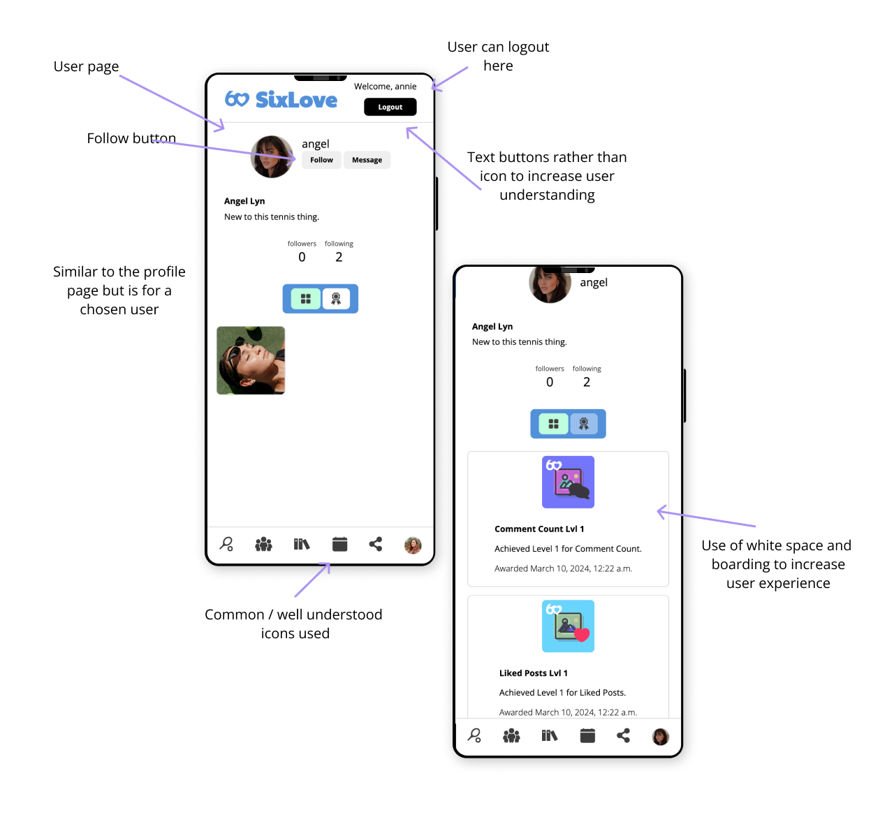
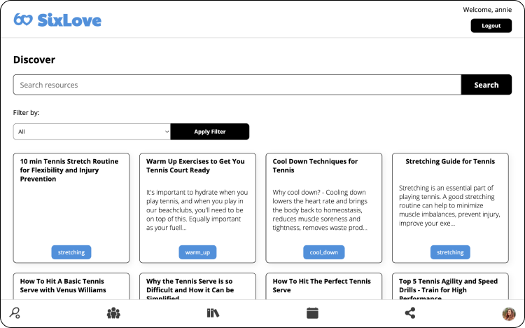

_Report - Final Project (CM3070)_

# SixLove - Can novice linear progression be applied to tennis?

_Taking on the task of creating a tennis app that provides users with the tools to go from novices to confident, well-rounded amateur players._

<!-- @import "[TOC]" {cmd="toc" depthFrom=1 depthTo=6 orderedList=false} -->

<!-- code_chunk_output -->

- [SixLove - Can novice linear progression be applied to tennis?](#sixlove---can-novice-linear-progression-be-applied-to-tennis)
- [1 Aims, objectives, and background](#1-aims-objectives-and-background)
  - [1.1 Introduction and background](#11-introduction-and-background)
  - [1.2 Concept and motivations](#12-concept-and-motivations)
  - [1.3 SixLoves's Users](#13-sixloves-users)
    - [1.3.1 Novice Tennis Players](#131-novice-tennis-players)
    - [1.3.2 Tennis Enthusiasts](#132-tennis-enthusiasts)
    - [1.3.3 Fitness Enthusiasts](#133-fitness-enthusiasts)
    - [1.3.4 Aspiring Amateur Tennis Competitors](#134-aspiring-amateur-tennis-competitors)
    - [1.3.5 Other Potential Users](#135-other-potential-users)
  - [1.4 Proposed approach](#14-proposed-approach)
    - [1.4.1 Aims](#141-aims)
    - [1.4.2 Objectives](#142-objectives)
- [2 Literature](#2-literature)
  - [2.1 Existing solutions](#21-existing-solutions)
    - [2.1.1 TennisPAL](#211-tennispal)
    - [2.1.2 MyFitnessPal](#212-myfitnesspal)
    - [2.1.3 TopCourt](#213-topcourt)
    - [2.1.4 Nike Training Club](#214-nike-training-club)
  - [2.2 Techniques and methods](#22-techniques-and-methods)
    - [2.2.1 The theory](#221-the-theory)
      - [2.2.1.1 Fundamental tennis strokes](#2211-fundamental-tennis-strokes)
      - [2.2.1.2 Linear progression in skill development](#2212-linear-progression-in-skill-development)
      - [2.2.1.3 Structured training sessions](#2213-structured-training-sessions)
      - [2.2.1.4 Cardiovascular endurance and agility](#2214-cardiovascular-endurance-and-agility)
      - [2.2.1.5 Progress tracking](#2215-progress-tracking)
    - [2.2.2 Software Libraries](#222-software-libraries)
  - [2.3 External research studies](#23-external-research-studies)
    - [2.3.1 The laws of muscle memory](#231-the-laws-of-muscle-memory)
- [3 Project Design](#3-project-design)
  - [3.1 Project structure](#31-project-structure)
    - [3.1.1 Wireframing](#311-wireframing)
    - [3.1.2 Entity-Relationship Diagram](#312-entity-relationship-diagram)
    - [3.1.3 Database Tables](#313-database-tables)
    - [3.1.4 SixLove Pages](#314-sixlove-pages)
    - [3.1.5 Django Structure](#315-django-structure)
  - [3.2 Work plan](#32-work-plan)
  - [3.3 Evaluation strategy](#33-evaluation-strategy)
      - [3.3.1 Functionality](#331-functionality)
      - [3.3.2 Usability](#332-usability)
      - [3.3.3 Goals Accomplished](#333-goals-accomplished)
- [4 The Implementation](#4-the-implementation)
  - [4.1 The `registration` app](#41-the-registration-app)
     - [4.1.1 The signup and login pages](#411-the-signup-and-login-pages)
     - [4.1.2 The home page](#412-the-home-page)
  - [4.2 The `tennis` app](#42-the-tennis-app)
    - [4.2.1 The tennis pages](#421-the-tennis-pages)
    - [4.2.2 The MVT Pattern](#422-the-mvt-pattern)
    - [4.2.3 The learn and resource pages](#423-the-learn-and-resource-pages)
  - [4.3 The `planner` app](#43-the-planner-app)
  - [4.4 The `community` app](#44-the-community-app) 
- [5 Evaluation](#5-evaluation)
  - [5.1 Unit testing](#51-unit-testing)
    - [5.1.1 The `registration` app](#511-the-registration-app)
    - [5.1.2 The `tennis` app](#512-the-tennis-app)
    - [5.1.3 The `planner` app](#513-the-planner-app)
    - [5.1.4 The `community` app](#514-the-community-app)
  - [5.2 Overall project evaluation](#52-overall-project-evaluation)
    - [5.2.1 Proposed changes](#521-proposed-changes)
- [6 Conclusion](#6-conclusion)
- [7 References](#7-references)

<!-- /code_chunk_output -->

The following is the link to the SixLove repository:
https://github.com/worthyag/SixLove/
(The code can be found within the `app` folder).


# 1 Aims, objectives, and background

## 1.1 Introduction and background

_Taking you back to the beginning._

Health is wealth- a sentiment echoed by millions across the globe. However, according to _ScienceDaily_ over "_95% of the world's population [have] health problems_" [1]. Though we cannot single-handedly gift health to 95% of the world, as fellow humans we have a duty to help facilitate the process of getting healthy. Now where does tennis fit into all this? Tennis is a great sport for those wanting to improve their health. It does not bear the initial intimidation of going to the gym for the first time, but also allows for social interaction. Most important to note is that tennis allows those playing it to improve their cardiovascular endurance, agility, and coordination- it provides a full body workout. _Mayo Clinic Proceedings_ published a study (The Copenhagen City Heart Study) in which it was found that tennis players added 9.7 years to their lives in comparison to sedentary individuals [2]. An article published in the _British Journal of Sports Medicine_ found that playing tennis for 3 hours a week reduced your risk of heart disease by 56%[3]. Tennis was also found to be linked to "_improved aerobic fitness, a lower body fat percentage, a more favourable lipid profile, reduced risk for developing cardiovascular disease, and improved bone health_" [4].

## 1.2 Concept and motivations

_Formally specifying the how._

The template chosen for this project is the 'CM3055 Interaction Design: Introducing novices to strength' template. I will be creating an app entitled 'SixLove'. This project is centred around novice linear progression. Novice linear progression (Novice LP) is defined as a program where "_weight on the bar increases, linearly, every workout for each lift_" [5]. What makes Novice LP so potent is that it provides a simple and structured approach for novices, allowing them to build strength efficiently and safely. What does this mean in practice? Novice LP can be be summarised into five key features / principles:

1. Basic movements
2. Linear progression
3. Three workouts per week
4. Simple structure
5. Goal-orientated

Basic movements refers to this idea of the fundamentals. This feature allows novices to learn the elemental barbell exercises, thus building the foundation required for strength. Linear progression represents the linear nature of the program (as defined earlier). This linearity helps to stimulate muscle growth and strength gains. The program is implemented three days a week "_on non-consecutive days, i.e. Mon/Wed/Fri, Tues/Thurs/Sat or similar_" [7]- allowing for sufficient recovery. Novice LP is simple in its nature with an emphasis on using a small number of exercises and sets, making it accessible for novices. Goal-orientated points to novices being encouraged to set specific and measurable strength goals- helping them stay motivated and track their progress.

The real challenge of this project, is taking the fundamental principles of this technique and applying it to tennis. (In [Section 2.2.1](#221-the-theory), an exploration will be undertaken to elaborate on how these principles will be tailored and applied to tennis). In greater detail, the idea is to create an application that helps take users from novices to confident, well-rounded amateur tennis players. Well, what is a novice tennis player? Or rather, what is an amateur tennis player? How is that any good? In the world of tennis, a novice tennis player refers to a beginner. Whereas an amateur tennis player refers to anything upwards of and including intermediate, so long as they are not professional- though these definitions can change based on the source. For the purpose of this project, a novice tennis player is an individual completely new to tennis, and an amateur tennis player is an individual who has learnt the basics but may still need to "_develop their shots and learn more about tactics_" [6]. 

## 1.3 SixLove's Users

_The target audiences._

In order to better describe the types of users that SixLove targets, I created user personas using Figma. Each persona represents a group of potential users. Users are grouped by the users mentioned below and by their age, or other categorising factor.

Users that this project was conceptualised for- include but are not limited to:

- Novice tennis players
- Tennis enthusiasts
- Fitness enthusiasts
- Aspiring amateur tennis competitors

### 1.3.1 Novice Tennis Players

**Figure 1** displays a persona for a user within the `novice tennis player` category, this person is a senior and is learning tennis for fitness and to socialise.

<figure>
	
        <figcaption><strong>Figure 1</strong> Novice Tennis Player User Persona</figcaption>
</figure><br><br>

<figure>
    
        <figcaption><strong>Figure 2</strong> Potential SixLove Solution</figcaption>
</figure><br><br>

**Figure 3** displays a persona for a user within the `novice tennis player` category, this person is in his late 20s and is learning tennis since he has recently developed a passion for it, and is very competitive and wants to beat his friend that has been playing tennis for much longer.

<figure>
    
        <figcaption><strong>Figure 3</strong> Novice Tennis Player User Persona</figcaption>
</figure><br><br>

<figure>
    
        <figcaption><strong>Figure 4</strong> Potential SixLove Solution</figcaption>
</figure><br><br>


### 1.3.2 Tennis Enthusiasts

**Figure 5** displays a persona for a user within the `tennis enthusiast` category who is deeply passionate about tennis, this person is a young adult and they already play tennis here and there, but are looking to take it more seriously.

<figure>
    <strong>Figure 5</strong> Tennis Enthusiast User Persona</figcaption>
</figure><br><br>

<figure>
    
        <figcaption><strong>Figure 6</strong> Potential SixLove Solution</figcaption>
</figure><br><br>


### 1.3.3 Fitness Enthusiasts

**Figure 7** displays a persona for a user within the `fitness enthusiast` category, this person is in their mid 30s to 50s and is learning tennis to lose weight and implement healthy practices into their lives.

<figure>
    
        <figcaption><strong>Figure 7</strong> Fitness Enthusiast User Persona</figcaption>
</figure><br><br>

<figure>
    
        <figcaption><strong>Figure 8</strong> Potential SixLove Solution</figcaption>
</figure><br><br>

### 1.3.4 Aspiring Amateur Tennis Competitors

**Figure 9** displays a persona for a user within the `aspiring amateur tennis competitor` category, this person is in her early teens and is learning tennis to either become a professional tennis player or earn a tennis scholarship for university.

<figure>
    
        <figcaption><strong>Figure 9</strong> Aspiring Amateur Tennis Competitors User Persona</figcaption>
</figure><br><br>

<figure>
    
        <figcaption><strong>Figure 10</strong> Potential SixLove Solution</figcaption>
</figure><br><br>


### 1.3.5 Other Potential Users

**Figure 11** displays a persona for a user within the `parent of young player` category, this person is a dad that has a very young child that is interested in playing tennis, the child watches the sport, and dreams of becoming a tennis player. The dad wants to be able to have all his child's tennis needs in one place, and want positive feedback / reinforcement for his child when completing tennis sessions.

<figure>
    
        <figcaption><strong>Figure 11</strong> Other Potential Users User Persona</figcaption>
</figure><br><br>

<figure>
    
        <figcaption><strong>Figure 12</strong> Potential SixLove Solution</figcaption>
</figure><br><br>


**Figure 13** displays a persona for a user within the `busy professional category`, this person is in their 40s to 50s and is learning tennis to stay in shape and because they have always wanted to learn it.

<figure>
    
        <figcaption><strong>Figure 13</strong> Other Potential Users User Persona</figcaption>
</figure><br><br>

<figure>
    
        <figcaption><strong>Figure 14</strong> Potential SixLove Solution</figcaption>
</figure><br><br>


There are of course other potential users or other ways to group the users, but the personas in [section 1.3](#sixloves-users) provide good examples of SixLove's target audiences.

With the mention of the users comes the project domain. Though alluded to and specified earlier, the domain can broadly be described as '_novice tennis training_'. Expanding upon that, this project will result in the creation of a web based application that is centred around guiding individuals with little or no tennis experience through a structured tennis training program.

## 1.4 Proposed approach

_Breaking down how I will go about this project._

### 1.4.1 Aims

_Goals for the development of SixLove and for its evaluation._

1. **Comprehensive training program**
   - SixLove should provide a structured and comprehensive training program.
   - SixLove should facilitate novice players with the gaining of the fundamental tennis strokes and skills.
   - SixLove users should have access to resources to support learning and improving technique.
2. **User engagement and community building**
   - SixLove should create a sense of community with the use of social features.
   - SixLove users should be able to connect, share achievements, and engage in joint training sessions.
3. **Customisation and personalisation**
   - SixLove users should be able to track their progress.
   - SixLove users should be able to add tennis sessions and create their own schedule.
4. **User-friendly interface and accessibility**
   - SixLove's design should be intuitive and visually appealing.
   - SixLove's design should ensure accessibility for a wide range of users.

### 1.4.2 Objectives

_The core objectives of SixLove._

1. **Skill development**
   - Provide a structured training program covering fundamental tennis strokes.
2. **User engagement and social interaction**
   - Implement user authentication and profiles, displaying achievements and progress.
   - Enable users to connect with each other.
   - Facilitate tennis session management, allowing joint tennis sessions.
3. **Customisation and personalisation**
   - Allow users to track progress.
   - Allow users to add their own tennis sessions.
4. **User interface (UI/UX)**
   - Design an intuitive and visually appealing interface.
   - Ensure a dynamic and responsive UI for an enhanced user experience.
5. **Community engagement**
   - Create an activity stream showcasing friends' achievements and posts.

# 2 Literature

_What has been done and what is to come._

## 2.1 Existing solutions

_Scoping out the current market._

### 2.1.1 TennisPAL

<figure>
    
        <figcaption><strong>Figure 15</strong> TennisPAL's User Interface</figcaption>
</figure><br><br>

TennisPAL is an app designed specifically for tennis players. It includes features for finding tennis partners and tracking match scores. It also allows users to improve their game through training exercises. **Figure 15** displays TennisPAL's user interface.

#### Some of the pros of TennisPAL include:

1. Simple, easily digestible user interface.

2. Social features.
   
   - TennisPAL provides a platform for tennis enthusiasts to connect with fellow players, schedule matches, and build a community.

3. Court locator.
   
   - TennisPAL allows users to find nearby tennis courts, while also providing information about their availability.

4. Match tracking.
   
   - TennisPAL allows its users to track match scores and stats.

5. In-app messaging.
   
   - TennisPAL offers offers in-app messaging for easy communication between players, which makes it easier to organise matches.

#### Some of the cons of TennisPAL include:

1. Lack of training resources.
   
   - Since TennisPAL's focus is on connecting players and tracking matches, it lacks training resources for novice players.

2. Limited coaching integration.

3. Absence of fitness tracking.

4. Not tailored to novices.

#### Areas of Improvement:

1. Training resources.
   
   - TennisPAL could offer a comprehensive library of tennis exercises and video tutorials, catering to novice players who want to learn and improve their skills.

2. Structured training programs.

3. Warm up and cool down routines.

4. Performance analytics.
   
   - TennisPAL could implement data tracking and analytics to allow users to monitor their progress which in turn would motivate users.

5. Machine learning recommendations.

### 2.1.2 MyFitnessPal

<figure>
    
        <figcaption><strong>Figure 16</strong> MyFitnessPal's User Interface</figcaption>
</figure><br><br>

MyFitnessPal is not tennis specific. However, it is a popular fitness app that allows users to track workouts, set fitness goals, and log nutrition. Tennis players can use the app to monitor their overall fitness and nutrition. **Figure 16** displays MyFitnessPal's user interface.

#### Some of the pros of MyFitnessPal include:

1. Diverse fitness content.

2. User engagement.
   
   - MyFitnessPal offers interactive features like challenges, social sharing, and a  community forum to keep users engaged and motivated.

3. Comprehensive tracking.

4. Personalisation.
   
   - MyFitnessPal gives users personalised workout recommendations and nutrition plans based on their goals and preferences.

5. Wide user base.

#### Some of the cons of MyFitnessPal include:

1. Lack of sport specific content.
   
   - MyFitnessPal does not offer fitness programs specifically aimed at tennis players.

2. Limited tennis resources.

3. Performance analytics for tennis.

4. Accessibility to novices.

#### Areas of Improvement:

1. Sport specific content.
   
   - MyFitnessPal could provide a dedicated section with tennis-specific content.

2. Tennis performance analytics.

3. User-centric design.
   
   - MyFitnessPal could make their user interface more user-friendly and accessible.

### 2.1.3 TopCourt

<figure>
    
        <figcaption><strong>Figure 17</strong> TopCourt's User Interface</figcaption>
</figure><br><br>

TopCourt offers video lessons from professional tennis players. This helps users improve their skill and fitness on the court. It also motivates novice tennis players, since they get the opportunity to learn from the very best. **Figure 17** displays TopCourt's user interface.

#### Some of the pros of TopCourt include:

1. High-quality tennis content.

2. Professional instruction.
   
   - TopCourt allows users to learn from world-class tennis players and coaches.

3. Skill development.

4. Diverse content.
   
   - TopCourt offers content not only pertaining to tennis technique but content centred around fitness, mental preparation, and other important aspects of tennis.

5. User progress tracking.

#### Some of the cons of TopCourt include:

1. Premium-only content.

2. Limited user interaction.

3. Quite expensive, especially for those new to the sport, and aren't sure if it is a sport that they will enjoy.

#### Areas of Improvement:

1. Free and affordable content.
   
   - TopCourt could consider offering a mix of free and premium content to cater to a broader audience, ensuring accessibility for users with varying budgets.

2. Social features and community.

### 2.1.4 Nike Training Club

<figure>
    
        <figcaption><strong>Figure 18</strong> Nike Training Club's User Interface</figcaption>
</figure><br><br>

Nike Training Club is a general fitness app that offers a variety of workout routines, including some designed for specific sports. Tennis players are able to use the app to find workouts that focus on agility, strength, and endurance. **Figure 18** displays Nike Training Club's user interface.

#### Some of the pros of Nike Training Club include:

1. High-quality workouts.

2. Diverse exercises.
   
   - Nike Training Club offers a diverse set of workouts including strength training, cardio, yoga, and the like, catering to a broad fitness audience.

3. User-friendly interfaces.

4. Personalisation.

5. Community and challenges.
   
   - Nike Training Club users can participate in challenges and engage with the Nike Training Club community, promoting motivation and accountability.

#### Some of the cons of Nike Training Club include:

1. Non-tennis specific / lack of tennis exercises.

2. Performance tracking.

3. Tailoring to novices.
   
   - Nike Training Club offers workouts for all fitness levels, however it does not specifically tailor content to novice tennis players who need foundational instruction.

#### Areas of Improvement

1. Nike Training Club could offer sport-specific tennis content.

2. Nike Training Club could have tennis and novice-friendly content.

## 2.2 Techniques and methods

_Exploring the various software libraries, algorithms, and research methodologies._

### 2.2.1 The theory

_Exploring tennis novice linear progression._

[Section 1.1](#11-introduction-and-background) delineated the fundamental features and principles of Novice LP. Now, the focus shifts to customising and applying these concepts to the realm of tennis. This brings us to the definition of tennis novice linear progression (TNLP)- a program that I have created based on Novice LP. TNLP represents a structured and incremental approach to skill development for novice tennis players. It places emphasis on foundational strokes, court awareness, fitness, and overall improvement in tennis proficiency. TNLP is built upon five core principles:

1. Fundamental tennis strokes
2. Linear progression in skill development
3. Structured training sessions
4. Cardiovascular endurance and agility
5. Progress tracking

#### 2.2.1.1 Fundamental tennis strokes

_The 'basic movements' of Novice LP._

The first core principle of TNLP encompasses the fundamental tennis strokes, namely the groundstrokes—forehand and backhand—and the serve. In order for novices to succeed in tennis, they must fully grasp the foundational shots. A good foundation leads to a more well-rounded tennis player.

#### 2.2.1.2 Linear progression in skill development

_The 'linear progression' of Novice LP._

While linearity in Novice LP involves an incremental increase in weight per workout, promoting strength development, in TNLP, it denotes continuous skill enhancement through consistent practice. This is achieved through the gradual increase in the complexity of tennis drills and exercises. Thus resulting in systematic progression through skill levels. TNLP encourages regular practice sessions to reinforce fundamental techniques and build muscle memory. TNLP hones in on the notion that "_repetition is the key_" [9]. This notion will be better understood when the laws of muscle memory are explored in [section 2.3.1](#231-the-laws-of-muscle-memory).

#### 2.2.1.3 Structured training sessions

_The 'three workouts per week' of Novice LP._

Novice LP used three workouts per week to gradually increase the novices strength while allowing for recovery. In terms of TNLP, structured tennis sessions are utilised to build muscle memory, so that (tennis) strokes can become instinctual. This is also linked to the laws of muscle memory.

#### 2.2.1.4 Cardiovascular endurance and agility

_The 'simple structure' of Novice LP._

The structure of Novice LP is simple in nature, allowing users to "_develop a strong foundation and learn proper lifting techniques_" [16]. This foundation is what enables novices to build strength and muscle mass. In terms of fitness for tennis, cardiovascular endurance and agility are key. Tennis matches do not have a set time and can go on for hours. The tennis court is quite big, and points are typically won by making use of its angles. These features call for a strong foundation in agility and good stamina. Though it is unlikely for novices to play against others novices who have the skills to make use of the whole tennis court, this a fundamental skill that is needed for their journey as a tennis enthusiast and amateur.

#### 2.2.1.5 Progress tracking

_The 'goal-orientated' of Novice LP._

Novice LP makes use of goals to encourage novices stay motivated and track their progress. Being goal-orientated allows users to focus on what is important and remember their reasons for picking up weight training. In TNLP, progress tracking is imperative. The exercises and practices may seem repetitive, but they are necessary for building muscle memory and improving technique. Progress tracking allows users to see the benefits of the seemingly repetitive tasks. Progress tracking helps monitor a novice's progression and provides motivation.

### 2.2.2 Software libraries

The libraries and technologies that will be used in this project are as follows:

_Though this is subject to change due to unforeseeable circumstances._

- **Frontend**
  
  - Figma
    
    - For wireframing, ideation, and creating a design system.
  
  - HTML, CSS / SCSS, JavaScript
    
    - For styling, user interactivity, and calendar functionality.

- **Backend**
  
  - Django (Django 5)
    
    - To serve static assets and handle API requests from the frontend.
    - Used to connect the database, query the database, and for other backend functionality.
    - To enhance the backend capabilities.

- **Database**
  
  - PostgreSQL
    - To store all the data needed for SixLove's functionality.

- **Version Control**
  
  - Git
    - To keep track of changes and monitor SixLove's progress.

## 2.3 External research studies

_Diving into external research to increase the effectiveness of SixLove._

### 2.3.1 The laws of muscle memory

_From beginners luck to second nature._

As mentioned in [section 2.2.1](#221-the-theory), TNLP is centred around this idea of muscle memory.  Therefore in order to gain a deeper understanding of the concept it is imperative to consider the laws of muscle memory. The laws of muscle memory as stated in Archie Dan Smith's "_Muscle Memory Application to Tennis_" paper are the following:

1. "_Your tennis strokes are due to muscle memory._

2. _Muscle memory is the result of permanent changes in the brain, nerves, and muscles._

3. _Permanent changes occur through repetition in a concentrated period of time._

4. _Repetition by doing it right in practice is how you hit good strokes during a match._

5. _Learning different patterns back to back may cause forgetting of the initial one._

6. _Once your muscle memory is in place it “forgets” slowly, if at all._

7. _The temporary improvement that occurs during practice or matches should not be considered learning, but rather a transient performance effect_."[11]

The laws of muscle memory will not be addressed in too much detail in this report, since at this stage it isn't necessary to do so. However, these laws illustrate why many of the principles of TNLP are focused around this idea of mastering the fundamentals, repetition and consistency. When creating TNLP I made sure to take into account these laws and Novice LP. TNLP is a concept that requires dedicated use, however if one is free to apply their self, they can improve quickly in tennis as opposed to when taking a more traditional approach (this will be discussed further in the final report). 

# 3 Project Design

## 3.1 Project structure

_Getting into the specifics: tackling the overall structure and important technologies and/or methods._

### 3.1.1 Wireframing

The wireframing and design in SixLove utilises a mobile first approach. This approach  is used since a vast majority of the SixLove app users will be accessing the app from their phone- due to the nature of the app. People are more likely to tracks things on their mobile devices as opposed to a desktop device.

**Figure 19** displays SixLove's landing page, login page, and sign up page. The designs are quite rudimentary (for now), since the focus was on designing for optimal app functionality. **Figure 19** displays the first iteration for the aforementioned pages. The next iteration for these pages will be making adjustments to the size of input elements and font-size.

<figure>
    
        <figcaption><strong>Figure 19</strong> SixLove's Landing, login, and signup pages.</figcaption>
</figure><br><br>

**Figure 20** displays SixLove's profile page and settings page. This too is the 1st iteration. The figures highlights the decisions to be made between the two settings logo based on any user feedback.  The settings icon on the left seems to be a lot more intuitive, however the other icon is fairly prevalent in apps that are commonly used.

<figure>
    
        <figcaption><strong>Figure 20</strong> SixLove's profile and settings pages.</figcaption>
</figure><br><br>

**Figures 21 to 23** display SixLove's tennis program page. Each figure represents an iteration. **Figure 21** was the first iteration of the page and **figure 23** the most recent. The annotations on the figures themselves explain why certain changes were made, but in general the goal was to increase the accessibility of the design based on the user feedback. The `+` buttons in the day boxes of the calendar were brought about as a concern. Therefore the following iterations, were primarily focused on the size of input elements and making the app more accessible.

<figure>
    
        <figcaption><strong>Figure 21</strong> SixLove's tennis program page (1st iteration).</figcaption>
</figure><br><br>

<figure>
    
        <figcaption><strong>Figure 22</strong> SixLove's tennis program page (2nd iteration).</figcaption>
</figure><br><br>

<figure>
    
        <figcaption><strong>Figure 23</strong> SixLove's tennis program page (3rd iteration).</figcaption>
</figure><br><br>

**Figure 24** displays SixLove's learning resources page, the aim of this page is to be a hub of information for users so that SixLove can be a sort of one stop shop. It was found that many people prefer to have all their functionality is one place, rather than in many places. Providing users with this bundled functionality aids in increasing their user experience.

<figure>
    
        <figcaption><strong>Figure 24</strong> SixLove's learning resources page.</figcaption>
</figure><br><br>

**Figure 25** displays SixLove's history page. The design is quite elementary since it is in its first iteration. The goal of the page is to allow users to look at their past tennis sessions. But rather than just listing them there, a date input is provided so that they can filter for specific days. 

*Side note: the history page will be scrapped in favour of the  calendar having its own page. The tennis page will no longer house the calendar, and history can be seen on both the calendar and tennis pages.

<figure>
    
        <figcaption><strong>Figure 25</strong> SixLove's history page.</figcaption>
</figure><br><br>

**Figure 26** displays SixLove's feed page. This is an important part of the app. It was essential to hone in on the community aspect of sports and fitness. Community is something that is integral in our lives and impacts us greatly. It was found that people who were "_actively involved in initiatives utilising community engagement approaches experienced positive benefits, in terms of physical and emotional health and well-being, self-confidence, self-esteem, social relationships and individual empowerment_" [17]. Therefore incorporating community in a sports app seemed fitting.

<figure>
    
        <figcaption><strong>Figure 26</strong> SixLove's feed page.</figcaption>
</figure><br><br>


The following figures (**figures 27** to **37**) display SixLove's final iterations.

<figure>
    
        <figcaption><strong>Figure 27</strong> Home Page</figcaption>
</figure><br><br>

<figure>
    
        <figcaption><strong>Figure 28</strong> Feed Page</figcaption>
</figure><br><br>

<figure>
    
        <figcaption><strong>Figure 29</strong> Profile Page</figcaption>
</figure><br><br>

<figure>
    
        <figcaption><strong>Figure 30</strong> User Page</figcaption>
</figure><br><br>

<figure>
    
        <figcaption><strong>Figure 31</strong> Settings Page</figcaption>
</figure><br><br>

<figure>
    
        <figcaption><strong>Figure 32</strong> Calendar Page</figcaption>
</figure><br><br>

<figure>
    
        <figcaption><strong>Figure 33</strong> Learn Page</figcaption>
</figure><br><br>

<figure>
    
        <figcaption><strong>Figure 34</strong> Landing Page</figcaption>
</figure><br><br>

<figure>
    
        <figcaption><strong>Figure 35</strong> Tennis Page</figcaption>
</figure><br><br>

<figure>
    
        <figcaption><strong>Figure 36</strong> Connect Page</figcaption>
</figure><br><br>

<figure>
    
        <figcaption><strong>Figure 37</strong> Authentication Pages</figcaption>
</figure><br><br>

### 3.1.2 Entity-Relationship Diagram

 **Figure 38** displays the entities and relationships that the SixLove app will potentially / initially have. Here is a brief summary of some of the potential relationships:

- Each user can have multiple posts, followers, tennis sessions, and history entries.

- Each post belongs to a user.

- Each follower relationship connects two users.

- Each tennis session belongs to a user.

- Each history entry records a user's completion of a tennis session.

- Each feed entry connects a user to a post.

<figure>
    
        <figcaption><strong>Figure 38</strong> The project's Entity Relationship Diagram.</figcaption>
</figure><br><br>

### 3.1.3 Database Tables

_The tables that will be turned into models._

**Figure 39** displays a tabular version of the entity relation diagram, while highlighting the primary keys and foreign keys. It was important to establish a database schema earlier on in the process, since it can be altered further down the line, and the SixLove application relies heavily on data.

<figure>
    
        <figcaption><strong>Figure 39</strong> The project's UML Diagram.</figcaption>
</figure><br><br>

### 3.1.4 SixLove Pages

_The main pages._

Though the entities, relationships, and design of the project have been showcased, the app's structure in terms of pages has yet to be addressed.

The SixLove app will have the following main pages:

- Profile page
  - This displays the users posts, and biography.
  - It also displays the users followers and following.
  - Users are able to toggle between viewing their posts and viewing their achievements / awards.
  - There is also a button that links to the setting page.
- User page
    - This is similar to the profile page, however it displays the profiles of users other than the account user.
    - Users can follow and unfollow other users here.
- Home page
    - This is where users can view their stats, such as (but not limited to):
        - Visualising the number of tennis sessions per month or comparing the number forehand lessons to backhand lesson.
    - Users are able to filter stats based on a variety of things.
- Landing page
    - This is the page a user is directed to when they are not yet logged in, the page displays some of the benefits of SixLove to the user.
- Tennis page
  - Displays the users tennis schedule, and whether or not they have a tennis session scheduled for today or not.
  - Tennis sessions are displayed as a card, with notes and a date.
  - Users can add, edit, view, and delete tennis sessions here.
  - There are also links to view their stats and calendar here.
- Calendar page
  - Displays a calendar that allows users to add tennis sessions to their schedule.
  - Users can click on a day to add, edit, view, and delete a tennis session.
  - Users can use the date picker to navigate to different dates.
- Learning page
  - This pages gives users access to a variety of resources pertaining to tennis.
  - These resources can be in the form of links, blog posts, and links to videos etc.
- Feed page
  - Since users can follow / friend other users, the feed page displays the user’s post and the post of those they are following.
  - Users can like, comment, and interact with posts.
- Settings page
  - Users can alter their biography, picture, and other settings.
  - User can alter their username etc.
- Connect
  - Enables users to search for and follow other users.
      - Users can also filter the search list.
  - Users are also able to view other users profiles here.
- Other pages
  - Login page
  - Sign up page

### 3.1.5 Django structure

_The overall code structure._

Since SixLove is built with Django, the project has the following structure (**figure 40**).

```
/project
    /project
        __init__.py
        asgi.py
        settings.py
        urls.py
        wsgi.py
	/achievement_images
	/article_images
    /community
        /management
            /commands
                __init__.py
                award_achievements.py
        /migrations
        /static
            /community
                images/
                scripts/
                    create-post.js
                    create-profile.js
                    edit-delete-post.js
                    follow-unfollow.js
                    post-menu.js
                    settings.js
                    toggle-comment-form.js
                    toggle-like.js
                    toggle-posts.js
                    view-post.js
                styles/
                    _connect.scss
                    _feed.scss
                    _global.scss
                    _mixins.scss
                    _profile.scss
                    _settings.scss
                    _variables.scss
                    styles.css
                    styles.css.map
                    styles.scss
        /templates
            /community
                connect.html
                feed.html
                profile.html
                settings.html
                user.html
        __init__.py
        admin.py
        apps.py
        context_processors.py
        forms.py
        models.py
        signals.py
        tests.py
        urls.py
        utils.py
        views.py
    /planner
        /migrations
        /static
            /planner
                scripts/
                    calendar.js
                styles/
                    _calendar.scss
                    _mixins.scss
                    _variables.scss
                    styles.css
                    styles.css.map
                    styles.scss
        /templates
            /planner
                calendar.html
        __init__.py
        admin.py
        apps.py
        models.py
        tests.py
        urls.py
        views.py
    /registration
        /migrations
        /static
            /registration
                scripts/
                    carousel.js
                styles/
                    _base.scss
                    _index.scss
                    _register.scss
                    _variables.scss
                    styles.css
                    styles.css.map
                    styles.scss
        /templates
            /registration
                base.html
                index.html
                login.html
                signup.html
        __init__.py
        admin.py
        apps.py
        forms.py
        models.py
        tests.py
        urls.py
        views.py
    /tennis
        /migrations
        /static
            /tennis
                styles/
                    _learn.scss
                    _resources.scss
                    _session.scss
                    _tennis.scss
                    _variables.scss
                    styles.css
                    styles.css.map
                    styles.scss
        /templates
            /tennis
                add_tennis_session.html
                delete_tennis_session.html
                edit_tennis_session.html
                learn.html
                resource.html
                success.html
                tennis.html
        __init__.py
        admin.py
        apps.py
        forms.py
        models.py
        tests.py
        urls.py
        views.py
    manage.py
/venv
.gitignore
```
**Figure 40** The project's structure.<br>

<br>

**Figure 40** displays a parent `project` folder with many children folders that follow a similar structure. An application built with Django is a project that is made up of a collection of apps. A Django project is defined as a "_collection of configuration and apps for a particular website_" [21]. A Django app is a "_web application that does something_"[21]. The difference between the two is that a project "_can contain multiple apps_" [21], whereas an app "_can be in multiple projects_"[21]. SixLove will be made up of the following apps:

- Project
  
  - The actual Python package for SixLove.

- Registration
  
  - For user authentication and creation.

- Tennis
  
  - For adding, viewing, editing, deleting tennis sessions and for providing the user with learning resources.

- Planner
  
  - For calendar functionality.

- Community
  
  - For all the community aspects.

I chose to use Django for this project since I like its focus on modularity, and the structure it gives to applications. Django is very stable and secure, and with developing an application that has a community aspect, and stores users data this is incredibly important. I also picked it due to the time aspect, since it was designed to enable developers to build applications as quickly as possible. The Django slogan is "_the web framework for perfectionists with deadlines_"[22] which was also fitting for this project.

## 3.2 Work plan

_My project roadmap._

**Figure 41** displays the SixLove's Gantt chart that contains all the major tasks and when they should be completed. Most tasks are given a duration of at least 4 to 7 days. The chart also doesn't allow work to be assigned on the weekends, and weekends are not accounted for when displaying how many days a task has been given.

<figure>
    
        <figcaption><strong>Figure 41</strong> The project's Gantt Chart.</figcaption>
</figure><br><br>

## 3.3 Evaluation strategy

_Now that there is a plan, how will I test and evaluate the project progress?_

*I created all the diagrams in this section using Figma.

SixLove  will be evaluated using three categories which are as follows:

- Functionality

- Usability

- Goals (aims and objectives) accomplished

I will expand upon these in the following sections.
 
### 3.3.1 Functionality

Functionality refers to functionality testing which is where all features are evaluated based on predefined categories. For this project, functionality testing will conducted in the form of unit testing- refer to [section 5.1](#sixloves-users)), and according to the evaluation displayed in **figures 42** and **43**.

<figure>
    
        <figcaption><strong>Figure 42</strong> The Evaluation of Features Table.</figcaption>
</figure><br><br>

<figure>
    
        <figcaption><strong>Figure 43</strong> Feature Evaluation Criteria.</figcaption>
</figure><br><br>

### 3.3.2 Usability

Usability refers to usability testing, which will display itself in the form of task evaluation. **Figure 44** displays the survey that will be filled by users for specific tasks. The survey results will then be evaluated in order to evaluate the overall usability of SixLove.
 
<figure>
	
        <figcaption><strong>Figure 44</strong> Usability Survey.</figcaption>
</figure><br><br>

### 3.3.3 Goals Accomplished

For this evaluation metric, the SixLove app will be evaluated against it's initial aims and objectives (and requirements). It will be decided whether or not SixLove delivered the planned functionality (or how much of its functionality has been completed). **Figures 45** and **46** display the table that will be filled in to evaluation the project.

<figure>
    
        <figcaption><strong>Figure 45</strong> Aims Evaluation Table.</figcaption>
</figure><br><br>

<figure>
    
        <figcaption><strong>Figure 46</strong> Objectives Evaluation Table.</figcaption>
</figure><br><br>

# 4 The Implementation

_Core functionality development._

I decided that I wanted to start building SixLove's functionality in a somewhat chronological order. Chronological order referring to the user's flow, for instance, what route would potential users take when navigating the app? That meant starting with the landing page, then moving on to the sign up and login pages, then to the pages that allow the users to add, edit, and delete tennis sessions. I have previously stated SixLove's aims and objectives, and at their very core user authentication and tennis sessions play a huge role in whether the aims and objectives are met, so using this approach made the most logical sense.  Once I completed the core features, I created the other features going app by app. The figures (**figures 47 to 69**) below display the final UI design for SixLove, and the following sub-sections expand on the implementations.

<figure>
    
        <figcaption><strong>Figure 47</strong> SixLove Landing Page (top)</figcaption>
</figure><br><br>

<figure>
    
        <figcaption><strong>Figure 48</strong> SixLove Landing Page (bottom)</figcaption>
</figure><br><br>

<figure>
    
        <figcaption><strong>Figure 49</strong> SixLove Signup Page</figcaption>
</figure><br><br>

<figure>
    
        <figcaption><strong>Figure 50</strong> SixLove Login Page</figcaption>
</figure><br><br>

<figure>
    
        <figcaption><strong>Figure 51</strong> SixLove Home / Stats Page (top)</figcaption>
</figure><br><br>

<figure>
    
        <figcaption><strong>Figure 52</strong> SixLove Home / Stats Page (mid) </figcaption>
</figure><br><br>

<figure>
    
        <figcaption><strong>Figure 53</strong> SixLove Tennis Page</figcaption>
</figure><br><br>

<figure>
    
        <figcaption><strong>Figure 54</strong> SixLove Tennis Page Add Tennis Session Form</figcaption>
</figure><br><br>

<figure>
    
        <figcaption><strong>Figure 55</strong> SixLove Feed Page</figcaption>
</figure><br><br>

<figure>
    
        <figcaption><strong>Figure 56</strong> SixLove Feed Page Create Post Modal</figcaption>
</figure><br><br>

<figure>
    
        <figcaption><strong>Figure 57</strong> SixLove Learn Page</figcaption>
</figure><br><br>

<figure>
    
        <figcaption><strong>Figure 58</strong> SixLove Resource Page (video)</figcaption>
</figure><br><br>

<figure>
    
        <figcaption><strong>Figure 59</strong> SixLove Resource Page (article)</figcaption>
</figure><br><br>

<figure>
    
        <figcaption><strong>Figure 60</strong> SixLove Connect Page</figcaption>
</figure><br><br>

<figure>
    
        <figcaption><strong>Figure 61</strong> SixLove User Page (posts)</figcaption>
</figure><br><br>

<figure>
    
        <figcaption><strong>Figure 62</strong> SixLove User Page View Post</figcaption>
</figure><br><br>

<figure>
    
        <figcaption><strong>Figure 63</strong> SixLove User Page (awards)</figcaption>
</figure><br><br>

<figure>
    
        <figcaption><strong>Figure 64</strong> SixLove Profile Page</figcaption>
</figure><br><br>

<figure>
    
        <figcaption><strong>Figure 65</strong> SixLove Profile Page View Post</figcaption>
</figure><br><br>

<figure>
    
        <figcaption><strong>Figure 66</strong> SixLove Profile Page Edit Post</figcaption>
</figure><br><br>

<figure>
    
        <figcaption><strong>Figure 67</strong> SixLove Profile Page (awards)</figcaption>
</figure><br><br>

<figure>
    
        <figcaption><strong>Figure 68</strong> SixLove Settings Page</figcaption>
</figure><br><br>

<figure>
    
        <figcaption><strong>Figure 69</strong> SixLove Settings Page Edit Bio</figcaption>
</figure><br><br>

## 4.1 The `registration` app

_Building the `CustomUser`._

User authentication is a primary requirement of the app. SixLove's purpose is to allow its users to keep track of their tennis sessions, follow a training schedule, and feel a sense of community. User authentication is needed for this to work. Users can only keep track of their sessions if they are able to log in. In addition, users should only be able to access their tennis sessions and not another user's one (other than in the case of joint sessions). User authentication is housed within the `registration` app. The app has the following pages:

- **Home**
    - The page that the user lands on when they navigate to the SixLove web application as a new or logged out user.
    - The stats page for users that are authenticated.
- **Sign up**- the page that allows the user to sign up.
- **Login**- the page that authenticates the user.

### 4.1.1 The signup and login pages
In order to authenticate the users, I needed to first create a table in my database that would store users information. In Django, this is facilitated through the creation of a model. The UML diagram for users can be seen in **figure 28**. Django has its own user model, but for the purpose of this project, I wanted to create my own- or expand upon it rather. It was important that I created the modified user model before making migrations (specifically, before running migrations of the Django `auth` app), since it would result in an `ValueError` . This I learnt the hard way, when I created a mock trial of the app, and was forced to clear all the databases tables and delete the migrations folder. The **code snippet 1** displays the model that I created to store user information. It inherits from the `AbstractUser` class. The official Django site describes the class as a '_model [that] behaves identically to the default user model_' [18]. The documentation advises developers to setup a custom user model beforehand, in case they want to later customise it in the future.

```python
class CustomUser(AbstractUser):
    """A custom user class that inherits from Abstract User."""
    first_name = models.CharField(max_length=50)
    last_name = models.CharField(max_length=50)
    email = models.EmailField(unique=True)
    date_of_birth = models.DateField(null=True, blank=True)
```
**Code Snippet 1** The `CustomUser` model.<br/><br>

Each attribute displayed in **code snippet 1** corresponds to a field within the database. In addition to the fields displayed, Django will add the other fields that are specified within `AbstractUser`, such as the user's `id` and `password` among some other things. With the database table created, I created a form that uses the `CustomUser` model to build a form with fields that correspond to the models attributes. **Code snippet 2** displays a reduced version of the code for the form.

```python
class CustomUserCreationForm(UserCreationForm):
    """A class that creates forms based on CustomUser model."""
    first_name = forms.CharField(required=True, max_length=50)
    last_name = forms.CharField(max_length=50)
    email = forms.EmailField(required=True)
    date_of_birth = forms.DateField(
        required=False, widget=forms.DateInput(attrs={'type': 'date'}))

    class Meta:
        model = CustomUser
        fields = ('first_name', 'last_name', 'email',
                  'date_of_birth',) + UserCreationForm.Meta.fields
```
**Code Snippet 2** The `CustomUserCreationForm` form.<br><br>

This form was used to create the forms displayed to the user, for both the login and sign up pages (which can be seen in **figures # and #**). I then created the views corresponding to the pages previously mentioned, **code snippet 3** displays a condensed version of the code for this.

```python
def home(request):
    """
    The view for the home page. Displays two different pages depending
    on the status of is_authenticated:
        - Landing Page: gives potentials user the chance to learn about SixLove.
        - Stats Page: where users can view their stats and progress.
    """
    # Only displays the user's stats if they are authenticated.
    if request.user.is_authenticated:
        # CHART 1
        # ========
        # Getting all the request user's tennis sessions.
        tennis_sessions = TennisModels.TennisSession.objects.filter(
            user=request.user
        )

        # To allow the user to filter the chart.
        filter_option = request.GET.get("filter", "")

        # Applying filters based on the filter_option.
        # Displays the tennis sessions that the user has completed.
        if filter_option == "completed":
            tennis_sessions = tennis_sessions.filter(is_completed=True)

        # Displays the tennis sessions that the user has NOT completed.
        elif filter_option == "not_completed":
            tennis_sessions = tennis_sessions.filter(is_completed=False)

        # Displays the user's upcoming tennis sessions.
        elif filter_option == "upcoming":
            tennis_sessions = tennis_sessions.filter(
                date__gt=timezone.now().date())

        # Displays the user's past tennis sessions.
        elif filter_option == "past":
            tennis_sessions = tennis_sessions.filter(
                date__lt=timezone.now().date())

        # Enables the tennis sessions to be further filtered by the session category.
        forehand_sessions = tennis_sessions.filter(category="forehand")
        backhand_sessions = tennis_sessions.filter(category="backhand")
        # ...more logic
        other_sessions = tennis_sessions.filter(category="other")

        # CHART 2
        # ========
        # Getting all the request user's tennis sessions for the chart 2.
        tennis_sessions_per_month = TennisModels.TennisSession.objects.filter(
            user=request.user
        )

        # To allow the user to filter the chart.
        filter_monthly = request.GET.get("filter-monthly", "")

        # Applying filters based on the filter_monthly.
        # Displays the user's forehand tennis sessions.
        if filter_monthly == "forehand":
            tennis_sessions_per_month = tennis_sessions_per_month.filter(
                category="forehand")
        
        #...more logic

        # Displays the user's stamina sessions.
        elif filter_monthly == "stamina":
            tennis_sessions_per_month = tennis_sessions_per_month.filter(
                category="stamina")

        # Displays the user's other tennis sessions types.
        elif filter_monthly == "other":
            tennis_sessions_per_month = tennis_sessions_per_month.filter(
                category="other")

        current_year = timezone.now().year

        # Enables the tennis sessions to be further filtered by the date (months).
        # Displays tennis sessions in January.
        jan_sessions = tennis_sessions_per_month.filter(
            date__year=current_year, date__month=1)
        # Displays tennis sessions in February.
        feb_sessions = tennis_sessions_per_month.filter(
            date__year=current_year, date__month=2)
        
        # more code...

        # Displays tennis sessions in November.
        nov_sessions = tennis_sessions_per_month.filter(
            date__year=current_year, date__month=11)
        # Displays tennis sessions in December.
        dec_sessions = tennis_sessions_per_month.filter(
            date__year=current_year, date__month=12)

        return render(
            request,
            "./registration/index.html",
            {
                "title": f"{request.user} - Home",
                "tennis_sessions": tennis_sessions,
                "filter_option": filter_option,
                "filter_monthly": filter_monthly,
                "forehand_sessions": forehand_sessions,
                "backhand_sessions": backhand_sessions,
                # more key-value pairs...
                "nov_sessions": nov_sessions,
                "dec_sessions": dec_sessions,
            }
        )
    # Displays something else if the user is not authenticated.
    else:
        return render(
            request,
            "./registration/index.html",
            {
                "title": "Home"
            }
        )


def signup(request):
    # more code...
    # If the request method is post the signup form is submitted.
    if request.method == "POST":
        form = CustomUserCreationForm(request.POST)

        if form.is_valid():
            user = form.save()
            user_profile, created = CommunityModels.UserProfile.objects.get_or_create(
                user=user)
            login(request, user)
            return redirect(reverse("community:profile"))
    # Else a signup form is created.
    else:
        form = CustomUserCreationForm()

    return render(
        request,
        "./registration/signup.html",
        {
            "title": "Sign Up",
            "form": form
        }
    )


def user_login(request):
    # more code...
    # If the request method is post the login form is submitted.
    if request.method == "POST":
        form = AuthenticationForm(request, request.POST)

        if form.is_valid():
            user = form.get_user()
            login(request, user)
            return redirect("home")
    # Else a login form is created.
    else:
        form = AuthenticationForm()

    return render(
        # Similar to the signup view.
    )
```
**Code Snippet 3** The `registration` app views.<br>

<br>

**Code snippet 3** displays how I use the form to create users and authenticate users. I passed the form to a html file (more specifically a Django template file), where it was then rendered (**code snippet 4** shows some of the code for the signup template).

```python
<form method="post">
    
    {{ form.as_p }}
    <button type="submit">Sign Up</button>
</form>
```
**Code Snippet 4** The `signup` html template.

With that completed, I had written most of the functionality for user authentication. I then created a superuser in order to conduct a manual pretest, then I wrote some unit tests to test everything thoroughly (this will be expanded on in [section 5.1.1](#511-the-registration-app), though I had written some unit tests as I went along.

### 4.1.2 The home page

The last implementation that I did for the `registration` app was creating a landing and stats page (refer to figures # and #). The code for this is in the home view which was shown in
**Code snippet 3**. When the user is authenticated a stats page is shown, and when their not a landing page is shown.

The stats page is home to two charts (I built these charts using `Chart.js`). Chart 1 (doughnut) displays information about the number of tennis sessions a user has and chart 2 (line) displays information about the tennis sessions per month. Users can make use of these interactive charts to track their progress by doing some of the following things:
- Compare the number of tennis sessions schedules for different categories.
    - Filter for completed and uncompleted sessions.
   - Filter for upcoming and past sessions.
- Track the number of tennis sessions scheduled across the year.
    - Filter for specific tennis session categories.

Users can also hover over the charts for more information. **Code Snippet 5** displays the django template associated with the stats page. Data is passed from the home view to the template, the neccesary data is then extracted and fed to the `Chart` object.

```html
<!-- First checking whether the user is authenticated. -->

<main id="home">
<!-- Reading in the data from the home view and putting it into elements
    to be easily accessed by JavaScript and Chart.js. -->
  <p style="display: none;" class="tennis-session-count">{{ tennis_sessions|length }}</p>
  <!-- ...more p elements -->
  <p style="display: none;" class="stamina-session-count">{{ stamina_sessions|length }}</p>
  <p style="display: none;" class="other-session-count">{{ other_sessions|length }}</p>

  <p style="display: none;" class="jan-session-count">{{ jan_sessions|length }}</p>
  <!-- ...more p elements -->
  <p style="display: none;" class="nov-session-count">{{ nov_sessions|length }}</p>
  <p style="display: none;" class="dec-session-count">{{ dec_sessions|length }}</p>

    <!-- Button that takes users to Chart 2. -->
  <a href="#monthly-sessions-chart">
    <button>Go to the Monthly Session Chart</button>
  </a>
  <section id="number-of-sessions-chart">
    <!-- The form that enables users to add filters, the data is passed to the
    Django view. -->
    <form method="get" class="filter-options">
      <label for="filter">Filter by:</label>
      <div class="filter-action-element">
        <select name="filter" id="filter">
          <option value="" selected>All</option>
          <option value="completed" selected>
            Completed Sessions
          </option>
          <!-- more options... -->
          <option value="past" selected>
            Past Sessions
          </option>
        </select>
        <button type="submit">Apply Filter</button>
      </div>
    </form>
    <div>
      <!-- Where chart 1 will be displayed. -->
      <canvas id="myChart"></canvas>
    </div>
  </section>

  <!-- Button that takes users to Chart 1s. -->
  <a href="#number-of-sessions-chart">
    <button>Go to the Number of Sessions Chart</button>
  </a>
  <section id="monthly-sessions-chart">
    <!-- The form that enables users to add filters, the data is passed to the
    Django view. -->
    <form method="get" class="filter-options">
      <label for="filter-monthly">Filter by:</label>
      <div class="filter-action-element">
        <select name="filter-monthly" id="filter-monthly">
          <option value="" selected>All</option>
          <option value="forehand" selected>
            Forehand Sessions
          </option>
          <!-- more options... -->
          <option value="other" selected>
            Other Sessions
          </option>
        </select>
        <button type="submit">Apply Filter</button>
      </div>
    </form>
    <div>
        <!-- Where chart 2 will be displayed. -->
      <canvas id="monthlyTennisSessions"></canvas>
    </div>
  </section>


  <script src="https://cdn.jsdelivr.net/npm/chart.js"></script>
  <script>
    (async function() {
      const ctx = document.getElementById('myChart');

      // The chart data taken from the elements.
      const data = [
        { 
          category: "All", 
          count: parseInt(document.querySelector(".tennis-session-count").innerText) 
        },
        { 
          category: "Forehand", 
          count: parseInt(document.querySelector(".forehand-session-count").innerText) 
        },
        // more categories...
        { 
          category: "Other", 
          count: parseInt(document.querySelector(".other-session-count").innerText) 
        },
      ];

      // Creating a new chart and populating with the data.
      new Chart(ctx, {
        type: 'doughnut',
        data: {
          labels: data.map(row => row.category),
          datasets: [{
            label: 'Number of tennis sessions',
            data: data.map(row => row.count),
            borderWidth: 1
          }]
        },
        options: {
          scales: {
            y: {
              beginAtZero: true
            }
          }
        }
      });
    })();

    (async function() {
      const ctx = document.getElementById('monthlyTennisSessions');

      // The chart data taken from the elements.
      const data = [
        { 
          month: "January", 
          count: parseInt(document.querySelector(".jan-session-count").innerText) 
        },
        { 
          month: "February", 
          count: parseInt(document.querySelector(".feb-session-count").innerText) 
        },
        // more months...
        { 
          month: "December", 
          count: parseInt(document.querySelector(".dec-session-count").innerText) 
        },
      ];

      // Creating a new chart and populating with the data.
      new Chart(ctx, {
        type: 'line',
        data: {
          labels: data.map(row => row.month),
          datasets: [{
            label: 'Tennis Sessions per Month',
            data: data.map(row => row.count),
            borderWidth: 1
          }]
        },
        options: {
          scales: {
            y: {
              beginAtZero: true
            }
          }
        }
      });
    })();
  </script>
</main>
```
**Code Snippet 5** The `home - stats` html template.<br>
<br>

The landing page is home to a carousel that I built from scratch using HTML, SCSS, and JavaScript. The carousel provides potential users with information about the SixLove app, so that they can decide whether they want to sign up or not. The carousel is automated but users have the option to stop the slides and navigate using the buttons instead. **Code Snippets 6** and **7** display the logic for this.

```html
<!-- If the user is not authenticated the following is displayed. -->

<main id="landing">
  <div class="content">
    <!-- more code... -->
    <div class="carousel-div">
      <section class="content-carousel">
        <p class="left arrow">&larr;</p>
        <div class="display-content current">
          <div class="increase"></div>
          <p class="info">Get progress analytics.</p>
        </div>
        <!-- more divs... -->
        <div class="display-content">
          <div></div>
          <p class="info">Learn from the FREE tennis resources available to you.</p>
        </div>
        <p class="right arrow">&rarr;</p>
      </section>
      <section class="nav-dots">
        <div class="nav-dot filled"></div>
        <!-- more nav dots... -->
        <div class="nav-dot"></div>
      </section>
      <div class="stop-btn">
        <button class="start-slides btn">Start Slides</button>
        <button class="stop-slides btn">Stop Slides</button>
      </div>
    </div>
    ...
</main>

```
**Code Snippet 6** The `home - landing` html template.<br>
<br>

```javascript
const contents = document.querySelectorAll('.display-content');
// ...other variables

// Calling the appropriate functions whenever the user clicks 
// on the arrow buttons.
leftArrow.addEventListener('click', previousContent);
rightArrow.addEventListener('click', nextContent);

// Handles the automation.
let automate = setInterval(nextContent, 3000);
startBtn.addEventListener('click', () => {automate = setInterval(nextContent, 5000);});
stopBtn.addEventListener('click', () => {clearTimeout(automate)});

function previousContent() {
    /**
     * Function that displays the previous slide (content).
     */
    let pos = sliderContents.length;

    // Iterates over the slides and displays the content.   
    for (let i = sliderContents.length - 1; i >= 0; i--) {        
        if (sliderContents[i].classList.contains('current')) {
            sliderContents[i].classList.toggle('current');
            navDots[i].classList.toggle('filled');
            pos = i-1;

            if (pos === -1) {
                pos = sliderContents.length - 1;
            }
            break;
        }
    }

    sliderContents[pos].classList.toggle('current');
    navDots[pos].classList.toggle('filled');
}

function nextContent() {
    /**
     * Function that displays the next slide (content).
     */
    let pos = -1;

    // Iterates over the slides and displays the content.
    for (let i = 0; i < sliderContents.length; i++) {        
        if (sliderContents[i].classList.contains('current')) {
            sliderContents[i].classList.toggle('current');
            navDots[i].classList.toggle('filled');
            pos = i+1;

            if (pos === sliderContents.length) {
                pos = 0;
            }
            break;
        }
    }

    sliderContents[pos].classList.toggle('current');
    navDots[pos].classList.toggle('filled');
}
```
**Code Snippet 7** The `carousel.js` file.<br>
<br>


## 4.2 The `tennis` app

_The creation of the `TennisSession` database table._

The next order of business was to create the `tennis` app. The ability to add, edit, and delete tennis sessions is the heart of SixLove. Users must be able to add tennis sessions to their calendar, and also view and update their schedule. The `tennis` app has the following pages:

- Tennis

- Add- the page where users can add tennis sessions.

- Edit- the page where users can edit tennis sessions.

- Delete- the page where users can delete tennis sessions.

- Success- the page that lets users know that they successfully completed their task.

- Learn- the page that provides users with a collection of learning / tennis resources.

- Resource- the page that displays a resource.

*The planner app also allows users to add, edit, and delete tennis sessions (this is expanded upon in [section 4.3](#43-the-planner-app).

### 4.2.1 The tennis pages

Like the `registration` app, I began with a model. **Figure 39** displays the fields and the name of the table that I created with the model. 


**Figure 39** TennisSession UML table.<br>

<br>

When I started writing the code for the model, I realised that it would be better to make `isToday` a method rather than an attribute. This is because, `isToday` is dependent on the date, it is not an attribute of a the tennis session.  **Code snippet 8** displays the code for the model.

```python
class TennisSession(models.Model):
    """
    Class that creates a tennis session object.
    """
    TENNIS_SESSION_CATEGORIES = [
        ("backhand", "Backhand"),
        ("forehand", "Forehand"),
        ("serve", "Serve"),
        ("volley", "Volley"),
        ("slice", "Slice"),
        ("smash", "Smash"),
        ("drop-shot", "Drop shot"),
        ("agility", "Agility"),
        ("stamina", "Stamina"),
        ("other", "Other")
    ]

    user = models.ForeignKey(get_user_model(), on_delete=models.CASCADE)
    category = models.CharField(
        max_length=100, choices=TENNIS_SESSION_CATEGORIES, default="other")
    title = models.CharField(max_length=150)
    notes = models.TextField()
    date = models.DateField()
    is_completed = models.BooleanField(default=False)

    def is_tennis_session_scheduled_today(self):
        # more code...
        today = timezone.now()

        if type(self.date) != type(""):
            if today.year == self.date.year:
                if today.month == self.date.month:
                    if today.day == self.date.day:
                        return True
            return False
        else:
            if today.year == int(self.date[:4]):
                if today.month == int(self.date[5:7]):
                    if today.day == int(self.date[8:11]):
                        return True
            return False
    # more code...
```

**Code Snippet 8** The `TennisSession` model.<br>

<br>

I also created a form that coincides with the model. It is the form used for all communication with the `TennisSession` database table (adding, editing, and deleting). **Code snippet 9** displays the form code.

```python
class TennisSessionForm(forms.ModelForm):
    # more code...
    class Meta:
        model = TennisSession
        fields = ['category', 'title', 'notes', 'date', 'is_completed']
        widgets = {
            'date': forms.DateInput(attrs={'type': 'date'})
        }
```

**Code Snippet 9** The `TennisSessionForm` form.<br>

<br>

Most of the work for both the `registration` and `tennis` app was focused on creating models and forms. My primary focus was on how the data would be stored, and figuring out the most effective ways to design the database and its interactions- resulting in a lot of my time being allocated to that. This allowed the implementation to feel more intuitive and less complex.

With the database table and its corresponding form completed, I created the views. **Code snippet 10** displays the tennis view. All of the views use the `@login_required` decorator. Decorators are a way to modify the behaviour of functions or methods in Python, and the `@login_required` decorator is provided by Django to protect views  (functions), since users are required to be logged in. All the views within the `tennis` app, are only accessible to users that are logged in.

```python
@login_required
def tennis(request):
    # more code...
    # Getting all the tennis sessions for the request user.
    tennis_sessions = models.TennisSession.objects.filter(
        user=request.user).order_by("date")

    # Filtering for tennis sessions today.
    today_sessions = [
        session for session in tennis_sessions if session.is_tennis_session_scheduled_today()
    ]
    is_today = "No tennis sessions scheduled for today." if len(
        today_sessions) == 0 else ""

    # Filtering for upcoming tennis sessions.
    upcoming_sessions = [session for session in tennis_sessions
                         if not session.is_tennis_session_scheduled_today() and
                         session.date > datetime.date.today()]

    # Filtering for past tennis sessions.
    past_sessions = [session for session in tennis_sessions
                     if not session.is_tennis_session_scheduled_today() and
                     session.date < datetime.date.today()]

    return render(
        request,
        "./tennis/tennis.html",
        {
            "title": "Tennis",
            "today_sessions": today_sessions,
            "is_today": is_today,
            "upcoming_sessions": upcoming_sessions,
            "past_sessions": past_sessions,
        }
    )
```

**Code Snippet 10** The `tennis` view of the `tennis` app.<br>

<br>

In addition to using the `@login_required` decorator, **code snippet 10** demonstrates how I further filter information based on the user who sent the request. This is to make sure that users can only see tennis sessions associated with their account. **Code snippet 11**, displays some of the other views within the `tennis` app (the success and learn views are not displayed).

```python
@login_required
def add(request):
    # more code...
    # If the request method is post the form will be submitted if not
    # a new form will be created.
    if request.method == 'POST':
        form = forms.TennisSessionForm(request.POST)

        if form.is_valid():
            session = form.save(commit=False)
            session.user = request.user
            session.save()
            return redirect("tennis:success")
    else:
        # Initialising a new form.
        form = forms.TennisSessionForm()

    return render(
        request,
        "./tennis/add_tennis_session.html",
        {
            "title": "Add Tennis Session",
            "form": form,
        }
    )


@login_required
def edit_tennis_session(request, tennis_session_id):
    # more code...
    # Stops users from user navigating to the edit page for a tennis
    # session that doesn't exist or doesn't belong to them.
    try:
        selected_session = get_object_or_404(models.TennisSession,
                                             id=tennis_session_id,
                                             user=request.user)
    except models.TennisSession.DoesNotExist:
        return redirect("tennis:tennis")
    except:
        return redirect("tennis:tennis")

    if request.method == "POST":
        form = forms.TennisSessionForm(request.POST,
                                       instance=selected_session)

        if form.is_valid():
            form.save()
            return redirect("tennis:success")
    else:
        form = forms.TennisSessionForm(instance=selected_session)

    return render(
        # Similar to the add_tennis_session function.
    )


@login_required
def delete_tennis_session(request, tennis_session_id):
    # more code...
    # Stops users from user navigating to the delete page for a tennis
    # session that doesn't exist or doesn't belong to them.
    try:
        # the same as the edit_tennis_session function.

    if request.method == "POST":
        selected_session.delete()
        return redirect("tennis:tennis")

    return render(
         # Also similar to the add_tennis_session function but doesn't 
         # send a form.
    )
```

**Code Snippet 11** The `add_tennis_session`, `edit_tennis_session`, and `delete_tennis_session` views of the `tennis` app.<br>

<br>

The views displayed in **code snippet 11** are those that specifically deal with the tennis sessions. These are the views that provide the users with the ability interact with the tennis sessions. These views communicate with the `TennisSession` database table. Other than the `delete` view, the views pass a form to their associated HTML templates. These templates contain forms that allow users to make changes to their tennis sessions, in a similar fashion to **code snippet 4**.

I also added the variable in **code snippet 12** to the settings file to ensure that the user is always redirected to the home (landing) page when they logout. The settings file is a file that "_contains all the configuration of your Django installation_" [19].

```python
# Redirects the user to the home page when they log out.
LOGOUT_REDIRECT_URL = "home"
```

**Code Snippet 12** The `LOGOUT_REDIRECT_URL` variable located in the settings file.<br>

<br>

I then wrote some unit tests to ensure that the `tennis` app was working as aspected (refer to [section 5.1.2](#512-the-tennis-app)), though I wrote some unit tests whenever I wrote new functionality.

### 4.2.2 The MVT Pattern

_The structure my project follows._

At this point, it is clear to see that there is a pattern emerging. I begin by creating some model(s), then I create some view(s) that seems to be linked to some template that I have created. This is the Django work cycle. Django has a model-view-template (MVT) architecture, as displayed in **figure 40**.


**Figure 40** Django project structure.<br>

<br>

A **model** in Django is defined as the "_the interface of your data_"[20]. It is an "_object that defines the structure of the data in a Django app_"[23]. This means that models are in charge of maintaining all of an application’s data and enables you to perform add, edit, delete, and view operations on the data.

A **view** in Django is the user interface (UI). More specifically, it is a "_handler function that accepts HTTP requests, processes them, and returns the HTTP response_" [23]. The view uses models to retrieve data, and then renders them to the UI using templates. Views in Django also have the functionality to create HTML pages, populating a HTML template dynamically- this is what I have done so far.

A **template** in Django is a "_file that defines the structure of the UI_" [23]. It can be a file of any type, though in this project I have used HTML files. Templates are able to receive data from the view and render it to the UI.

### 4.2.3 The learn and resource pages
The last pages to implement were the learn and resource pages (refer to figures # and #). The whole purpose of the learn page was to provide users with resources to aid their tennis training. Novice LP (and TNLP) are simple in nature and do not require expert supervision, however there are many things in tennis that would require a novice to further research.

To implement the pages I needed to first gather the resources. I researched many APIs but none of them had the features that I needed (they mostly consisted of live match scores and court locators rather than training guides). Therefore I decided to gather my own resources to ensure that they were suitable for the app. I didn't want to create static pages with data, as I wanted the users to be able to search and filter the resources. To achieve this I created three models: `Tag`, `Resource`, and `ArticleSection`. 

The `Tag` model creates the tag that will be associated with a resource (this is used to filter the resources by tags). The `Resource` model creates the resource that can then be displayed to the user. There are two types of resources (videos and articles). Each resource has the attributes displayed in **Code snippet 13**. The `Resource` is associated with with zero or many `ArticleSection`s through the `sections` attribute. The `ArticleSection` model creates the parts that make up an article.

```python
class Tag(models.Model):
    # more code...
    RESOURCE_TAGS = [
        ("backhand", "Backhand"),
        ("forehand", "Forehand"),
        ("warm_up", "Warm Up"),
        ("cool_down", "Cool Down"),
        ("stretching", "Stretching"),
        ("serve", "Serve"),
        ("agility", "Agility"),
        ("volley", "Volley"),
        ("slice", "Slice"),
        ("stamina", "Stamina"),
        ("tnlp", "TNLP"),
        ("other", "Other")
    ]

    name = models.CharField(max_length=255, unique=True, choices=RESOURCE_TAGS)

    def __str__(self):
        return self.name


class Resource(models.Model):
    # more code...
    RESOURCE_TYPES = [
        ("video", "Video"),
        ("article", "Article")
    ]

    title = models.CharField(max_length=255)
    resource_type = models.CharField(max_length=20, choices=RESOURCE_TYPES)
    tags = models.ManyToManyField(Tag, blank=True)
    reference = models.URLField()
    video_url = models.CharField(max_length=20, blank=True, null=True)
    article_image = models.ImageField(upload_to="article_images/",
                                      blank=True, null=True)
    sections = models.ManyToManyField(
        "ArticleSection", blank=True, related_name="resources")

    def __str__(self):
        """"""
        return f"{self.title}"


class ArticleSection(models.Model):
    """
    Creates the parts that builds the resource.
    """
    SECTION_TYPES = [
        ("heading", "Heading"),
        ("paragraph", "Paragraph"),
        ("image", "Image"),
        ("bullet_points", "Bullet Points")
    ]

    resource = models.ForeignKey(Resource, on_delete=models.CASCADE,
                                 related_name="article_sections",
                                 default=None)
    section_type = models.CharField(max_length=15, choices=SECTION_TYPES)
    content = models.TextField(blank=True, null=True)
    image = models.ImageField(upload_to="article_images/",
                              blank=True, null=True)

    class Meta:
        ordering = ['resource', 'id']

    def __str__(self):
        """"""
        return f"{self.section_type} - {self.resource.title} - \
            {self.content[:20] if self.content else 'No Content'}"

```
**Code Snippet 13** The `Tag`, `Resource`, and `ArticleSection` models.<br>
<br>

With the resources created I registered the models to the `admin.site` so that I could populate the database with resources. I then created the views (refer to **Code Snippet 14**) necessary to process the data, and the templates (refer to **Code Snippets 15** and **16**) needed to create an interface for the users.

```python
@login_required
def learn(request):
    """The view for the learn page."""
    # To allow the user to search through the list of resources.
    # Getting the search query from the request.
    query = request.GET.get("resource-search", "")

    # To allow the user to filter the resources.
    filter_option = request.GET.get("filter", "")

    # Querying the data.
    resources = models.Resource.objects.filter(
        Q(title__icontains=query) | Q(tags__name__icontains=query)
    )

    # Applying additional filters based on the filter_option.
    if filter_option == "fundamentals":
        resources = resources.filter(
            tags__name__in={"forehand", "backhand", "serve"}
        ).order_by("title")

    # more logic...
    
    elif filter_option == "slice":
        resources = resources.filter(
            tags__name="slice"
        ).order_by("title")

    return render(
        request,
        "./tennis/learn.html",
        {
            "title": "Learn",
            "resources": resources,
            "search_query": query,
            "filter_option": filter_option,
        }
    )


@login_required
def resource(request, resource_id):
    """The view for the resource page."""
    try:
        resource = get_object_or_404(models.Resource, id=resource_id)
        sections = resource.sections.all() if resource.resource_type == "article" else None

        # Splitting content for sections with type "bullet_points" or "paragraph".
        if sections is not None:
            for section in sections:
                if section.section_type in ["bullet_points", "paragraph"]:
                    section.split_content = section.content.split("\n")

        return render(
            request,
            "./tennis/resource.html",
            {
                "title": resource.title,
                "resource": resource,
                "sections": sections
            }
        )
    except:
        return render(
            request,
            "./tennis/resource.html",
            {
                "title": "Resource Not Found",
                "resource": None,
                "sections": None
            }
        )
```
**Code Snippet 14** The `learn` and `resource` views.<br>
<br>


```html
<main id="learn">
  <!-- More code... -->
  <!-- Search Form -->
  <form class="search-form" action="" method="get">
    <input type="text" name="resource-search" placeholder="Search resources" value="{{ search_query }}">
    <button type="submit">Search</button>
  </form>

  <!-- Filter Option -->
  <form method="get" class="filter-options">
    <label for="filter">Filter by:</label>
    <div class="filter-action-element">
      <select name="filter" id="filter">
        <option value="" selected>All</option>
        <option value="fundamentals" selected>
          Fundamentals
        </option>
        <!-- More options... -->
        <option value="slice" selected>
          Slice
        </option>
      </select>
      <button type="submit">Apply Filter</button>
    </div>
  </form>
  
  <!-- Populating page with resource cards. -->
  <div class="resources">
    
    <a href="">
      <div class="resource">
        <p class="resource-title">{{ resource.title }}</p>
        
          
            
              <p class="resource-content">{{ first_section.content|slice:":150" }}...</p>
            
          
        
        <p class="resource-tag">{{ resource.tags.first.name }}</p>
      </div>
    </a>
    
  </div>
</main>
```
**Code Snippet 15** The `learn` template.<br>
<br>

```html
<main id="resource">
  <!-- More code... -->
  
  
    <iframe class="resource-video" src="https://www.youtube.com/embed/{{ resource.video_url }}" frameborder="0"></iframe>
  
    

    <!-- If the resource is not a video do the following. -->
    
      <div class="resource-content">
        <!-- Iterating through sections for articles -->
        
          <!-- Rendering section content based on section_type -->
          
            <p class="subheading">{{ section.content }}</p>
          
            
                <p>{{ para }}</p>
              
          
            
          
            <ul>
              
                <li>{{ point }}</li>
              
            </ul>
          
        
      </div>
  <!-- More code... -->
</main>
```
**Code Snippet 16** The `resource` template.<br>
<br>


## 4.3 The `planner` app

_How I created the calendar._

With the tennis session functionality implemented, I was ready to extend it to the calendar page. The goal for the calendar page was to allow users to view and interact with their tennis sessions in a more user-friendly manner.

The `planner` app has the following pages:

- Calendar

As mentioned earlier the `planner` app also allows user to add, edit, and delete tennis sessions, this is all facilitated through the interactive calendar that is located on the calendar page (**figures 31** to **35** display the calendar page).

I wanted users to be able to interact with the calendar. My aim was to build a calendar that allows users to do the following:

- Click a specific day and be able to add, view, edit, and delete sessions.

- Navigate to different months using a date picker or the arrows on the calendar.

- View which days have tennis sessions and which don't based on just looking at the calendar.

I originally wanted to use the 'FullCalendar' javascript library to build the calendar, however I didn't want to deal with the licensing. I then decided to use the calendar python library, more specifically the HTMLCalendar. However, after reading the documentation, and researching other projects that had incorporated it, it did not feel right for this project.  Though I know that I could have built upon it, the library felt too limited. In the end, I decided to build a calendar from scratch myself, in order to focus on the things needed for SixLove. Building a calendar from scratch also allowed me to make alterations with ease- especially since I knew all the workings of it.

I did not have to create a model for the `planner` app since it works with the models already created. Therefore I began by creating a simple view, so that I could begin working on the calendar itself. The first stage was to work on the logic for the calendar interface. At this stage, my goal was to build a calendar using HTML and CSS/SCSS, that displayed the date above it and a date picker beneath it. Once I hard coded the calendar, I then modified my code, to use javascript to dynamically render the calendar. I created a `buildCalendar()` function that rendered the calendar based on a specific date. **Code snippet 17** displays the most important parts of the function.

```javascript
function buildCalendar() {
  // more code...
  // Getting info about the previous and current month days.
  const currentFirstDay = new Date(year, month, 1);
  const currentLastDay = new Date(year, month + 1, 0);
  const prevLastDay = new Date(year, month, 0);

  const prevTotalDays = prevLastDay.getDate();
  const currentTotalDays = currentLastDay.getDate();
  const day = currentFirstDay.getDay() - 1;
  const nextDays = 7 - currentLastDay.getDay();

  // Updating the date.
  date.textContent = `${getMonth(month)[1]} ${year}`;

  // Adding the days to the DOM.
  let days = "";

  // Function that checks if a date has a tennis session.
  function hasTennisSession(date) {
    return tennisSessions.some(session => {
      const sessionDate = new Date(session.date);
      return (
        date.getFullYear() === sessionDate.getFullYear() &&
        date.getMonth() === sessionDate.getMonth() &&
        date.getDate() === sessionDate.getDate()
      );
    });
  }

  // Adding the previous month days.
  for (let i = day; i > 0; i--) {
    const dayElement = document.createElement('div');
    dayElement.classList.add('day', 'prev-date');
    dayElement.textContent = prevTotalDays - i + 1;

    daysDiv.appendChild(dayElement);
  }

  // Adding the current month days.
  for (let i = 1; i <= currentTotalDays; i++) {
    const currentDate = new Date(year, month, i);
    const hasSession = hasTennisSession(currentDate);
    const isToday = currentDate.toDateString() === today.toDateString();

    const dayElement = document.createElement('div');
    dayElement.classList.add('day', isToday ? 'today' : 'day', 
                            hasSession ? 'tennis-session' : 'day');
    dayElement.textContent = i;
    dayElement.addEventListener('click', () => showSidePanel(i));

    daysDiv.appendChild(dayElement);
  }

  // Adding the next month days.
  for (let i = 1; i <= nextDays; i++) {
    // Similar to the prev month days.
  }
}
```

**Code Snippet 17** The `BuildCalendar` function.<br>

<br>

The next thing I did was add functionality to the arrows, so that the users could navigate to different months using the arrows. I also adding functionality to the date picker and the today button. **Code snippet 18** displays some of the code for that functionality.

```javascript
function updateDatePicker() {
  const datePicker = document.querySelector("#selectDatePicker");
  let monthDatePicker = (month >= 9) ? month + 1 : `0${month + 1}`;
  datePicker.value = `${year}-${monthDatePicker}`;
}

function prevMonth() {
  // more code...
  month--;
  if (month < 0) {
    month = 11;
    year--;
  }

  updateDatePicker();
  buildCalendar();
}

function nextMonth() {
  // more code...
  // Similar to the prevMonth().
}

// Event listeners for prevBtn and nextBtn here.
// more code...

// Today btn functionality.
todayBtn.addEventListener("click", () => {
  today = new Date();
  year = today.getFullYear();
  month = today.getMonth();

  updateDatePicker();
  buildCalendar();
});

// Select date functionality here.
// more code...
```

**Code Snippet 18** Added functionality to the arrows, date picker and today button.<br>

<br>

Once the calendar was fully functional, the next stage was to incorporate the tennis sessions with the calendar. I began by creating a side panel (**code snippet 19**) and three modals (**code snippet 20**). The side panel displays the tennis sessions to the user when they click on a day (refer to **figure 31**)- though at this stage it just displayed the message "No tennis sessions scheduled", and the `add tennis session` button. The three modals refers to the `add session modal` (**figure 33**), the `edit session modal` (**figure 32**), and the `delete session modal` (**figure 34**). I incorporated the modals with the form created by the `TennisSessionForm` class previously written in order to communicate with the `TennisSession` database table with ease (though I did add some changes to the forms).

```javascript
function showSidePanel(day) {
  // more code...
  // Checking if there are tennis sessions for the clicked day.
  const sessionsForDay = tennisSessions.filter(session => {
    // Similar to HasTennisSession function.
  });

  if (sessionsForDay.length === 0) {
    addCloseBtn();

    // If no tennis sessions scheduled display a message.
    // more code...
  } 
  else {
    addCloseBtn();

    // Displaying tennis session info in the side panel.
    sessionsForDay.forEach(session => {
      const sessionDiv = document.createElement('div');
      sessionDiv.classList.add("side-panel-session-div");

      sessionDiv.innerHTML = `
        <p><span>Title</span>: ${session.title}</p>
        <p><span>Date</span>: ${getMonth(session.date.getMonth())[1]} ${session.date.getDate()}, ${session.date.getFullYear()} </p>
        <p><span>Notes</span>: ${session.notes}</p>
        <p><span>Completed</span>: ${session.isCompleted ? 'Yes' : 'No'}</p>
        <button class="edit-session-btn" onclick="editSession(${session.id})">Edit</button>
        <button class="delete-session-btn" onclick="deleteSession(${session.id}, '${session.title}')">Delete</button>
      `;

      sidePanel.appendChild(sessionDiv);
    });
  }

  addAddSessionBtn(day);

  // Show the side panel.
  // more code...
}

function closeSidePanel() {
  // more code...
}
```

**Code Snippet 19** Side panel javascript functionality.<br>

<br>

```html
<div id="editModal" class="modal">
    <div class="modal-content">
      <span class="close-btn" onclick="closeModal('#editModal')">
        ×
      </span>
      <div id="modalContent">
        <form action="" method="post" novalidate>
          
          {{ form.as_p }}
          <div style="display: none;">
            <label for="session-id">ID: </label>
            <input type="hidden" type="text" name="session-id" 
                   id="session-id" value="X">
          </div>
          <input class="btn" type="submit" value="Edit Tennis Session">
        </form>
      </div>
    </div>
  </div>
```

**Code Snippet 20** Edit modal HTML.<br>

<br>

I then had to make sure that the tennis session data was being sent to calendar page, and that the calendar view (**code snippet 21**) knew what to do depending on which modal was submitting the form. This logic was achieved through the use of a hidden id input that I added to the form. This meant that the calendar view knew which sessions to edit and which sessions to delete, though this wasn't necessary for adding tennis sessions.

```python
@login_required
def calendar(request):
    """"""
    tennis_sessions = TennisModels.TennisSession.objects.filter(
        user=request.user
    )

    # Converting the QuerySet to a list of dictionaries.
    tennis_sessions_data = [{
                             'title': session.title, 
                             'date': session.date.strftime("%Y-%m-%d"),
                             'notes': session.notes, 
                             'isCompleted': str(session.is_completed), 
                             'id': session.id
                            } 
                            for session in tennis_sessions]

    json_data = json.dumps(tennis_sessions_data)

    if request.method == "POST":
        session_id = request.POST.get("session-id")

        if session_id is not None:

            if (session_id != "X"):
                # Editing Tennis Session
                try:
                    selected_session = get_object_or_404(TennisModels.TennisSession,
                                                         id=int(session_id),
                                                         user=request.user)
                except:
                    return HttpResponseBadRequest("Invalid request")
                form = TennisForms.TennisSessionForm(request.POST,
                                                     instance=selected_session)

                if form.is_valid():
                    form.save()
                    return redirect("planner:calendar")
                else:
                    return HttpResponseBadRequest("Invalid form data")
            else:
                # Adding Tennis Session
                form = TennisForms.TennisSessionForm(request.POST)

                if form.is_valid():
                    session = form.save(commit=False)
                    session.user = request.user
                    session.save()
                    return redirect("planner:calendar")
                else:
                    return HttpResponseBadRequest("Invalid form data")

        else:
            # Delete Tennis Session
            if (request.POST["delete-id"] != "delete"):
                try:
                    selected_session = get_object_or_404(TennisModels.TennisSession,
                                                         id=int(
                                                             request.POST["delete-id"]),
                                                         user=request.user)
                except:
                    return HttpResponseBadRequest("Invalid request")

                selected_session.delete()
                return redirect("planner:calendar")
    else:
        # Initialising a new form.
        form = TennisForms.TennisSessionForm()

    return render(
        request,
        "./planner/calendar.html",
        {
            "title": "Calendar",
            "tennis_sessions": json_data,
            "form": form
        }
    )
```

**Code Snippet 21** The `calendar` view.<br>

<br>

With that, I wrote corresponding javascript code (**code snippet 22**) that provided the interactivity needed for the user to be able to add, edit, delete, and view their tennis sessions.

```javascript
function editSession(sessionId) {
// Displays the edit modal when the user clicks the edit btn.
  // more code...
  tennisSessions.forEach(session => {
    if (session.id === sessionId) {
      titleInput.value = session.title;
      notesInput.textContent = session.notes;

      const year = session.date.getFullYear();
      const month = (session.date.getMonth() + 1).toString().padStart(2, '0'); // Months are zero-based
      const day = session.date.getDate().toString().padStart(2, '0');
      const formattedDate = `${year}-${month}-${day}`;

      dateInput.forEach(input => {
        input.value = formattedDate;
      });

      isCompletedInput.checked = session.isCompleted;
    }
  });
  // more code...
}

function deleteSession(sessionId, title) {
  // Displays the delete modal when the user clicks the delete btn.
  // more code...
}

function addSession(day) {
// Displays the add modal when the user clicks the add btn.
  // more code...
  const months = {
    "January": 1,
    "February": 2,
    ...
    "December": 12,
  };

  const calDate = date.textContent.split(" ");
  const calYear = parseInt(calDate[1]);
  const calMonth = (months[calDate[0]]).toString().padStart(2, '0');
  const calDay = day.toString().padStart(2, '0');
  const formattedDate = `${calYear}-${calMonth}-${calDay}`;
  // more code...
}
```

**Code Snippet 22** The functionality for the modals.<br>

<br>

Once I completed most of the calendar functionality, I wrote some unit tests that will be expanded upon in [section 5.1.3](#513-the-planner-app), though I wrote a few unit tests as I went along.


## 4.4 The `community` app
_Implementing the social aspect._

The last app I implemented was the `community` app. The goal of this app was to add social features to the SixLove. This app enables users to do the following:
- Follow / unfollow other users.
- View the profiles of other users.
- Create, edit, view, and delete posts.
- View their achievements / awards.
- Interact with their posts and others.
    - Like posts.
    - Comment on posts.
- Create and edit a user profile.
- Connect with other users.

The `community` app has the following pages:

- Connect
- Feed
- Profile
- Settings
- User

I began by creating the following models:
- `UserProfile`
    - Each user can create one `userprofile` which is then used to store all their activity and data necessary for the `community` app.
- `UserPosts`
    - Used to create posts, its stores data pertaining to post interaction and creation.
- `Follow`
    - Houses the relationship between users.
- `Like`
    - Stores data about a like such as the post, the user, and the date.
- `Comment`
    - Stores data about a comment such as the post, the user, and the date.
- `AchievementCategory`
    - The achievement category used by the `Achievement` model.
- `Achievement`
    - Used to create achievements, it stores the date recieved, the `userprofile` (and so user) it was awarded to, and many other things.

What the models consist of is displayed in **Code Snippet 23**.

```python
class UserProfile(models.Model):
    """"""
    user = models.OneToOneField(get_user_model(), on_delete=models.CASCADE)
    profile_picture = models.ImageField(
        upload_to='profile_pics/',
        default='profile_pics/images/profile-pic-temp.png'
    )
    bio = models.TextField(blank=True)
    username = models.CharField(max_length=50)
    profile_name = models.CharField(max_length=50)

    # Represents the many-to-many relationships between users for followers and following.
    # Allows me to retrieve the set of users who are followers and whom a user is following.
    followers = models.ManyToManyField(
        'self', symmetrical=False, related_name='followers_set', blank=True)
    following = models.ManyToManyField(
        'self', symmetrical=False, related_name='following_set', blank=True)

    def __str__(self):
        return self.username

    def follow(self, user_to_follow):
        """"""
        self.following.add(user_to_follow)
        user_to_follow.followers.add(self)

    def unfollow(self, user_to_unfollow):
        """"""
        self.following.remove(user_to_unfollow)
        user_to_unfollow.followers.remove(self)

    def toggle_follow(self, other_user_profile):
        """"""
        if self.following.filter(id=other_user_profile.id).exists():
            self.unfollow(other_user_profile)
            return False
        else:
            self.follow(other_user_profile)
            return True

    # Dynamically get the follower count.
    def get_followers_count(self):
        """"""
        return self.followers.count()

    # Dynamically get the following count.
    def get_following_count(self):
        """"""
        return self.following.count()


class Follow(models.Model):
    """"""
    follower = models.ForeignKey(
        UserProfile, related_name="followed_by", on_delete=models.CASCADE)
    followed = models.ForeignKey(
        UserProfile, related_name="following_user", on_delete=models.CASCADE)

    def __str__(self):
        return f'{self.follower} follows {self.followed}'


class UserPosts(models.Model):
    """"""
    user_profile = models.ForeignKey(
        UserProfile, on_delete=models.CASCADE, related_name='user_posts')
    post_picture = models.ImageField(
        upload_to='post_pics/'
    )
    post_caption = models.TextField()
    created_at = models.DateTimeField(default=timezone.now)
    likes = models.ManyToManyField(
        'Like',
        related_name='post_likes')
    comments = models.ManyToManyField(
        'Comment',
        related_name='post_comments')

    def __str__(self):
        return f"{self.user_profile.username}'s post - {self.created_at}"

    def delete(self, *args, **kwargs):
        """"""
        # Deleting the associated picture when the post is deleted.
        try:
            storage, path = self.post_picture.storage, self.post_picture.path
            super(UserPosts, self).delete(*args, **kwargs)
            storage.delete(path)
        except FileNotFoundError:
            print("File does not exist.")


    def toggle_like(self, user_profile):
        """Toggle like on the post."""
        like_instance, created = Like.objects.get_or_create(
            user_profile=user_profile,
            post=self
        )

        if created:
            self.likes.add(like_instance)
            liked = True
        else:
            like_instance.delete()
            self.likes.remove(like_instance)
            liked = False

        return liked

    def comment(self, user_profile, content):
        """"""
        comment_instance = Comment.objects.create(
            user_profile=user_profile,
            post=self,
            content=content
        )

        self.comments.add(comment_instance)

    def remove_comment(self, comment_instance):
        """"""
        if comment_instance in self.comments.all():
            comment_instance.delete()
            self.comments.remove(comment_instance)

    def get_like_count(self):
        """"""
        return self.likes.count()

    def get_comment_count(self):
        """"""
        return self.comments.count()


class Like(models.Model):
    """"""
    user_profile = models.ForeignKey(UserProfile, on_delete=models.CASCADE)
    post = models.ForeignKey(UserPosts, on_delete=models.CASCADE)
    created_at = models.DateTimeField(default=timezone.now)

    def __str__(self):
        return f"{self.user_profile.username} likes {self.post.user_profile.username}'s post"


class Comment(models.Model):
    """"""
    user_profile = models.ForeignKey(UserProfile, on_delete=models.CASCADE)
    post = models.ForeignKey(UserPosts, on_delete=models.CASCADE)
    content = models.TextField()
    created_at = models.DateTimeField(default=timezone.now)

    def __str__(self):
        return f"{self.user_profile.username}'s comment on {self.post.user_profile.username}'s post"


class AchievementCategory(models.Model):
    """"""
    name = models.CharField(max_length=255)
    description = models.TextField()
    image = models.ImageField(upload_to='achievement_images/',
                              blank=True, null=True)

    def __str__(self):
        return self.name


class Achievement(models.Model):
    """"""
    user_profile = models.ForeignKey("UserProfile", on_delete=models.CASCADE)
    category = models.ForeignKey(AchievementCategory, on_delete=models.CASCADE)
    name = models.CharField(max_length=255)
    description = models.TextField()
    level = models.PositiveIntegerField()
    completed_at = models.DateTimeField(default=timezone.now)

    class Meta:
        # Adding a unique constraint based on the user_profile, category, and level.
        unique_together = ['user_profile', 'category', 'level']

    def __str__(self):
        return f"{self.user_profile.username} - {self.category.name} - {self.name} (Level {self.level})"
```
**Code Snippet 23** The `community` app models.<br>

<br>

Next, I created the following forms to go with the models:
- `UserProfileForm`
    - Enables users to craete a user profile.
- `UserPostsForm`
    - Used for creating posts.
- `CommentForm`
    - Used to create a comment.
- `EditUsernameForm`
    - Used by the settings page to update a user's username.
- `EditBioForm`
    - Used by the settings page to update a user's bio.
- `EditProfilePictureForm`
    - Used by the settings page to update a user's picture.
- `EditProfileNameForm`
    - Used by the settings page to update a user's profile name.


A closer look of the forms can be seen in **Code Snippet 24**.

```python
class UserPostsForm(forms.ModelForm):
    """
    Creates (adds) / updates a user post to the database.
    """

    def __init__(self, *args, **kwargs):
        super().__init__(*args, **kwargs)
        self.fields['user_profile'].required = False
        self.fields['post_picture'].required = False

    class Meta:
        model = UserPosts
        fields = ['user_profile', 'post_picture', 'post_caption', 'created_at']

        widgets = {
            'user_profile': forms.HiddenInput(),
            'created_at': forms.HiddenInput(),
        }


class UserProfileForm(forms.ModelForm):
    """
    Creates a user profile for the user.
    """

    def __init__(self, *args, **kwargs):
        super().__init__(*args, **kwargs)
        self.fields['user'].required = False
        self.fields['followers'].required = False
        self.fields['following'].required = False

    class Meta:
        model = UserProfile
        fields = ['user', 'username', 'profile_name',
                  'profile_picture', 'bio',
                  'followers', 'following']

        widgets = {
            'user': forms.HiddenInput(),
            'followers': forms.HiddenInput(),
            'following': forms.HiddenInput(),
        }


class CommentForm(forms.ModelForm):
    """"""

    def __init__(self, *args, **kwargs):
        super().__init__(*args, **kwargs)
        self.fields['user_profile'].required = False
        self.fields['post'].required = False

    class Meta:
        model = Comment
        fields = ['user_profile', 'post', 'content']

        widgets = {
            'user_profile': forms.HiddenInput(),
        }

class EditProfileForm(forms.ModelForm):
    """
    Enables the user to update their profile.
    """
    class Meta:
        model = UserProfile
        fields = ['username', 'profile_name',
                  'profile_picture', 'bio']


class EditUsernameForm(forms.ModelForm):
    """
    Enables the user to update their username.
    """
    class Meta:
        model = UserProfile
        fields = ['username']

class EditBioForm(forms.ModelForm):
    """
    Enables the user to update their bio.
    """
    class Meta:
        model = UserProfile
        fields = ['bio']

class EditProfilePictureForm(forms.ModelForm):
    """
    Enables the user to update their profile picture.
    """
    class Meta:
        model = UserProfile
        fields = ['profile_picture']

class EditProfileNameForm(forms.ModelForm):
    """
    Enables the user to update their profile name.
    """
    class Meta:
        model = UserProfile
        fields = ['profile_name']
```
**Code Snippet 24** The `community` app forms.<br>

<br>


I then created the following views (refer to **Code Snippet 25**):
- `connect`
    - Provides the interface for users to query and filter SixLove's users.
    - Handles the user's queries.
- `feed`
    - Provides users with the tools to add, edit, and delete posts.
    - Handles the comment form and creates comments.
    - Displays a feed of posts that consists of the user's posts and user's they're following (the most recent post is at the top).
- `profile`
    - Enables the user to create a user profile.
    - Displays the users posts and achievements.
    - Users can edit their post here too.
- `user`
    - Displays the profile of a given user.
    - Enables users to view the posts and achievements of other users.
- `profile_settings`
    - Provides users with the interface to make changes to their user profile.
- `toggle_like`
    - Handles all the like functionality.
    - Returns a JSON response to be used with Fetch API.
- `toggle_follow`
    - Handles all the follow functionality.
    - Returns a JSON response to be used with Fetch API.
- `get_like_info`
    - Gets information about the current user has liked a post or not.

```python
@login_required
def connect(request):
    """
    The connect page view.
    """
    # Getting the profile of the request user.
    request_profile = models.UserProfile.objects.get(user=request.user)

    # To allow the user to search through the list of users.
    # Getting the search query from the request.
    query = request.GET.get("user-search", "")

    # To allow the user to filter the list of users.
    filter_option = request.GET.get("filter", "")

    # Querying the data.
    user_profiles_query = models.UserProfile.objects.filter(
        Q(username__icontains=query) | Q(profile_name__icontains=query)
    )

    # Applying additional filters based on the filter_option.
    if filter_option == "last_posted":
        user_profiles_query = user_profiles_query.annotate(
            last_posted=Max("user_posts__created_at")
        ).order_by("-last_posted")

    elif filter_option == "most_followers":
        user_profiles_query = user_profiles_query.annotate(
            follower_count=Count("followers")
        ).order_by("-follower_count")

    elif filter_option == "most_posts":
        user_profiles_query = user_profiles_query.annotate(
            post_count=Count("user_posts")
        ).order_by("-post_count")

    elif filter_option == "last_active":
        user_profiles_query = user_profiles_query.annotate(
            last_active=F("user__last_login")
        ).order_by("-last_active")

    elif filter_option == "followers":
        # Those that are following the request user.
        user_profiles_query = user_profiles_query.filter(
            following=request_profile)

    elif filter_option == "following":
        # Those that are followed by the request user.
        user_profiles_query = user_profiles_query.filter(
            followers=request_profile)

    user_profiles_data = {
        user_profile.id: {
            "username": user_profile.username,
            "profile_picture": user_profile.profile_picture.url if user_profile.profile_picture else None,
            "profile_name": user_profile.profile_name,
            "is_following": request_profile.following.filter(id=user_profile.id).exists()
        }
        # for user_profile in models.UserProfile.objects.all()
        for user_profile in user_profiles_query
    }

    request_profile_id = request_profile.id

    return render(
        request,
        "./community/connect.html",
        {
            "title": "Connect",
            "user_profiles_data": user_profiles_data,
            "search_query": query,
            "request_profile_id": request_profile_id,
            "filter_option": filter_option,
        }
    )


@login_required
def feed(request):
    """
    The feed page view.
    """
    # Initialising a new form.
    form = forms.UserPostsForm()
    comment_form = forms.CommentForm()

    if request.method == 'POST':
        print(request.POST)  # testing

        post_id = request.POST.get("post-id")

        if post_id == "create":
            # Creating a new post.
            form = forms.UserPostsForm(request.POST, request.FILES)

            if form.is_valid():
                post = form.save(commit=False)

                try:
                    user_profile = models.UserProfile.objects.get(
                        user=request.user)
                    post.user_profile = user_profile
                    post.save()
                except models.UserProfile.DoesNotExist:
                    print("User profile does not exist.")

                return redirect("community:feed")
            else:
                return HttpResponseBadRequest("Invalid form data")

        elif post_id == "edit":
            # Editing the post.
            try:
                selected_post = get_object_or_404(models.UserPosts,
                                                  id=int(
                                                      request.POST["post-id-to-edit"])
                                                  )
            except:
                return HttpResponseBadRequest("Invalid request")

            # Creating a form instance with the provided data and the
            # instance to be updated.
            form = forms.UserPostsForm(request.POST,
                                       request.FILES,
                                       instance=selected_post)

            if form.is_valid():
                post = form.save(commit=False)

                # Only the user who created the post can edit it.
                try:
                    user_profile = models.UserProfile.objects.get(
                        user=request.user)
                    post.user_profile = user_profile

                    # Ensure that no new picture is given.
                    post.post_picture = selected_post.post_picture
                    post.save()
                except models.UserProfile.DoesNotExist:
                    print("User profile does not exist.")

                return redirect("community:feed")
            else:
                return HttpResponseBadRequest("Invalid form data")

        elif post_id == "delete":
            # Deleting a post.
            try:
                selected_post = get_object_or_404(models.UserPosts,
                                                  id=int(
                                                      request.POST["post-id-to-delete"])
                                                  )
            except:
                return HttpResponseBadRequest("Invalid request")

            # Only the user who created the post can delete it.
            try:
                user_profile = models.UserProfile.objects.get(
                    user=request.user)

                if user_profile and selected_post.user_profile == user_profile:
                    selected_post.delete()
                    return redirect("community:feed")

            except models.UserProfile.DoesNotExist:
                print("User profile does not exist.")

        elif 'comment-submit' in request.POST:
            request_profile = models.UserProfile.objects.get(
                user=request.user)

            comment_form = forms.CommentForm(request.POST)

            if comment_form.is_valid():
                content = comment_form.cleaned_data['content']

                post = get_object_or_404(
                    models.UserPosts,
                    id=int(post_id)
                )

                post.comment(user_profile=request_profile, content=content)
                return redirect("community:feed")
            else:
                return HttpResponseBadRequest("Invalid form data")
        else:
            pass
    else:
        pass

    try:
        user_profile = models.UserProfile.objects.get(user=request.user)
        following_users = user_profile.following.all()

        # Getting the posts from user's profile and users they are following.
        following_posts = models.UserPosts.objects.filter(
            user_profile__in=following_users) | models.UserPosts.objects.filter(
            user_profile=user_profile)

        # Annotating each post with the comment count.
        following_posts = following_posts.annotate(
            comment_count=Count("comments"))

        # Annotating each post with info about whether the current user has liked it.
        following_posts = following_posts.annotate(
            user_has_liked=Exists(models.Like.objects.filter(
                user_profile=user_profile, post=OuterRef("pk")
            ))
        )

        # Ordering the posts and making sure that there are no duplicates.
        following_posts = following_posts.order_by('-created_at').distinct()

        for post in following_posts:
            if post.user_profile.username == "worthy":
                print(post.comments.all())

    except models.UserProfile.DoesNotExist:
        user_profile = None
        following_posts = None

    return render(
        request,
        "./community/feed.html",
        {
            "title": "Feed",
            "user_profile": user_profile,
            "posts": following_posts,
            "form": form,
            "comment_form": comment_form,
        }
    )


@login_required
def profile(request):
    """
    The profile page view.
    """
    # Initialising a new form.
    comment_form = forms.CommentForm()

    # First checking whether a user profile exists.
    try:
        user_profile = models.UserProfile.objects.get(user=request.user)
        user_posts = models.UserPosts.objects.filter(
            user_profile=user_profile).order_by('-created_at')
        user_awards = models.Achievement.objects.filter(
            user_profile=user_profile).order_by('-completed_at')

    except models.UserProfile.DoesNotExist:
        user_profile = None
        user_posts = None
        user_awards = None

    # If a user profile does not exist.
    if not user_profile:
        if request.method == 'POST':
            form = forms.UserProfileForm(request.POST, request.FILES)

            if form.is_valid():
                user_profile = form.save(commit=False)
                user_profile.user = request.user
                user_profile.save()
                return redirect("community:profile")
        else:
            # Initialising a new form.
            form = forms.UserProfileForm()

        return render(
            request,
            "./community/profile.html",
            {
                "title": "Profile",
                "form": form
            }
        )
    # If a user profile does exist.
    else:
        user_posts = models.UserPosts.objects.filter(
            user_profile=user_profile).order_by('-created_at')

        # Annotating each post with info about whether the current user has liked it.
        user_posts = user_posts.annotate(
            user_has_liked=Exists(models.Like.objects.filter(
                user_profile=user_profile, post=OuterRef("pk")
            ))
        )

        if request.method == 'POST':
            post_id = request.POST.get("post-id")

            if post_id == "edit":
                # Editing the post.
                try:
                    selected_post = get_object_or_404(models.UserPosts,
                                                      id=int(
                                                          request.POST["post-id-to-edit"])
                                                      )
                except:
                    return HttpResponseBadRequest("Invalid request")

                # Creating a form instance with the provided data and the
                # instance to be updated.
                form = forms.UserPostsForm(request.POST,
                                           request.FILES,
                                           instance=selected_post)

                if form.is_valid():
                    post = form.save(commit=False)

                    # Only the user who created the post can edit it.
                    try:
                        user_profile = models.UserProfile.objects.get(
                            user=request.user)
                        post.user_profile = user_profile

                        # Ensure that no new picture is given.
                        post.post_picture = selected_post.post_picture
                        post.save()
                    except models.UserProfile.DoesNotExist:
                        print("User profile does not exist.")

                    return redirect("community:profile")
                else:
                    return HttpResponseBadRequest("Invalid form data")

            elif post_id == "delete":
                # Deleting a post.
                try:
                    selected_post = get_object_or_404(models.UserPosts,
                                                      id=int(
                                                          request.POST["post-id-to-delete"])
                                                      )
                except:
                    return HttpResponseBadRequest("Invalid request")

                # Only the user who created the post can delete it.
                try:
                    user_profile = models.UserProfile.objects.get(
                        user=request.user)

                    if user_profile and selected_post.user_profile == user_profile:
                        selected_post.delete()
                        return redirect("community:profile")

                except models.UserProfile.DoesNotExist:
                    print("User profile does not exist.")

            elif 'comment-submit' in request.POST:
                request_profile = models.UserProfile.objects.get(
                    user=request.user)

                comment_form = forms.CommentForm(request.POST)

                if comment_form.is_valid():
                    content = comment_form.cleaned_data['content']

                    post = get_object_or_404(
                        models.UserPosts,
                        id=int(post_id)
                    )

                    post.comment(user_profile=request_profile, content=content)
                    return redirect("community:profile")
                else:
                    return HttpResponseBadRequest("Invalid form data")
        else:
            # Initialising a new form.
            form = forms.UserPostsForm()

        return render(
            request,
            "./community/profile.html",
            {
                "title": "Profile",
                "user_profile": user_profile,
                "user_posts": user_posts,
                "user_awards": user_awards,
                "form": form,
                "comment_form": comment_form,
            }
        )


@login_required
def user(request, user_profile_id):
    """
    The user page view.
    """
    # Initialising a new form.
    comment_form = forms.CommentForm()

    # First checking whether a user profile exists.
    try:
        user_profile = models.UserProfile.objects.get(id=user_profile_id)
        user_posts = models.UserPosts.objects.filter(
            user_profile=user_profile).order_by('-created_at')
        user_awards = models.Achievement.objects.filter(
            user_profile=user_profile).order_by('-completed_at')

    except models.UserProfile.DoesNotExist:
        user_profile = None
        user_posts = None
        user_awards = None

    # If a user profile does not exist.
    if not user_profile:
        return render(
            request,
            "./community/user.html",
            {
                "title": "User Profile",
                "user_profile": user_profile,
                "user_posts": user_posts,
            }
        )
    # If a user profile does exist.
    else:
        request_profile = models.UserProfile.objects.get(user=request.user)

        # Annotating each post with info about whether the current user has liked it.
        user_posts = user_posts.annotate(
            user_has_liked=Exists(models.Like.objects.filter(
                user_profile=request_profile, post=OuterRef("pk")
            ))
        )

        is_following = request_profile.following.filter(
            id=user_profile.id).exists()

        if request.method == 'POST':
            post_id = request.POST.get("post-id")

            if 'comment-submit' in request.POST:
                comment_form = forms.CommentForm(request.POST)

                if comment_form.is_valid():
                    content = comment_form.cleaned_data['content']

                    post = get_object_or_404(
                        models.UserPosts,
                        id=int(post_id)
                    )

                    post.comment(user_profile=request_profile, content=content)
                    return redirect(reverse("community:user", args=[user_profile_id]))
                else:
                    return HttpResponseBadRequest("Invalid form data")

        if request_profile != user_profile:
            return render(
                request,
                "./community/user.html",
                {
                    "title": f"{user_profile.username}'s Profile",
                    "user_profile": user_profile,
                    "user_posts": user_posts,
                    "user_awards": user_awards,
                    "is_following": is_following,
                    "comment_form": comment_form,
                }
            )
        else:
            return redirect("community:profile")


@login_required
def profile_settings(request):
    """
    The settings page view.
    """
    request_profile = models.UserProfile.objects.get(user=request.user)

    # Initialising new forms.
    profile_form = forms.EditProfileForm(instance=request_profile)
    username_form = forms.EditUsernameForm(instance=request_profile)
    name_form = forms.EditProfileNameForm(instance=request_profile)
    bio_form = forms.EditBioForm(instance=request_profile)
    dp_form = forms.EditProfilePictureForm(instance=request_profile)

    if request.method == 'POST':
        if "edit-profile" in request.POST:
            profile_form = forms.EditProfileForm(request.POST,
                                                 request.FILES,
                                                 instance=request_profile)

            if profile_form.is_valid():
                profile = profile_form.save(commit=False)
                profile.save()
                return redirect("community:profile-settings")
            else:
                return HttpResponseBadRequest("Invalid form data")

        elif "edit-username" in request.POST:
            username_form = forms.EditUsernameForm(request.POST,
                                                   instance=request_profile)

            if username_form.is_valid():
                username = username_form.save(commit=False)
                username.save()
                return redirect("community:profile-settings")
            else:
                return HttpResponseBadRequest("Invalid form data")

        elif "edit-name" in request.POST:
            name_form = forms.EditProfileNameForm(request.POST,
                                                  instance=request_profile)

            if name_form.is_valid():
                name = name_form.save(commit=False)
                name.save()
                return redirect("community:profile-settings")
            else:
                return HttpResponseBadRequest("Invalid form data")

        elif "edit-bio" in request.POST:
            bio_form = forms.EditBioForm(request.POST,
                                         instance=request_profile)

            if bio_form.is_valid():
                bio = bio_form.save(commit=False)
                bio.save()
                return redirect("community:profile-settings")
            else:
                return HttpResponseBadRequest("Invalid form data")

        elif "edit-dp" in request.POST:
            dp_form = forms.EditProfilePictureForm(request.POST,
                                                   request.FILES,
                                                   instance=request_profile)

            if dp_form.is_valid():
                dp = dp_form.save(commit=False)
                dp.save()
                return redirect("community:profile-settings")
            else:
                return HttpResponseBadRequest("Invalid form data")

    return render(
        request,
        "./community/settings.html",
        {
            "title": f"{request_profile.username}'s settings",
            "profile_form": profile_form,
            "username_form": username_form,
            "name_form": name_form,
            "bio_form": bio_form,
            "dp_form": dp_form,
        }
    )


@login_required
def toggle_like(request, post_id):
    """
    View that toggles a like (called when the like button is clicked).
    """
    # Getting the user profile of the request user.
    user_profile = get_object_or_404(models.UserProfile, user=request.user)
    # Getting the post object using the post id.
    post = get_object_or_404(models.UserPosts, id=post_id)

    liked = post.toggle_like(user_profile)

    # Returning the updated like count and whether the user has liked the post.
    like_count = post.get_like_count()
    response_data = {
        "like_count": like_count,
        "liked": liked
    }

    print("Response Data:", response_data)

    return JsonResponse(response_data)


@login_required
def toggle_follow(request, user_profile_id):
    """
    View that toggles a follow (called when the (un)follow button is clicked).
    """
    # Getting the user profile of the request user.
    request_profile = get_object_or_404(models.UserProfile, user=request.user)

    # Getting the user profile of the current page profile.
    user_profile = get_object_or_404(models.UserProfile, id=user_profile_id)

    # Toggling the follow status.
    is_following = request_profile.toggle_follow(user_profile)

    # Returning the updated followers and following count.
    followers_count = user_profile.get_followers_count()
    following_count = user_profile.get_following_count()

    response_data = {
        "followers_count": followers_count,
        "following_count": following_count,
        "is_following": is_following
    }

    print("Response Data:", response_data)

    return JsonResponse(response_data)


@login_required
def get_like_info(request, post_id):
    """
    View that extracts data about from a like.
    """
    # Getting the post.
    post = get_object_or_404(models.UserPosts, id=post_id)

    # Getting the like count for the post.
    like_count = post.likes.count()

    # Checking if the current user has liked the post.
    user_has_liked = models.Like.objects.filter(
        user_profile=request.user.userprofile, post=post).exists()

    # Preparing the JSON response.
    like_info = {
        'like_count': like_count,
        'user_has_liked': user_has_liked,
    }

    return JsonResponse(like_info)
```


**Code Snippet 25** The `community` app views.<br>

<br>

Then, I created the following templates (refer to **Code Snippets 26** to **30**) to render an interface to the users:
- `connect.html`
- `feed.html`
- `profile.html`
- `settings.html`
- `user.html`


```html
<main id="connect">
  <!-- More code... -->
  <!-- Search Form -->
  <form class="search-form" action="" method="get">
    <input type="text" name="user-search" placeholder="Search users" value="{{ search_query }}">
    <button type="submit">Search</button>
  </form>

  <!-- Filter Users -->
  <form method="get" class="filter-options">
   <!-- Similar to the resource page... -->
  </form>

  <div class="users">
    
    <a href="">
      <div class="user-info">
        
        <div class="user-dets">
          <p class="username">{{ user_profile_data.username }}</p>
          <p class="name">{{ user_profile_data.profile_name }}</p>
          
            <p class="following">Your profile</p>
          
            <p class="following">Following</p>
          
            <p class="following">Not following</p>
          
        </div>
      </div>
    </a>
    
  </div>
</main>
```
**Code Snippet 26** The `connect.html` template.<br>

<br>

```html
<!-- More code... -->
<script>
  const toggleLikeUrl = "".replace("0", "__post_id__");
</script>
<script src="" defer></script>
<!-- More scripts... -->
<script src="" defer></script>



<main id="feed">

  
    <button class="create-post-btn">Create New Post</button>
    <div class="posts">
      
        <div class="post">
          <div class="post-img">
            
          </div>
          <div class="post-btns">
            <div class="interactive-btns">
              
                <button class="post-like-btn"></button>
              
                <button class="post-like-btn"></button>
              
              <button class="post-comment-btn"></button>
            </div>
            
            <div class="post-action-group">
              <button class="post-more-btn"></button>
              <div class="post-action-btns hide-action-btns">
                <span class="edit-post-btn">Edit Post</span>
                <span class="delete-post-btn">Delete Post</span>
              </div>
            </div>
            
          </div>
          <div class="post-id-details" style="display: none;">
            <span class="post-id-data">{{ post.id }}</span>
          </div>
          <div class="post-likes"><span class="like-count">{{ post.get_like_count }}</span> likes</div>
          <div class="post-caption">
            <span class="username">
              <a href="">
                {{ post.user_profile.username }}
              </a>
            </span>
            <span class="caption-text">{{ post.post_caption }}</span>
          </div>
          <!-- Comment form -->
          <form class="comment-form hide-comment-form" method="post" 
          action=""
          data-post-id="{{ post.id }}">
            <span class="close-btn">&times;</span>
            
            <div class="form-elements">
              <input class="hidden-id" type="hidden" name="post-id" value="{{ post.id }}">
              {{ comment_form.as_p }}
            </div>
            <button type="submit" name="comment-submit">Post Comment</button>
          </form>
          <div class="post-comments">
            <span class="post-comments-count">{{ post.comment_count }} comments</span>
            <div class="expanded-comments">
              
                <span class="comment">
                  <a href="">
                    <span class="commenters-username">{{ comment.user_profile.username }}</span>
                  </a>
                   {{ comment.content }}</span><br>
              
            </div>
            
          </div>
          <div class="post-date">{{ post.created_at }}</div>
        </div>
      
    </div>

    <!-- Modal for editing a post -->
    <div id="editPostModal" class="modal">
      <div class="modal-content">
        <span class="close-btn" onclick="closeModal('#editPostModal')">&times;</span>
        <div id="modalContent">
          <form action="" method="post" novalidate enctype="multipart/form-data">
             
            {{ form.as_p }}
            <div style="display: none;">
              <label for="post-id">ID: </label>
              <input type="hidden" type="text" name="post-id" id="post-id" value="edit">
              <input type="hidden" type="text" name="post-id-to-edit" id="post-id-to-edit" value="X">
            </div>
            <input class="btn" type="submit" value="Edit Post" />
          </form>
        </div>
      </div>
    </div>

    <!-- Modal for deleting a post. -->
    <div id="deletePostModal" class="modal">
      <!-- Similar to the edit modal. -->
    </div>
  
    <!-- More code... -->
  
  <!-- Modal for creating a post -->
  <div id="createPostModal" class="modal">
    <!-- Similar to the other modals. -->
  </div>

  <!-- More code... -->

</main>
  
<script>
  function closeModal(id) {
    const closeBtn = document.querySelector(id);
    closeBtn.style.display = "none";
  }
</script>
```
**Code Snippet 27** The `feed.html` template.<br>

<br>

```html
<!-- more code... -->
<script>
  const toggleLikeUrl = "".replace("0", "__post_id__");
  const likeInfoUrl = "".replace("0", "__post_id__");
  const commentersProfileUrl = ""
                                .replace("0", "__commenters_id__");
</script>
<script src="" defer></script>
<!-- More scripts... -->
<script src="" defer></script>


<!-- Checking whether a user profile exists for the request user. -->

<main id="profile">
  <div class="profile-top">
    <a class="settings-btn" href="">
      
    </a>
    <div class="profile-header">
      <div class="profile-photo">
        
      </div>
      <div class="profile-username-action-btns">
        <p class="profile-username">{{ user_profile.username }}</p>
      </div>
    </div>
    <div class="info">
      <div class="profile-name">{{ user_profile.profile_name }}</div>
      <div class="profile-bio">{{ user_profile.bio }}</div>
    </div>

    <div class="followers-following">
      <div class="followers">
        <div class="follower-text ff-text">followers</div>
        <div class="follower-count ff-count">{{ user_profile.get_followers_count }}</div>
      </div>
      <div class="following">
        <div class="following-text ff-text">following</div>
        <div class="following-count ff-count">{{ user_profile.get_following_count }}</div>
      </div>
    </div>
  </div>
  <div class="toggle-container">
    <div class="toggle-feed-view">
      <button class="posts-btn active">
        
      </button>
      <button class="achievements-btn">
        
      </button>
    </div>
  </div>
  <!-- Displaying the user posts. -->
  <div class="feed">
    
      
      <div class="feed-post">
        
        <div class="post-details" style="display: none;">
          <span class="likes-data">{{ post.get_like_count }}</span>
          <span class="username-data">{{ post.user_profile.username }}</span>
          <span class="captionText-data">{{ post.post_caption }}</span>
          <span class="postId-data">{{ post.id }}</span>
          <span class="commentCount-data">{{ post.get_comment_count }} comments</span>
          <div class="comments-data">
            
            <div>
              <span class="commentersID-data">{{ comment.user_profile.id }}</span>
              <span>
                <span class="commentersUsername-data">{{ comment.user_profile.username }}</span>
                <span class="commentContent-data"> {{ comment.content }}</span>
              </span>
            </div>
            
          </div>
          <span class="date-data">{{ post.created_at }}</span>
          <span class="post-id-data">{{ post.id }}</span>
          <span class="user_has_liked-data">{{ post.user_has_liked }}</span>
        </div>
      </div>
      
    
    <p>No posts yet.</p>
    
  
  </div>

  <!-- Displaying the user's achievements. -->
  <div class="achievements toggle-posts">
    
      
        <div class="award">
          <div class="award-img">
            
          </div>
          <div class="award-info">
            <p class="award-name">{{ award.name }}</p>
            <p class="award-desc">{{ award.description }}</p>
            <p class="award-date">Awarded {{ award.completed_at }}</p>
          </div>
        </div>
      
    
  </div>

    <!-- Modal for viewing the post -->
    <div id="viewPostModal" class="modal">
      <div class="modal-content">
        <span class="close-btn" onclick="closeModal('#viewPostModal')">&times;</span>
        <div id="modalContent">
          <div class="post">
            <div class="post-img">
              
            </div>
            <div class="post-btns">
              <div class="interactive-btns">
                <button class="post-like-btn"></button>
                <button class="post-comment-btn"></button>
              </div>
              <div class="post-action-group">
                <button class="post-more-btn"></button>
                <div class="post-action-btns hide-action-btns">
                  <span class="edit-post-btn">Edit Post</span>
                  <span class="delete-post-btn">Delete Post</span>
                </div>
              </div>
            </div>
            <div class="post-id-details" style="display: none;">
              <span class="post-id-data">X</span>
            </div>
            <div class="post-likes"><span class="like-count">124</span> likes</div>
            <div class="post-caption">
              <span class="username">username</span>
              <span class="caption-text">caption text will be placed...</span>
            </div>
            <!-- Comment form -->
            <form class="comment-form hide-comment-form" method="post" 
            action=""
            data-post-id="{{ post.id }}">
              <span class="close-btn">&times;</span>
              
              <div class="form-elements">
                <input class="hidden-id" type="hidden" name="post-id" value="{{ post.id }}">
                {{ comment_form.as_p }}
              </div>
              <button type="submit" name="comment-submit">Post Comment</button>
            </form>
            <div class="post-comments">
              <span class="post-comments-count">View all 12 comments</span>
              <div class="expanded-comments">
                <span class="comment">
                  <a class="comment-user-link" href="">
                    <span class="commenters-username">username</span>
                  </a> <span class="comment-content">content</span>
                </span>
              </div>
            </div>
            <div class="post-date">2 days ago</div>
          </div>
        </div>
      </div>
    </div>

    <!-- Modal for editing a post -->
    <!-- Modal for deleting a post -->

  </main>

<main id="profile">
  <p>You haven't created your user profile yet.</p>
  <button class="create-profile-btn">Create Profile</button>

  <!-- Modal for creating a profile -->
  <div id="createProfileModal" class="modal">
    <div class="modal-content">
      <span class="close-btn" onclick="closeModal('#createProfileModal')">&times;</span>
      <div id="modalContent">
        <form action="" method="post" novalidate enctype="multipart/form-data">
           
          {{ form.as_p }}
          <input class="btn" type="submit" value="Create Profile" />
        </form>
      </div>
    </div>
  </div>
</main>
<!-- More code... -->
```
**Code Snippet 28** The `profile.html` template.<br>

<br>

```html
<!-- More code... -->

<script src="" defer></script>


<main id="settings">
  <div class="settings-header">
    <a class="back-to-profile-btn" href="">
      
    </a>
    <h2>Settings</h2>
    <a><span class="not-visible"></span></a>
  </div>
  <div class="setting-options">
    <div class="setting-block profile-settings-block">
      <p>Edit profile</p>
      <p class="arrow-right">></p>
    </div>
    <!-- More divs... -->
    <div class="setting-block dp-settings-block">
      <p>Edit profile picture</p>
      <p class="arrow-right">></p>
    </div>
  </div>
  <!-- Modal for editing a profile. -->
  <!-- Modal for editing a user's username. -->
  <!-- Modal for editing a user's profile name. -->
  <!-- Modal for editing a user's bio. -->
  <!-- Modal for editing a user's profile picture. -->
  <!-- More code... -->
```
**Code Snippet 29** The `settings.html` template.<br>

<br>

```html
<!-- More code... -->
<script>
  const toggleLikeUrl = "".replace("0", "__post_id__");
  const likeInfoUrl = "".replace("0", "__post_id__");
  const commentersProfileUrl = ""
                                .replace("0", "__commenters_id__");
  const toggleFollowUrl = ""
                          .replace("0", "__user_profile_id__");
</script>
<script src="" defer></script>
<!-- More scripts... -->
<script src="" defer></script>



<main id="profile">
  <!-- Similar to the profile page but with an additional follow button. -->
  <!-- Modals for viewing the post -->
 </main>
 <!-- More code... -->
```
**Code Snippet 30** The `user.html` template.<br>

<br>


The following are the scripts that I wrote to accompany some of the templates:
- `create-post.js`
    - Displays the create post modal.
- `create-profile.js`
    - Displays the create profile modal.
- `edit-delete-post.js`
    - Displays the create post modal.
    - Populate the edit post modal.
    - Displays the delete post modal.
- `follow-unfollow.js` (refer to **Code Snippet 31**)
    - Handles follow and unfollow functionality.
- `post-menu.js`
    - Displays the menu for the post.
- `settings.js`
    - Displays the modals for the settings page.
- `toggle-comment-form.js`
    - Displays the comment form.
- `toggle-like.js` (refer to **Code Snippet 32**)
    - Handles like and unlike functionality.
- `toggle-posts.js`
    - Toggles between viewing posts and viewing achievements.
- `view-posts.js` (refer to **Code Snippet 33**)
    - Populates the posts on the feed page.
    - Displays whether a user has liked a post or not.


```javascript
const followButton = document.querySelector('.follow-btn');

followButton.addEventListener("click", (e) => {
  // Preventing the default form submission.
  e.preventDefault(); 

  const userProfileId = followButton.dataset.targetUserId;
  const action = followButton.dataset.action;

  toggleFollow(userProfileId, action, followButton);
});

// Function to handle follow or unfollow action
function toggleFollow(userProfileId, action, followButton) {
  // Sending an request to the Django backend to toggle follow status.
  fetch(toggleFollowUrl.replace("__user_profile_id__", userProfileId), {
      method: 'POST',
      headers: {
          'Content-Type': 'application/json',
          'X-CSRFToken': getCookie('csrftoken'), // Including CSRF token.
      },
  })
      .then(response => response.json())
      .then(data => {
          // Updating the UI based on the response.
          if (data.is_following) {
              // When the user is followed, update the UI.
              followButton.textContent = 'Unfollow';
              followButton.classList.add('unfollow-button');
              followButton.classList.remove('follow-button');
          } else {
              // User the is unfollowed, update the UI.
              followButton.textContent = 'Follow';
              followButton.classList.add('follow-button');
              followButton.classList.remove('unfollow-button');
          }

          // Updating follower and following counts in the UI.
          const followersCountElement = document.querySelector('.follower-count');
          const followingCountElement = document.querySelector('.following-count');

          followersCountElement.textContent = data.followers_count;
          followingCountElement.textContent = data.following_count;
      })
      .catch(error => console.error('Error:', error));
}

// Helper function to get CSRF token from cookies.
function getCookie(name) {
  const value = `; ${document.cookie}`;
  const parts = value.split(`; ${name}=`);
  if (parts.length === 2) return parts.pop().split(';').shift();
}
```
**Code Snippet 31** The `follow-unfollow.js` file.<br>

<br>


```javascript
const likeButtons = document.querySelectorAll(".post-like-btn");

for (const [index, likeButton] of likeButtons.entries()) {
  likeButton.addEventListener("click", async () => {
    const postId = likeButton.closest(".post")
                              .querySelector(".post-id-details")
                              .children[0]
                              .innerText;

    try {
      const csrfToken = document.querySelector("input[name=csrfmiddlewaretoken]").value;
      

      const response = await fetch(toggleLikeUrl.replace("__post_id__", postId), {
        method: "POST",
        headers: {
          "Content-Type": "application/json",
          "X-CSRFToken": csrfToken,
        }
      });

      const data = await response.json();

      // Updating the like count.
      const likeCountElement = likeButton.closest(".post")
                                          .querySelector(".like-count");
      likeCountElement.innerText = data.like_count;

      // Updating the like button image.
      const img = likeButton.children[0];
      const url = img.getAttribute("src");

      const liked = "/static/community/images/liked-icon.svg";
      const like = "/static/community/images/like-icon.svg";

      img.setAttribute("src", (url === like) ? liked : like);

      // Reloading the page after updating the like.
      // location.reload();

    } catch (error) {
        console.error("Error toggling the like: ", error);
    } 
  });
}
```
**Code Snippet 32** The `toggle-like.js` file.<br>

<br>


```javascript
const feedPosts = document.querySelectorAll(".feed-post");

for (const [index, feedPost] of feedPosts.entries()) {
  feedPost.addEventListener("click", (post) => {
    const img = feedPost.children[0];
    const info = feedPost.children[1];
    const url = img.getAttribute("src");

    viewPost(url, info, index);
  });
}

async function viewPost(url, infoDiv, index) {
  const modal = document.querySelector("#viewPostModal");
  const postImgDiv = modal.querySelector(".post-img img");
  const likeCountElement = modal.querySelector(".like-count");
  const usernameElement = modal.querySelector(".username");
  const captionElement = modal.querySelector(".caption-text");
  const postComments = modal.querySelector(".post-comments");
  const commentForm = modal.querySelector(".comment-form");
  const postId = modal.querySelector(".hidden-id");

  // Fetching the updated like info for a specific post.
  try {
    const response = await fetch(likeInfoUrl.replace(
      "__post_id__", infoDiv.querySelector(".post-id-data").innerText
    ));
    const likeInfo = await response.json();

    // Updating the like count in the modal.
    likeCountElement.textContent = likeInfo.like_count;

    // Updating the user_has_liked attribute for the like button.
    const hasLikedData = document.querySelectorAll(".user_has_liked-data")[index];
    hasLikedData.textContent = likeInfo.user_has_liked.toString();

  } catch (error) {
    console.error("Error fetching the like info: ", error);
  }

  // Setting modal content.
  postImgDiv.setAttribute("src", url);
  usernameElement.textContent = infoDiv.querySelector(".username-data").innerText;
  captionElement.textContent = infoDiv.querySelector(".captionText-data").innerText;

  // Updating comments.
  const postIDData = infoDiv.querySelector(".postId-data");
  const commentCountData = infoDiv.querySelector(".commentCount-data");

  if (commentForm) {
    commentForm.setAttribute("data-post-id", postIDData.innerText);
    postId.value = postIDData.innerText;
  }

  const comments = Array.from(infoDiv.querySelector(".comments-data").children);
  postComments.textContent = "";

  const postCommentCount = document.createElement("span");
  postCommentCount.classList.add("post-comments-count");
  postCommentCount.textContent = commentCountData.innerText;
  postComments.appendChild(postCommentCount);

  const br = document.createElement("br");
  postComments.appendChild(br);

  const expandedComments = document.createElement("span");
  expandedComments.classList.add("expanded-comments");

  for (const div of comments) {
    const spans = Array.from(div.children);
    const commentSpans = Array.from(spans[1].children);

    const comment = document.createElement("span");
    comment.classList.add("comment");

    const link = document.createElement("a");
    link.classList.add("comment-user-link");
    link.setAttribute("href", commentersProfileUrl
                                .replace("__commenters_id__", spans[0].innerText));
    
    const username = document.createElement("span");
    username.classList.add("commenters-username");
    username.textContent = commentSpans[0].innerText;
    link.appendChild(username);
    comment.appendChild(link);

    const content = document.createElement("span");
    content.classList.add("comment-content");
    content.textContent = commentSpans[1].innerText;
    comment.appendChild(content);

    const br = document.createElement("br");
    comment.appendChild(br);

    expandedComments.appendChild(comment);
  }

  postComments.appendChild(expandedComments);

  // Setting date.
  const date = infoDiv.querySelector(".date-data").innerText;
  modal.querySelector(".post-date").textContent = date;

  // Setting the post ID.
  const id = infoDiv.querySelector(".post-id-data").innerText;
  modal.querySelector(".post-id-details").children[0].textContent = id;

  // Setting like button image.
  const userHasLiked = infoDiv.querySelector(".user_has_liked-data")
                              .innerText
                              .toLowerCase();
  const likeImg = modal.querySelector(".post-like-btn img");

  const liked = "/static/community/images/liked-icon.svg";
  const like = "/static/community/images/like-icon.svg";

  likeImg.setAttribute("src", userHasLiked === "true" ? liked : like);

  // Displaying the modal.
  modal.style.display = "block";
}

```
**Code Snippet 33** The `view-posts.js` file.<br>

<br>


The last thing that I implemented was the achievements system. I have already shown the models for it and the code that displays an achievement to the user, however there was much more to the functionality. The way that the system works is that a user gets achievements (awards) when they complete certain actions. Figures # to # displays the actions that need to be met by the user and the award they achieve.

<figure>
	
        <figcaption><strong>Figure #</strong> The achievements and the actions needed to get them (1)</figcaption>
</figure><br><br>

<figure>
	
        <figcaption><strong>Figure #</strong> The achievements and the actions needed to get them (2)</figcaption>
</figure><br><br>

<figure>
	
        <figcaption><strong>Figure #</strong> The achievements and the actions needed to get them (3)</figcaption>
</figure><br><br>

<figure>
	
        <figcaption><strong>Figure #</strong> The achievements and the actions needed to get them (4)</figcaption>
</figure><br><br>


The purpose of the achievements system is to motivate users and help them stay connected. In order for the achievements to be awarded I had to make use of Django signals. I used them to trigger specific functions whenever a user made a particular action. In order to complete the functionality for the achievements I created the following files:
- `utils.py` (refer to **Code Snippet 34**)
    - The helper functions I created to use in the `signals.py` file.
- `signals.py` (refer to **Code Snippet 35**)
    - Checks whether certain actions have occured.
- modified `app.py` (refer to **Code Snippet 36**)
    - The `ready` function connects the signal handlers so that they are registered when the SixLove starts.


```python
...
def check_achievement(user, award_category_name, name, levels):
    """
    Checks and awards achievements for a specific task.
    """
    current_count = get_current_count(user, award_category_name)

    award_category = models.AchievementCategory.objects.get(
        name=award_category_name
    )

    # Getting the user profile of the user.
    user_profile = models.UserProfile.objects.get(user=user)

    for level, threshold in enumerate(levels, start=1):
        # Checking if the user has already received the achievement.
        if not has_achievement(user_profile, award_category, level):
            if current_count >= threshold:
                award_achievement(user_profile, award_category, name, level)


def has_achievement(user_profile, award_category, level):
    """
    Checks if the user has already received the achievement for
    a specific category and level.
    """
    return models.Achievement.objects.filter(
        user_profile=user_profile,
        category=award_category,
        level=level
    ).exists()


def get_current_count(user, award_category):
    """
    Returns the current count for a specific task (award category).
    """
    # Getting the user profile of the user.
    user_profile = models.UserProfile.objects.get(user=user)

    if award_category == "Tennis Sessions":
        tennis_sessions = TennisModels.TennisSession.objects.filter(
            user=user,
            is_completed=True
        )

        # Getting the count of the tennis sessions.
        return tennis_sessions.count()

    elif award_category == "Created Posts":
        # Getting the count of the users posts.
        return user_profile.user_posts.count()

    elif award_category == "Liked Posts":
        # Getting the count of the user's given likes.
        return user_profile.like_set.count()

    elif award_category == "Comment Count":
        # Getting the count of the user's given comments.
        return user_profile.comment_set.count()

    elif award_category == "Followed Count":
        # Getting the count of the user's followed users.
        return user_profile.following.count()

    elif award_category == "Followers Count":
        # Getting the count of the user's followers.
        return user_profile.followers.count()

    elif award_category == "Resources Read":
        pass

    elif award_category == "Backhand Sessions":
        backhand_sessions = TennisModels.TennisSession.objects.filter(
            user=user,
            category="backhand",
            is_completed=True
        )

        # Getting the count of the backhand tennis sessions.
        return backhand_sessions.count()

    elif award_category == "Forehand Sessions":
        forehand_sessions = TennisModels.TennisSession.objects.filter(
            user=user,
            category="forehand",
            is_completed=True
        )

        # Getting the count of the forehand tennis sessions.
        return forehand_sessions.count()

    elif award_category == "Serve Sessions":
        serve_sessions = TennisModels.TennisSession.objects.filter(
            user=user,
            category="serve",
            is_completed=True
        )

        # Getting the count of the serve tennis sessions.
        return serve_sessions.count()

    elif award_category == "Volley Sessions":
        volley_sessions = TennisModels.TennisSession.objects.filter(
            user=user,
            category="volley",
            is_completed=True
        )

        # Getting the count of the volley tennis sessions.
        return volley_sessions.count()

    elif award_category == "Slice Sessions":
        slice_sessions = TennisModels.TennisSession.objects.filter(
            user=user,
            category="slice",
            is_completed=True
        )

        # Getting the count of the slice tennis sessions.
        return slice_sessions.count()

    elif award_category == "Smash Sessions":
        smash_sessions = TennisModels.TennisSession.objects.filter(
            user=user,
            category="smash",
            is_completed=True
        )

        # Getting the count of the smash tennis sessions.
        return smash_sessions.count()

    elif award_category == "Drop-Shot Sessions":
        drop_shot_sessions = TennisModels.TennisSession.objects.filter(
            user=user,
            category="drop-shot",
            is_completed=True
        )

        # Getting the count of the drop-shot tennis sessions.
        return drop_shot_sessions.count()

    elif award_category == "Agility Sessions":
        agility_sessions = TennisModels.TennisSession.objects.filter(
            user=user,
            category="agility",
            is_completed=True
        )

        # Getting the count of the agility tennis sessions.
        return agility_sessions.count()

    elif award_category == "Stamina Sessions":
        stamina_sessions = TennisModels.TennisSession.objects.filter(
            user=user,
            category="stamina",
            is_completed=True
        )

        # Getting the count of the stamina tennis sessions.
        return stamina_sessions.count()


def award_achievement(user_profile, award_category, name, level):
    """
    Awards an achievement to the user profile.
    """
    achievement = models.Achievement.objects.create(
        user_profile=user_profile,
        category=award_category,
        name=f"{name} Lvl {level}",
        description=f"Achieved Level {level} for {name}.",
        level=level
    )
    print(f"Achievement Awarded: {achievement}")

```
**Code Snippet 34** The `utils.py` file.<br>

<br>


```python
...
@receiver(post_save, sender=TennisModels.TennisSession)
def check_tennis_session_achievements(sender, instance, **kwargs):
    user = instance.user
    # Checking the number of completed tennis sessions achievements.
    check_achievement(user,
                      "Tennis Sessions",
                      "Tennis Sessions",
                      [1, 5, 25, 50, 100])

    # Achievement Categories related to tennis sessions.
    categories = ["Backhand Sessions", "Forehand Sessions", "Serve Sessions",
                  "Volley Sessions", "Slice Sessions", "Smash Sessions",
                  "Drop-Shot Sessions", "Agility Sessions", "Stamina Sessions"]

    for category in categories:
        check_achievement(user,
                          category,
                          category,
                          [5, 10, 25, 50, 100])


@receiver(post_save, sender=models.UserPosts)
def check_posts_achievements(sender, instance, **kwargs):
    user = instance.user_profile.user
    # Checking the number of created posts achievements.
    check_achievement(user,
                      "Created Posts",
                      "Created Posts",
                      [1, 5, 10, 15, 20, 25])


@receiver(post_save, sender=models.Like)
def check_likes_achievements(sender, instance, **kwargs):
    user = instance.user_profile.user
    # Checking the number of given likes achievements.
    check_achievement(user,
                      "Liked Posts",
                      "Liked Posts",
                      [5, 10, 25, 50, 100])


@receiver(post_save, sender=models.Comment)
def check_comments_achievements(sender, instance, **kwargs):
    user = instance.user_profile.user
    # Checking the number of given comments achievements.
    check_achievement(user,
                      "Comment Count",
                      "Comment Count",
                      [1, 5, 10, 15, 20, 25])


@receiver(post_save, sender=models.Follow)
def check_follow_achievements(sender, instance, **kwargs):
    user = instance.followed_by.user
    # Checking the followed count achievements.
    check_achievement(user,
                      "Followed Count",
                      "Followed Count",
                      [1, 2, 5, 10])

    # Checking the followers count achievements.
    check_achievement(user,
                      "Followers Count",
                      "Followers Count",
                      [1, 2, 5, 10])
```
**Code Snippet 35** The `signals.py` file.<br>

<br>


```python
class CommunityConfig(AppConfig):
    # More code...
    def ready(self):
        import community.signals
```
**Code Snippet 36** The modified `app.py` file.<br>

<br>

With that the achievements system was completed signalling the completion of the community app.


# 5 Evaluation

_Breaking the project down._

## 5.1 Unit testing

_Testing the code._

### 5.1.1 The `registration` app

_The app that focuses on the user._

Once I finished a significant portion of the `registration` app functionality. I wrote some unit tests. The `test_existing_user_can_logout()` test displayed in **code snippet 17** allowed me to realise that there was a problem with when my page redirects. The page was only redirecting due to line of code displayed in **code snippet 16**.

```html
<form style="margin-top: 24px;" method="post" 
action="?next=">
</form>
```

**Code Snippet 16** Previous code.<br>

<br>

```python
def test_existing_user_can_logout(self):
        ...
        # Logging the user in.
        self.client.login(username=self.user_data['username'],
                          password=self.user_data['password'])

        # Logging the user out + checking whether the operation was
        # successfully.
        response = self.client.post(reverse("logout"))
        self.assertEqual(response.status_code, 302)
        self.assertRedirects(response, reverse("home"))
```

**Code Snippet 17** The `test_existing_user_can_logout()` test.<br>

<br>

I wanted to keep redirection functionality outside of the templates, therefore I didn't want to use `next` since it is set in the template. In addition, it wasn’t producing the redirection code (302)- and so was producing an error, because technically it wasn’t redirecting. I solved this issue by adding the line of code in **code snippet 9**, and removing the `?next=` from **code snippet 16**. **Code snippet 18** displays some of the other unit testing that I did for the `registration` app.

```python
...
class RegistrationViewsTests(TestCase):
    ...
    def registration_view_uses_template(self, url_name: str, template: str):
        ...
        # Getting the url for the chosen view
        url = reverse(url_name)

        # Sending a GET response to the chosen view.
        response = self.client.get(url)

        # Checking whether the chosen view uses the template.
        self.assertTemplateUsed(
            response,
            f"./registration/{template}.html"
        )

    def test_home_view_uses_template(self):
        """
        Testing the the home view uses the given template.
        """
        # Checking whethr the home view uses the template.
        self.registration_view_uses_template("home", "index")

    def test_user_login_view_uses_template(self):
        # Similar to the previous tests.

    def test_signup_view_uses_template(self):
        # Similar to the previous tests.

    def test_onboarding_view_uses_template(self):
        # Similar to the previous tests.


class RegistrationUserAuthenticationTests(TestCase):
    ...
    def setUp(self):
       ...
        self.user_data = {
            "first_name": "test",
            "last_name": "user",
            "email": "testuser@email.com",
            "username": "test_user",
            "password": "password1"
        }

        self.user = get_user_model().objects.create_user(**self.user_data)

    def create_login_response(self):
        """Helper function to minimise code repetition."""
        response = self.client.post(reverse("login"), {
            "username": self.user_data["username"],
            "password": self.user_data["password"],
        })

        return response

    def test_existing_user_can_login(self):
        ...
        response = self.create_login_response()
        self.assertEqual(response.status_code, 302)

    def test_existing_user_is_redirected_logged_in(self):
        ...

    def test_existing_user_is_authenticated(self):
        ...
        # Logging the user in.
        self.create_login_response()

        # Checking that the user is authenticated
        response = self.client.get(reverse("home"))
        self.assertEqual(response.status_code, 200)
        self.assertTrue(response.context['user'].is_authenticated)

    def test_existing_user_can_logout(self):
        ...

    def test_existing_user_is_not_authenticated_once_logged_out(self):
        ...
       # Logging the user in.
        self.client.login(username=self.user_data['username'],
                          password=self.user_data['password'])

        # Logging the user out + checking whether they are no longer authenticated.
        self.client.post(reverse("logout"))
        response = self.client.get(reverse("home"))
        self.assertEqual(response.status_code, 200)
        self.assertFalse(response.context["user"].is_authenticated)

    def test_new_user_can_signup(self):
        new_user_data = {
            "first_name": "new",
            "last_name": "user",
            "email": "newuser@email.com",
            "username": "new_user",
            "password": "Before2day"
        }

        # Checking whether the sign up was successful.
        response = self.client.post(
            reverse("signup"), new_user_data)

        self.assertEqual(response.status_code, 200)
```

**Code Snippet 18** Tests for the `registration` app.<br>

<br>

### 5.1.2 The `tennis` app

_The app that houses the learning resources and tennis sessions._

For the `tennis` app it was important for me to test the functionality of the tennis sessions. The unit tests can be seen in **code snippet 19**. I began the tests however by testing whether certain messages were displayed to the user since I wrote those tests as I was going along. I then tested the add, edit, and delete functionality that can be seen in the code snippet.

```python
...
def generate_the_current_date():
    ...
    return timezone.now().date()


class TennisViewsTest(TestCase):
    ...

    def setUp(self) -> None:
        ...
        # Every test needs access to the request factory.
        self.factory = RequestFactory()
        self.user = CustomUser.objects.create(
            username="testuser",
            password="testpassword"
        )

    def helper_get_response_tennis_view(self):
        ...
        # Creating an instance of a GET request.
        request = self.factory.get(reverse("tennis:tennis"))

        # Simulating a logged-in user manually.
        request.user = self.user

        # Testing the view.
        response = views.tennis(request)

        return response

    def test_tennis_view_with_no_tennis_sessions(self):
        ...
        # Generating the response / logging in.
        response = self.helper_get_response_tennis_view()

        self.assertEqual(response.status_code, 200)
        self.assertContains(
            response,
            "No tennis sessions scheduled for today."
        )

    def test_tennis_view_with_tennis_sessions(self):
        ...
        # Adding a tennis session.
        TennisSession.objects.create(
            user=self.user,
            title="This is not a drill",
            notes="I repeat, this is not a drill",
            date=generate_the_current_date(),
        )

        response = self.helper_get_response_tennis_view()

        self.assertEqual(response.status_code, 200)
        self.assertNotContains(
            response,
            "No tennis sessions scheduled for today."
        )


class AddViewTest(TestCase):
    ...
    def setUp(self) -> None:
        # The same as the TennisViewTest class.

    def helper_get_response_add_view(self):
        # Similar to the helper_get_response_tennis_view() method.

    def test_add_view_loads(self):
        ...
        response = self.helper_get_response_add_view()
        self.assertEqual(response.status_code, 200)

    def test_add_view_post_valid_form(self):
        ...
        response = self.helper_get_response_add_view()

        data = {
            "title": "This is not a drill",
            "notes": "I repeat, this is not a drill",
            "date": generate_the_current_date(),
        }

        response = self.client.post(reverse('tennis:add'), data)
        self.assertEqual(response.status_code, 302)


class EditTennisSessionViewTest(TestCase):
    ...
    def setUp(self) -> None:
        ...
        # The same as the previous TennisViewTest class.

        self.tennis_session = TennisSession.objects.create(
            user=self.user,
            title="This will be edited",
            notes="I will add to this later.",
            date=generate_the_current_date(),
        )

    def helper_get_response_edit_tennis_session_view(self):
        # Similar to the helper_get_response_tennis_view() method.

    def test_edit_tennis_session_view_loads(self):
        ...
        response = self.helper_get_response_edit_tennis_session_view()
        self.assertEqual(response.status_code, 200)

    def test_edit_tennis_session_view_post_valid_form(self):
        ...
        response = self.helper_get_response_edit_tennis_session_view()

        # Editing tennis sessions using the form.
        data = {
            "title": "Updated session",
            "notes": "I told you that I would update my notes.",
            "date": generate_the_current_date(),
        }

        response = self.client.post(reverse('tennis:edit',
                                            args=[self.tennis_session.id]),
                                    data)
        self.assertEqual(response.status_code, 302)


class DeleteTennisSessionViewTest(TestCase):
    ...
    def setUp(self) -> None:
        ...
        # The same as the EditTennisSessionViewTest class.

    def helper_get_response_delete_tennis_session_view(self):
        # Similar to the helper_get_response_tennis_view() method.

    def test_delete_tennis_session_view_loads(self):
        ...
        response = self.helper_get_response_delete_tennis_session_view()
        self.assertEqual(response.status_code, 200)

    def test_delete_tennis_session_view_post_valid_form(self):
        ...
        response = self.helper_get_response_delete_tennis_session_view()
        response = self.client.post(reverse('tennis:delete',
                                            args=[self.tennis_session.id]))
        self.assertEqual(response.status_code, 302)
```

**Code Snippet 19** Tests for the `tennis` app.<br>

<br>

### 5.1.3 The `planner` app

_The app that houses the calendar._

In terms of the `planner` app it was imperative that I tested that the page loaded without error, and that users were able to use the calendar to add, edit, view, and delete tennis sessions. I also had to ensure that those changes were in fact reflected in the database. **Code snippet 20** displays the unit tests that I conducted.

```python
...
class CalendarViewTest(TestCase):
    ...
    def setUp(self) -> None:
        ...
        self.factory = RequestFactory()
        self.user = CustomUser.objects.create(
            username="testuser",
            password="testpassword"
        )

    def helper_get_response_calendar_view(self):
        ...
        # Creating an instance of a GET request.
        request = self.factory.get(reverse("planner:calendar"))

        # Simulating a logged-in user manually.
        request.user = self.user

        # Testing the view.
        response = views.calendar(request)

        return response

    def test_calendar_view_loads(self):
        ...
        response = self.helper_get_response_calendar_view()
        self.assertEqual(response.status_code, 200)

    def test_calendar_edit_tennis_session(self):
        ...
        # Creating a tennis session.
        session = TennisSession.objects.create(
            user=self.user,
            title="Test Session",
            notes="Test Notes",
            date="2024-02-01",
            is_completed=False
        )

        # Creating an instance of a POST request.
        request = self.factory.post(reverse("planner:calendar"),
                                    {
            "session-id": session.id,
            "title": "Updated Session",
            "notes": session.notes,
            "date": session.date,
            "is_completed": session.is_completed
        })

        # Simulating a logged-in user manually.
        request.user = self.user

        # Testing the view.
        response = views.calendar(request)

        # Expecting a redirect.
        self.assertEqual(response.status_code, 302)

        # Checking if the TennisSession was updated
        updated_session = TennisSession.objects.get(id=session.id)

        self.assertEqual(updated_session.title, "Updated Session")

    def test_calendar_add_session(self):
        ...
        # Creating an instance of a POST request.
        request = self.factory.post(reverse("planner:calendar"),
                                    {
            "session-id": "X",
            "title": "New Session",
            "notes": "New Notes",
            "date": "2024-03-01",
            "is_completed": "False"
        })

        request.user = self.user
        response = views.calendar(request)
        self.assertEqual(response.status_code, 302)

        new_session = TennisSession.objects.get(title="New Session")

        self.assertEqual(new_session.user, self.user)
        self.assertEqual(new_session.notes, "New Notes")

    def test_calendar_delete_session(self):
        ...
        session = TennisSession.objects.create(
            user=self.user,
            title="Test Session",
            notes="Test Notes",
            date="2024-02-01",
            is_completed=False
        )

        request = self.factory.post(reverse("planner:calendar"),
                                    {"delete-id": session.id})

        request.user = self.user
        response = views.calendar(request)
        self.assertEqual(response.status_code, 302)

        # Checking if the TennisSession was deleted.
        with self.assertRaises(TennisSession.DoesNotExist):
            TennisSession.objects.get(id=session.id)

    def test_calendar_invalid_form_data(self):
        ...
        request = self.factory.post(reverse("planner:calendar"),
                                    {
            "session-id": "X",
            "title": "Invalid Session",
        })

        request.user = self.user
        response = views.calendar(request)
        self.assertEqual(response.status_code, 400)
```

**Code Snippet 20** Tests for the `planner` app.<br>

<br>

### 5.1.4 The `community` app

_The app that connects users._

Testing was essential for the community since there was a lot of complex functionality. **Code snippet 21** displays the unit tests that I conducted.

```python
...
class CommunityViewsTest(TestCase):
    """Testing the community views."""

    def setUp(self) -> None:
        """"""
        # Every test needs access to the request factory.
        self.factory = RequestFactory()
        self.user = CustomUser.objects.create(
            username="testuser",
            password="testpassword"
        )

    def helper_get_response_community_views(self, view):
        """
        A helper function that produces a response for the community view
        and logs the user in. (To reduce code repetition).
        """
        # Creating an instance of a GET request.
        request = self.factory.get(reverse(f"community:{view}"))

        # Simulating a logged-in user manually.
        request.user = self.user

        if view == "connect":
            # Testing the view.
            response = views.connect(request)
        elif view == "feed":
            # Testing the view.
            response = views.feed(request)
        elif view == "profile":
            # Testing the view.
            response = views.profile(request)
        elif view == "user":
            # Testing the view.
            response = views.user(request)
        elif view == "profile_settings":
            # Testing the view.
            response = views.profile_settings(request)

        return response

    def test_connect_view_loads(self):
        """"""
        # Generating the response / logging in.
        response = self.helper_get_response_community_views("connect")

        self.assertEqual(response.status_code, 200)

    def test_feed_view_loads(self):
        """"""
        # Generating the response / logging in.
        response = self.helper_get_response_community_views("feed")

        self.assertEqual(response.status_code, 200)

    def test_profile_view_loads(self):
        """"""
        # Generating the response / logging in.
        response = self.helper_get_response_community_views("profile")

        self.assertEqual(response.status_code, 200)

    def test_user_view_loads(self):
        """"""
        # Generating the response / logging in.
        response = self.helper_get_response_community_views("user")

        self.assertEqual(response.status_code, 200)

    def test_profile_settings_view_loads(self):
        """"""
        # Generating the response / logging in.
        response = self.helper_get_response_community_views("profile_settings")

        self.assertEqual(response.status_code, 200)

```
**Code Snippet 21** Tests for the `community` app.<br>

<br>

## 5.2 Overall project evaluation

_Where my head is currently at._

Based on the Goals Accomplised metric discussed in [section 3.3.3](#333-goals-accomplished), my project got the following results:
- Aims Completion Evaluated (refer to **figure #**).
    - 34/36 = 94% complete.
- Objectives Completition Evaluated (refer to **figure #**).
    - 33/36 = 92% complete.


<figure>
	
        <figcaption><strong>Figure #</strong> Aims Completition Evaluated</figcaption>
</figure><br><br>

<figure>
	
        <figcaption><strong>Figure #</strong> Objectives Completition Evaluated</figcaption>
</figure><br><br>

In terms of the _Aims Completion Evaluation_, I lost points on the first and fifth aims. This is because though I added measures to create a structured training program, there is still a lot of room for improvement. I also didn't finish implementing the joint sessions. To be fair, I implemented it, but due to already having data in the `TennisSessions` table and other problems that Django was shouting about, I put it aside. In order to implement it, I would have had to delete, recreate, and repopulate the database which I wasn't willing to do so close to submission. Going forward, I would use a different method to implement joint sessions (I used a many-to-many attribute in the model). I lost points on the _Objectives Completion Evaluation_ for the same reasons.


### 5.2.1 Proposed changes

_What I will be doing going forward._

The main focus of SixLove is to guide users with little to no tennis experience through a structured tennis training program. However, SixLove users add their own tennis sessions, so are technically free to create any schedule that they like. This begs the question, how can SixLove guide its users through a structured tennis training program while still giving those same users the freedom to add their own sessions, and decide when they want to train? With that, how do I get users to follow TNLP (which is fundamental for a user's success) on their own accord?

In terms of TNLP, one solution I propose is to dedicate a page to TNLP, and give users examples of training schedules and ideas. SixLove rewards users that follow a somewhat consistent regiment through an achievements system, which was one of the methods I used to add structure and motivation. 

In terms of structure, there seems to be a fine line. The following aim "_SixLove should provide a structured and comprehensive training program_" can potentially clash with this aim "_SixLove users should be able to add tennis sessions and create their own schedule_". My way around this was to add more structure to the `TennisSession` model itself. Instead of just the `title`, `notes`, `date`, and `is_complete` attributes, there was also a `categories` attribute which manifested as a selector element. This `categories` attribute has the fundamental tennis strokes as options (for example, forehand, backhand etc)- and represents the focus of the tennis session. In this way, users gain a little structure without losing flexibility. Adding to that,  the `categories` attribute was useful for data visualisation and progress tracking. This is because users are able to filter past tennis sessions or view graphs to see what fundamental strokes they had been working on, and what hadn’t been covered as much.

To go a step further, I would also add a `rank` attribute, allowing users to rate their skill level for the chosen fundamental stroke when they add the tennis session. This would enable users to track their progression in terms of skill development. It would also result in four (1, 2, 3, 5) of the five principles of TNLP being covered (refer to [section 2.2.1](#221-the-theory)).

Since I have created an achievemnets systems, going forward I would like to implement notifications, so that users are notified when certain actions happen rather than checking their profile for changes. I would also like to add privacy features, so that users have the option to hide or display their profile to users they choose.

# 6 Conclusion

_To conclude..._

At this point the project is complete (for now). Coming into this I had no experience with Django and I learnt a lot from this project. I am happy with what I produced but there is definitely space for extensibility. I would have liked to add joint sessions, so that is a bit of a sore spot for me. There are also different approaches that I could have taken. I did all the styling of the app with CSS and SCSS/SASS, and if I were to do it again I would consider using a library to save time. I also wish that I had involved users more in this process, and that is definittely something that I would change. Overall, SixLove was a success and I hope to take it further in the future.


# 7 References

_List of all the sources used for this project._

[1] The Lancet. 8 June 2015. "_Over 95% of the world’s population has health problems, with over a third having more than five ailments_." _ScienceDaily_. [Online]. Available: https://www.sciencedaily.com/releases/2015/06/150608081753.htm [Accessed 29 November 2023]<br>
[2] Peter Schnohr, MD, DMSc, James H. O’Keefe, MD, Andreas Holtermann, PhD, Carl J. Lavie, MD, Peter Lange, MD, DMSc, Gorm Boje Jensen, MD, DMSc, Jacob Louis Marott, MSc. September 04, 2018. "_Various Leisure-Time Physical Activities Associated With Widely Divergent Life Expectancies: The Copenhagen City Heart Study_", _Mayo Clinic Proceedings_, vol. 93, issue 12, pp. 1775-1785. doi: 10.1016/j.mayocp.2018.06.025.<br>
[3] Babette M Pluim, Jack L Groppel, Dave Miley, Miguel Crespo, Michael S Turner.  2018. "_Health benefits of tennis_", _British Journal of Sports Medicine_, vol. 52, issue 3, pp. 201-202. doi: 10.1136/bjsports-2017-098623.<br>
[4] Babette M Pluim, J Bart Staal, Bonita L Marks, Stuart Miller, Dave Miley. November, 2007. "_Health benefits of tennis_", _British Journal of Sports Medicine_, vol. 41, issue 11, pp. 760-768. doi: 10.1136/bjsm.2006.034967.<br>
[5] "_Novice Linear Progression Program Explained_" _Barbell Logic_ [Online]. Available: https://barbell-logic.com/novice-linear-progression-explained. [Accessed 29 November 2023]<br>
[6] "_Tennis Beginner vs Intermediate (Main Differences)_" _My Tennis HQ_ [Online]. Available: https://mytennishq.com/tennis-beginner-vs-intermediate-main-differences/ [Accessed 29 November 2023]<br>
[7] "_The Starting Strength Program_" _Starting Strength_ [Online]. Available: https://startingstrength.com/get-started/programs. [Accessed 30 November 2023]<br>
[8] "_Novice LP: Why We Love It and You Should Too_" _Barbell Logic_ [Online]. Available: https://barbell-logic.com/why-novice-linear-progression/. [Accessed 30 November 2023]<br>
[9] Jack Edward. "_How to improve your tennis as an adult - and get the most from coaching_" _Talking Tennis_ [Online]. Available: https://talkingtennis.net/blog-posts/how-to-get-improve-your-tennis-as-an-adult-and-get-the-most-from-coaching [Accessed 1 December 2023]<br>
[10] Archie Dan Smith. April, 2018. "_Muscle memory and imagery: Better tennis. An introduction_", _International Tennis Federation: Coaching & Sport Science Review_, issue 74, pp. 22-25. doi: 10.52383/itfcoaching.v26i74.266.<br>
[11] Archie Dan Smith. January, 2018. "_Muscle Memory Application to Tennis_", doi: 10.13140/RG.2.2.12047.69287.<br>
[12] "_TennisPAL_" [Online]. Available: [https://tennispal.com/](https://tennispal.com/) [Accessed 15 November 2023]<br>
[13] "_MyFitnessPal_" [Online]. Available: [https://www.myfitnesspal.com/](https://www.myfitnesspal.com/) [Accessed 15 November 2023]<br>
[14] "_TopCourt_" [Online]. Available: [https://www.topcourt.com/](https://www.topcourt.com/) [Accessed 15 November 2023]<br>
[15] "_Nike Training Club_" [Online]. Available: https://apps.apple.com/gb/app/nike-training-club-fitness/id301521403 [Accessed 15 November 2023]<br>
[16] "_Linear Progression vs. Conjugate Method: Quick Start Guide_" [Online]. Available: [Linear Progression vs. Conjugate Method: Quick Start Guide](https://www.boostcamp.app/blogs/linear-progression-vs-conjugate-method) [Accessed January 2024]
[17] Pamela Attree PhD, Beverley French PhD, Beth Milton PhD, Susan Povall PhD, Margaret Whitehead PhD FFPH, Jennie Popay BA (Hons) MA. 8 December, 2010. "_The experience of community engagement for individuals: a rapid review of evidence_", vol. 19, issue 3, pp. 250-260. doi: 10.1111/j.1365-2524.2010.00976.x.<br>
[18] "_Customizing authentication in Django_" [Online]. Available: [Customizing authentication in Django | Django documentation | Django](https://docs.djangoproject.com/en/5.0/topics/auth/customizing/) [Accessed February 2024]<br>
[19] "_Django settings_" [Online]. Available: [[Django settings | Django documentation | Django](https://docs.djangoproject.com/en/5.0/topics/settings/)](https://www.geeksforgeeks.org/django-project-mvt-structure/) [Accessed February 2024]<br>
[20] "_Django Project MVT Structure_" [Online]. Available: [Django Project MVT Structure - GeeksforGeeks](https://www.geeksforgeeks.org/django-project-mvt-structure/) [Accessed February 2024]<br>
[21] "_Writing your first Django app, part 1_" [Online]. Available: [Writing your first Django app, part 1 | Django documentation | Django](https://docs.djangoproject.com/en/5.0/intro/tutorial01/) [Accessed February 2024]<br>
[22] "_Django_" [Online]. Available: [Django](https://www.djangoproject.com/) [Accessed February 2024]<br>
[23] "_What is MVT structure in Django?_" [Online]. Available: [Educative Answers - Trusted Answers to Developer Questions](https://www.educative.io/answers/what-is-mvt-structure-in-django) [Accessed February 2024]<br>
